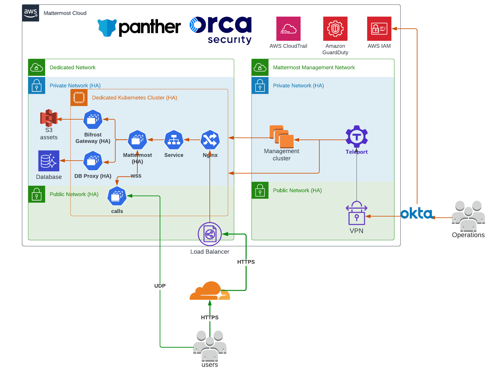

Cloud Shared
=============

.. include:: ../_static/badges/ent-cloud-only.rst
  :start-after: :nosearch:

Mattermost Cloud Shared is designed as a cost-effective solution for companies who don't have strict security and compliance requirements that need a straightforward, managed communication platform without the necessity for extensive customization or dedicated resources.

Your Mattermost workspace is isolated, is fully hosted and managed by Mattermost, and runs :ref:`Mattermost Enterprise <about/editions-and-offerings:mattermost enterprise>` on shared infrastructure where resources are shared among multiple Mattermost customers, which might affect performance during peak times. 

Reference architecture
----------------------

Available features
------------------

Zero-downtime upgrades
~~~~~~~~~~~~~~~~~~~~~~

Mattermost releases biweekly updates and leverages recurring maintenance windows to keep your instance up-to-date with new stable or beta features behind feature flags, fix security issues, and ensure the overall reliability and performance of your environment. Maintenance windows are announced in advance on https://status.mattermost.com/

Additional support options, including quicker response times, dedicated support personnel, and stronger service level agreements (SLAs), are also available.

Disaster Recovery
~~~~~~~~~~~~~~~~~

Mattermost Cloud Dedicated supports data failover to a secondary region/site should the primary instance experiences an unrecoverable outage with guaranteed recovery times.

Mattermost supports a **multi-AZ (availability zones)** strategy in the same site/region.

Daily backups of the database, object storage, and high availability clusters are captured and retained for 30 days.

In addition, highly available observability tools with automated alerting, long term metrics, and logs retention are retained for a duration of 1 year.

Security
~~~~~~~~

You have access to all the resources required to run the Mattermost application with the highest security standards, including data encryption at rest and in transit.

Your pre-configured cluster is secure by default, based on industry best practices including Data encryption at rest and in transit, TLS certificates life cycle management, and automatic security updates.

Mattermost maintains control over network and security policies, including `encryption <#encryption>`__, database, data, object storage, backup schedules, and compliance certifications. 

Authentication and authorization
~~~~~~~~~~~~~~~~~~~~~~~~~~~~~~~~

Mattermost offers advanced security and authentication options for integrating with corporate directories, including :doc:`Active Directory/LDAP </onboard/ad-ldap>`, Okta, OneLogin, :doc:`SAML </onboard/sso-saml>`, :doc:`Google </onboard/sso-google>`, :doc:`EntraID </onboard/sso-office>`, and :doc:`OpenID </onboard/sso-openidconnect>`.

Secure networking
~~~~~~~~~~~~~~~~~~

Enterprise customers with a Mattermost Cloud Shared deployment can :ref:`configure IP filtering <manage/cloud-ip-filtering:configure ip filtering>` through CIDR-based IP ranges, within the Mattermost System Console to specify authorized IPs or IP ranges for seamless access control. Users attempting to access the workspace from IPs outside defined ranges are restricted from entry.

Encryption
~~~~~~~~~~~

Mattermost provides encryption-in-transit and encryption-at-rest capabilities. Mattermost supports :doc:`TLS encryption </install/setup-tls>`, including AES-256 with 2048-bit RSA on all data transmissions, between Mattermost client applications and the Mattermost server. You may either set up TLS on the Mattermost Server or :doc:`install a proxy such as NGINX </install/proxy-to-mattermost-transport-encryption>`, and set up TLS on the proxy.

Connections to :doc:`Active Directory/LDAP </onboard/ad-ldap>` can :ref:`optionally be secured with TLS or stunnel <configure/authentication-configuration-settings:ad/ldap port>`.

Connections to calls are secured with a combination of:

- TLS: The existing WebSocket channel is used to secure the signaling path.
- DTLS v1.2 (mandatory): Used for initial key exchange. Supports ``TLS_ECDHE_ECDSA_WITH_AES_128_GCM_SHA256`` and ``TLS_ECDHE_ECDSA_WITH_AES_256_CBC_SHA`` algorithms.
- SRTP (mandatory): Used to encrypt all media packets (i.e. those containing voice or screen share). Supports ``AEAD_AES_128_GCM`` and ``AES128_CM_HMAC_SHA1_80`` algorithms.

Gossip encryption (experimental)
~~~~~~~~~~~~~~~~~~~~~~~~~~~~~~~~

Mattermost supports encryption of cluster data in-transit when using the gossip protocol. See our :ref:`gossip encryption <deploy/encryption-options:gossip encryption (experimental)>` documentation for details.

The encryption uses AES-256 by default, and it is not configurable. However, it is possible to manually set the value in the ``Systems`` table for the ``ClusterEncryptionKey`` row. A key is a byte array converted to ``base64``. It can be set to a length of 16, 24, or 32 bytes to select ``AES-128``, ``AES-192``, or ``AES-256`` respectively.

SMTP
~~~~

Email sent from Mattermost Cloud Dedicated uses XXX, and the connection to XXX is encrypted. See our :doc:`SMTP </configure/smtp-email>` documentation for setup details.

Audit and observability
~~~~~~~~~~~~~~~~~~~~~~~

Mattermost Cloud Dedicated provides access to :doc:`audit and system logs </manage/logging>` generated by the application. 

Customization
~~~~~~~~~~~~~~

Approved plugins developed and/or tested by Mattermost are supported and available in the `Mattermost Marketplace <https://mattermost.com/marketplace/>`_. Custom plugins and integrations outside of Mattermost Marketplace aren’t currently supported.

Migrate from a self-hosted instance
------------------------------------

See our :ref:`workspace migration <manage/cloud-data-export:migrate from self-hosted to cloud>` documentation to learn more about migrating from a self-hosted to a Mattermost Cloud instance.