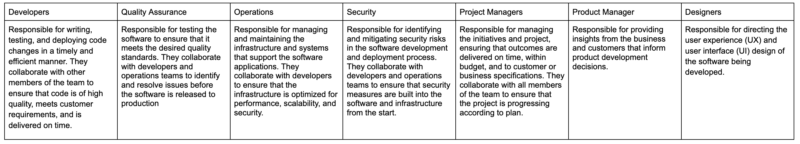

DevOps collaboration
====================

.. contents:: On this page
    :backlinks: top
    :depth: 2

In DevOps, teams work together to accelerate software development and deployment processes, reduce costs, and ensure their organization remains competitive in the fast-paced digital marketplace. 

DevOp practitioners include a variety of disciplines including product managers, designers, developers, operations, quality assurance, security, and project managers. 

DevOps collaboration pains
--------------------------

DevOps teams can experience the following collaboration pains: 

- Members from different departments and timezones have different priorities, skills, and vocabularies, which can lead to misunderstandings, miscommunications, and delays in decision-making.
- Limited visibility into each other's work can lead to duplication of effort, conflicts, and missed opportunities for optimization.
- Resistance from stakeholders who are reluctant to adopt new technologies or processes can slow down innovation, increase costs, and create tension within the team.
- Difficulty ensuring that software is developed, deployed, and managed securely to protect against data breaches and cyber-attacks. This involves coordinating efforts between developers, operations, and security teams to identify and mitigate security risks.

There are several different processes that DevOps teams need to effectively collaborate in order to deliver software reliably. Each requires a different set of procedures and tools, but they all share the common goal of shipping high-quality software to meet customer needs and expectations. Mattermost can help solve collaboration pains in many DevOps use cases. 

Learn more
----------

Join us on `Mattermost Academy <https://academy.mattermost.com>`__ to enroll in the following DevOps collaboration courses and learn how Mattermost can help you solve collaboration pains:

- `Agile Software Development <https://academy.mattermost.com/p/devops-in-mattermost>`__ - Learn how technical teams use Mattermost to develop software or applications by sharing code, working together on a common platform, and identifying and resolving technical issues.
- `Quality Assurance and Testing <https://academy.mattermost.com/p/quality-assurance-testing>`__ - Learn how technical teams use Mattermost to ensure that product deliverables meet quality standards by developing test plans, executing tests, reporting defects, sharing test results, and coordinating efforts to fix issues.
- `Platform Engineering <https://academy.mattermost.com/p/platform-engineering>`__ - Learn how technical teams use Mattermost to manage and maintain IT infrastructure, such as networks, servers, and storage systems by monitoring performance, identifying and resolving issues, implementing upgrades or new technology, as well as automating the deployment of software applications.
- `Release Management <https://academy.mattermost.com/p/release-management>`__ - Learn how technical teams use Mattermost to communicate and coordinate the release of software updates and features across different departments and stakeholders by sharing information, tracking progress, and resolving issues in real-time to ensure that releases are delivered on time, with minimal disruption and risk to users and the business.
- `Technical Support <https://academy.mattermost.com/p/technical-support>`__ - Learn how technical teams use Mattermost to provide technical support to customers, such as diagnosing and resolving issues, providing documentation and training, and creating solutions to recurring problems by sharing knowledge, coordinating efforts to resolve issues, and identifying opportunities for process improvement.
- `Security Operations <https://academy.mattermost.com/p/security-operations>`__ - Learn how technical teams use Mattermost to share information, coordinate responses to security incidents, and implement security measures to prevent future incidents by sharing threat intelligence, incident response plans, and coordinating efforts to prevent, detect, and respond to security incidents.
