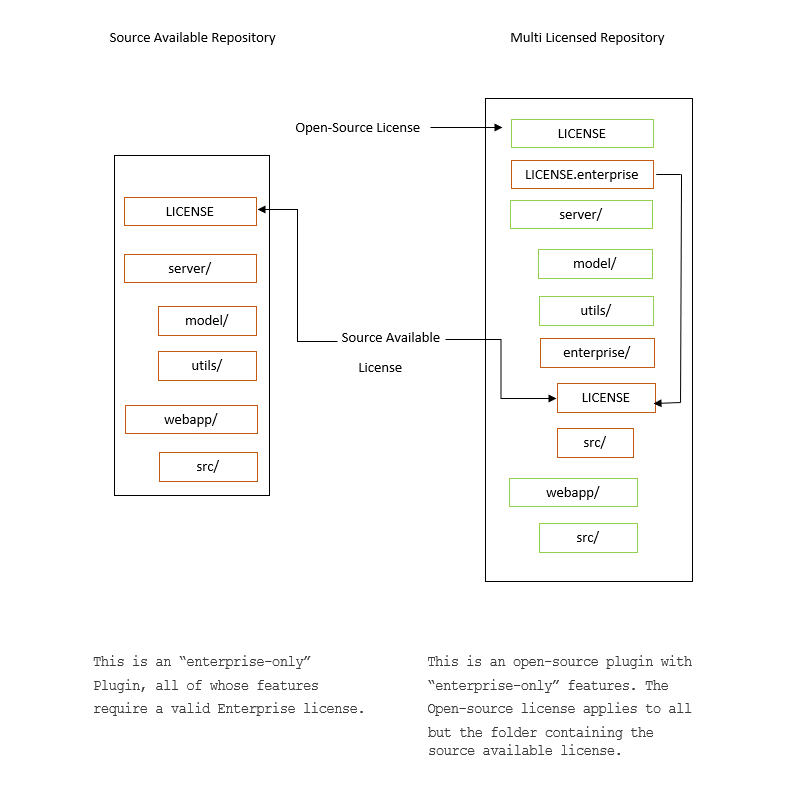

Open-source licensing questions
===============================

.. contents:: On this page
    :backlinks: top
    :depth: 2

Terms of use and privacy policy
-------------------------------

What are Mattermost's policies around licensing, terms of use, and privacy?
~~~~~~~~~~~~~~~~~~~~~~~~~~~~~~~~~~~~~~~~~~~~~~~~~~~~~~~~~~~~~~~~~~~~~~~~~~~

The following outlines the licensing, terms of use and privacy policies across Mattermost software and services.

Mattermost Software
~~~~~~~~~~~~~~~~~~~

+----------------------------------------------------+----------------------------------------------------------------------------------------------------------------------------+-------------------------------------------------------------------------------------------------------------------------------+----------------------------------------------------------------------------------------------------------------------------+
| Software                                           | License                                                                                                                    | Terms and Conditions                                                                                                          | Privacy Policy                                                                                                             |
+====================================================+============================================================================================================================+===============================================================================================================================+============================================================================================================================+
| Mattermost Team Edition (Open Source)              | Open Source **MIT License**.                                                                                               | `Mattermost Trademark Policy <https://mattermost.com/trademark-standards-of-use/>`__                                          | `Mattermost Server Privacy Policy <https://github.com/mattermost/mattermost/blob/master/server/build/PRIVACY_POLICY.md>`__ |
|                                                    |                                                                                                                            |                                                                                                                               | with `GDPR Data Processing Addendum <https://mattermost.com/data-processing-addendum/>`__.                                 |
|                                                    | Open Source Add-ons available under `Apache v2 and other licenses </about/subscription.html>`__.                           | `Mattermost Terms of Use <https://mattermost.com/terms-of-use/>`__                                                            |                                                                                                                            |
+----------------------------------------------------+----------------------------------------------------------------------------------------------------------------------------+-------------------------------------------------------------------------------------------------------------------------------+                                                                                                                            |
| Mattermost Enterprise Edition with no subscription | `Commercial Enterprise Edition License <https://mattermost.com/enterprise-edition-license/>`__.                            | No subscription terms apply when operating without a subscription                                                             |                                                                                                                            |
|                                                    |                                                                                                                            |                                                                                                                               |                                                                                                                            |
|                                                    | You are welcome to use the Enterprise Edition of Mattermost free of charge in perpetuity when the subscription feature     |                                                                                                                               |                                                                                                                            |
+----------------------------------------------------+ are not enabled by a license key.                                                                                          +-------------------------------------------------------------------------------------------------------------------------------+                                                                                                                            |
| Mattermost Enterprise Edition with subscription    |                                                                                                                            | `Self Managed Subscription Terms <https://mattermost.com/enterprise-edition-terms/>`__                                        |                                                                                                                            |
|                                                    | If you choose to purchase a subscription for paid features, terms and conditions are offered                               |                                                                                                                               |                                                                                                                            |
|                                                    | as part of the subscription purchase (see “Terms”).                                                                        | `Enterprise Edition Subscription Terms for Purchase by Resale <https://mattermost.com/terms-of-use/>`__                       |                                                                                                                            |
|                                                    |                                                                                                                            |                                                                                                                               |                                                                                                                            |
|                                                    |                                                                                                                            | `Cloud Subscription Agreement <https://mattermost.com/cloud-subscription-terms/>`__                                           |                                                                                                                            |
+----------------------------------------------------+----------------------------------------------------------------------------------------------------------------------------+-------------------------------------------------------------------------------------------------------------------------------+----------------------------------------------------------------------------------------------------------------------------+

Mattermost Service Agreements
^^^^^^^^^^^^^^^^^^^^^^^^^^^^^

+-----------------------------------------------------------------------------+-------------------------------------------------------------------------------------------------------------------------------------------------+----------------------------------------------------------------------------------------------------------------------------+
| Service                                                                     | Terms and Conditions                                                                                                                            | Privacy Policy                                                                                                             |
+=============================================================================+=================================================================================================================================================+============================================================================================================================+
| Mattermost Enterprise Edition Support, including Premier Support            | `Mattermost Support Terms <https://mattermost.com/support/>`__                                                                                  | `Mattermost Server Privacy Policy <https://github.com/mattermost/mattermost/blob/master/server/build/PRIVACY_POLICY.md>`__ |
+-----------------------------------------------------------------------------+-------------------------------------------------------------------------------------------------------------------------------------------------+ with `GDPR Data Processing Addendum <https://mattermost.com/data-processing-addendum/>`__.                                 |
| Mattermost Hosted Push Notification Service                                 | `Hosted Push Notifications Service Terms <https://mattermost.com/terms-of-use/>`__                                                              |                                                                                                                            |
+-----------------------------------------------------------------------------+-------------------------------------------------------------------------------------------------------------------------------------------------+                                                                                                                            |
| Mattermost Professional Services                                            | To be posted.                                                                                                                                   |                                                                                                                            |
+-----------------------------------------------------------------------------+-------------------------------------------------------------------------------------------------------------------------------------------------+----------------------------------------------------------------------------------------------------------------------------+

Mattermost Websites
~~~~~~~~~~~~~~~~~~~

+----------------------------+------------------------------------------------------------------------------------------------------------------------------------------------------------------+---------------------------------------------------------------------------------------+---------------------------------------------------------------------------------------------------------------------------+
| Website                    | License                                                                                                                                                          | Terms and Conditions                                                                  | Privacy Policy                                                                                                            |
+============================+==================================================================================================================================================================+=======================================================================================+===========================================================================================================================+
| Mattermost Websites:       | Open source under                                                                                                                                                | `Mattermost Terms of Use <https://mattermost.com/terms-of-service/>`__                | `Mattermost Websites Privacy Policy <https://mattermost.com/privacy-policy/>`__                                           |
|                            | `Creative Commons Attribution-NonCommercial-ShareAlike 3.0 Unported License (CC BY-NC-SA 3.0) <https://creativecommons.org/licenses/by-nc-sa/3.0/deed.en_US>`__. |                                                                                       |                                                                                                                           |
|  - about.mattermost.com    |                                                                                                                                                                  |                                                                                       |                                                                                                                           |
|  - mattermost.com          |                                                                                                                                                                  |                                                                                       |                                                                                                                           |
|  - mattermost.org          |                                                                                                                                                                  |                                                                                       |                                                                                                                           |
|  - forum.mattermost.org    |                                                                                                                                                                  |                                                                                       |                                                                                                                           |
|  - docs.mattermost.com     |                                                                                                                                                                  |                                                                                       |                                                                                                                           |
+----------------------------+------------------------------------------------------------------------------------------------------------------------------------------------------------------+---------------------------------------------------------------------------------------+---------------------------------------------------------------------------------------------------------------------------+

Mattermost Partnership Agreements
~~~~~~~~~~~~~~~~~~~~~~~~~~~~~~~~~

+-----------------------------------------------------------------------------+-------------------------------------------------------------------------------------------------------------------+
| Partnership Agreement                                                       | Agreement                                                                                                         |
+=============================================================================+===================================================================================================================+
| Mattermost Authorized Reseller Agreement                                    | `Mattermost Authorized Reseller Agreement <https://mattermost.com/partners/>`__                                   |
+-----------------------------------------------------------------------------+-------------------------------------------------------------------------------------------------------------------+

Mattermost Confidentiality Agreements
~~~~~~~~~~~~~~~~~~~~~~~~~~~~~~~~~~~~~

+-----------------------------------------------------------------------------+---------------------------------------------------------------------------------------------------------------------------------------+
| Confidentiality Agreement                                                   | Agreement                                                                                                                             |
+=============================================================================+=======================================================================================================================================+
| Mattermost Mutual Non-Disclosure Agreement                                  | `Mattermost Mutual Non-Disclosure Agreement <https://docs.google.com/document/d/1Ev3VFjiJBKSf1D5Kmf2BScbHBgSQbMzTzOhY3Of28vY/edit>`__ |
+-----------------------------------------------------------------------------+---------------------------------------------------------------------------------------------------------------------------------------+

Working for Mattermost
~~~~~~~~~~~~~~~~~~~~~~~

+-----------------------------------------------------------------------------+--------------------------------------------------------------------------------------------------------------------------------------------------+
| Service                                                                     | Terms and Conditions                                                                                                                             |
+=============================================================================+==================================================================================================================================================+
| Mattermost Professional Consulting Services                                 | `Mattermost Professional Consulting Services Agreement <https://docs.google.com/document/d/1tgEkO5Q-xqAgVEcx5Y-z28OC36HptpltKORpivQGLoY/edit>`__ |
+-----------------------------------------------------------------------------+--------------------------------------------------------------------------------------------------------------------------------------------------+
| Mattermost Consulting                                                       | `Mattermost Consulting Terms <https://handbook.mattermost.com/operations/sales/partner-programs>`__                                              |
+-----------------------------------------------------------------------------+--------------------------------------------------------------------------------------------------------------------------------------------------+

Source available licensing
--------------------------

What is the Mattermost Source Available License?
~~~~~~~~~~~~~~~~~~~~~~~~~~~~~~~~~~~~~~~~~~~~~~~~

A source available license gives access to source code, but places restrictions on its use. The Mattermost Source Available License allows free-of-charge and unrestricted use of the source code in development and testing environments, but requires a valid Mattermost Enterprise Edition License in a production environment.

How can I identify code licensed as source available?
~~~~~~~~~~~~~~~~~~~~~~~~~~~~~~~~~~~~~~~~~~~~~~~~~~~~~

When the Mattermost Source Available ``LICENSE`` file appears at the root of a repository, the restrictions apply to all source code within the repository. A note in the ``README.md`` often identifies the use of this license and links to this FAQ.

When the Mattermost Source Available ``LICENSE`` file appears in a specific directory, the restrictions apply to all source code within that directory. This directory is often called "enterprise". For additional clarity, an additional ``LICENSE.enterprise`` file may appear in the root directory, symlinked to the ``enterprise/LICENSE`` file.

In all cases, any third party components remain licensed under their original license.

An example directory layout, using an Enterprise license, is shown below:

Why are you changing the licensing model?
~~~~~~~~~~~~~~~~~~~~~~~~~~~~~~~~~~~~~~~~~

Our plugin framework delivers substantial value to our enterprise customers but requires significant development and support resources. This change to the licensing model allows us to continue developing open source features while selectively charging for features.

How are repositories changing?
~~~~~~~~~~~~~~~~~~~~~~~~~~~~~~

As we add enterprise-only functionality, we will update the license on affected Mattermost-authored plugin repositories. The intent is to work alongside the existing, open source functionality in our plugins while reserving certain enterprise functionality to customers who pay us for enterprise licenses.

To which repositories does this apply?
~~~~~~~~~~~~~~~~~~~~~~~~~~~~~~~~~~~~~~

We plan to apply this license to the enterprise directories of our `Jira <https://github.com/mattermost/mattermost-plugin-jira>`__, `Microsoft Calendar <https://github.com/mattermost/mattermost-plugin-mscalendar>`__, and `Microsoft Teams Meetings <https://github.com/mattermost/mattermost-plugin-msteams-meetings>`__ plugins. We also intend to release `Playbooks </guides/repeatable-processes.html>`__ and `Channel Export <https://github.com/mattermost/mattermost-plugin-channel-export>`__ plugins under the Mattermost Source Available License. New, Mattermost-authored plugins will generally be released under the Mattermost Source Available License. When we update the licenses, we will release a new version and note the change in the ``README.md`` file of the GitHub repository and any release notes.

We expect to keep plugins without an enterprise component under our open source license. No licensing changes are planned to non-plugin repositories, such as `mattermost <https://github.com/mattermost/mattermost>`__ or `mattermost webapp <https://github.com/mattermost/mattermost/tree/master/webapp>`__.

Will the repositories be public?
~~~~~~~~~~~~~~~~~~~~~~~~~~~~~~~~

Yes, existing repositories will stay public. We are now also able to make public several enterprise-only plugins under the Mattermost Source Available License previously developed in private.

Can I still contribute?
~~~~~~~~~~~~~~~~~~~~~~~

Yes, we continue to welcome all contributions. Mattermost may select some contributions as enterprise features and license them under the Mattermost Source Available License. We will aim to communicate such decisions as early as possible in the contribution process.

As with all Mattermost repositories, you will still need to sign the `Mattermost CLA <https://mattermost.com/contribute/>`__. We will not accept contributions without signing the Mattermost CLA.

Do I need to re-sign the `Mattermost CLA <https://mattermost.com/contribute/>`__?
~~~~~~~~~~~~~~~~~~~~~~~~~~~~~~~~~~~~~~~~~~~~~~~~~~~~~~~~~~~~~~~~~~~~~~~~~~~~~~~~~

No, if you have already signed the `Mattermost CLA <https://mattermost.com/contribute/>`__, you do not need to sign it again.

Can I compile your plugins by myself?
~~~~~~~~~~~~~~~~~~~~~~~~~~~~~~~~~~~~~

Yes. If you have a Mattermost Enterprise Edition license, you are free to compile and use a plugin under the Mattermost Source Available License. Furthermore, if you are developing against or testing with such a plugin, you are free to compile and test a plugin even without a Mattermost Enterprise Edition license. Without an Enterprise Edition license, source available plugins may have reduced functionality or refuse to start altogether. Request a `trial license <https://mattermost.com/trial/>`__ if your testing requires access to enterprise functionality.

Several of our customers value complete access to our source code and compile our plugins from source before deploying to their production servers. By adopting the Mattermost Source Available License, we can develop enterprise-only features in public without impacting this workflow.

Will you distribute open source plugin binaries without any licensing restrictions?
~~~~~~~~~~~~~~~~~~~~~~~~~~~~~~~~~~~~~~~~~~~~~~~~~~~~~~~~~~~~~~~~~~~~~~~~~~~~~~~~~~~

At this time, we have no plans to distribute more than one version of each of our plugins. Without a Mattermost Enterprise Edition License, plugins may have reduced functionality or refuse to start altogether.

Can I continue to use the existing open source repositories without restriction?
~~~~~~~~~~~~~~~~~~~~~~~~~~~~~~~~~~~~~~~~~~~~~~~~~~~~~~~~~~~~~~~~~~~~~~~~~~~~~~~~

Yes, the Mattermost Source Available License will only apply from the date it is added and to the versions in which it is included.

Do I need to use the Mattermost Source Available License for plugins I create?
~~~~~~~~~~~~~~~~~~~~~~~~~~~~~~~~~~~~~~~~~~~~~~~~~~~~~~~~~~~~~~~~~~~~~~~~~~~~~~

You are free to license your own code as you see fit. We will not apply the Mattermost Source Available License either to the `starter-template <https://github.com/mattermost/mattermost-plugin-starter-template>`__ or `demo <https://github.com/mattermost/mattermost-plugin-demo>`__ plugins, leaving them under a permissive open source license to give you the freedom to develop your own plugins.

Can I publish my own plugin and rely on enterprise specific functionality?
~~~~~~~~~~~~~~~~~~~~~~~~~~~~~~~~~~~~~~~~~~~~~~~~~~~~~~~~~~~~~~~~~~~~~~~~~~

As before, you are free to license your own code as you see fit. Note that some server functionality is only enabled with a Mattermost Enterprise license regardless of how you license your plugin.

Can’t someone compile out any license restrictions?
~~~~~~~~~~~~~~~~~~~~~~~~~~~~~~~~~~~~~~~~~~~~~~~~~~~

We trust our community to honor the Mattermost Source Available License and work alongside us to develop features across our free and paid offerings. Our Support team does not provide support to unlicensed, enterprise-only functionality.

If I make my own plugin using your source available code, can I remove the license restriction?
~~~~~~~~~~~~~~~~~~~~~~~~~~~~~~~~~~~~~~~~~~~~~~~~~~~~~~~~~~~~~~~~~~~~~~~~~~~~~~~~~~~~~~~~~~~~~~~

No, the Mattermost Source Available License continues to apply to modifications.

Will you pursue legal action if this license is violated?
~~~~~~~~~~~~~~~~~~~~~~~~~~~~~~~~~~~~~~~~~~~~~~~~~~~~~~~~~

Yes, if necessary. But we would always rather collaborate, so if you need to negotiate a different license, please ask us.

Is this a legal document?
~~~~~~~~~~~~~~~~~~~~~~~~~

No. This FAQ is informational only. The Mattermost Source Available License stands on its own, and this FAQ does not affect its meaning.

What is the full text of the Mattermost Source Available License?
~~~~~~~~~~~~~~~~~~~~~~~~~~~~~~~~~~~~~~~~~~~~~~~~~~~~~~~~~~~~~~~~~

"The Mattermost Source Available License (the “Source Available License”)
(c) Mattermost, Inc. 2015-present.

With regard to the Mattermost Software:

This software and associated documentation files (the "Software") may only be
used in production, if you (and any entity that you represent) have agreed to,
and are in compliance with all of the following: (a) the Mattermost Terms of Use,
available at https://mattermost.com/terms-of-use/ (the "TOU"), (b) and the Mattermost
Software License Agreement,  available at https://mattermost.com/enterprise-edition-terms/
(the “SLA”) or other licensing agreement governing your use of the Software, as agreed
by you and Mattermost, and otherwise have a valid Mattermost Enterprise for the correct
number of Registered Authorized Users the Software. Subject to the foregoing, you are free
to modify this Software and publish patches to the Software. You agree that
Mattermost and/or its licensors (as applicable) retain all right, title and
interest in and to all such modifications and/or patches, and all such
modifications and/or patches may only be used, copied, modified, displayed,
distributed, or otherwise exploited with a valid license or Subscription for the correct number of
Registered Authorized Users of the Software.  Notwithstanding
the foregoing, you may copy and modify the Software for development and testing
purposes, without requiring a valid license or Subscription.  You agree that Mattermost and/or
its licensors (as applicable) retain all right, title and interest in and to
all such modifications.  You are not granted any other rights beyond what is
expressly stated herein.  Subject to the foregoing, it is forbidden to copy,
merge, publish, distribute, sublicense, and/or sell the Software.

The full text of this Source Available License shall be included in all copies or substantial
portions of the Software.

THE SOFTWARE IS PROVIDED "AS IS", WITHOUT WARRANTY OF ANY KIND, EXPRESS OR
IMPLIED, INCLUDING BUT NOT LIMITED TO THE WARRANTIES OF MERCHANTABILITY,
FITNESS FOR A PARTICULAR PURPOSE AND NONINFRINGEMENT. IN NO EVENT SHALL THE
AUTHORS OR COPYRIGHT HOLDERS BE LIABLE FOR ANY CLAIM, DAMAGES OR OTHER
LIABILITY, WHETHER IN AN ACTION OF CONTRACT, TORT OR OTHERWISE, ARISING FROM,
OUT OF OR IN CONNECTION WITH THE SOFTWARE OR THE USE OR OTHER DEALINGS IN THE
SOFTWARE.

For all third party components incorporated into the Mattermost Software, those
components are licensed under the original license provided by the owner of the
applicable component."

Open source derivative work of Mattermost
-----------------------------------------

How do I fork Mattermost?
-------------------------

If you wish to create a forked version of the Mattermost source code, you must comply with the applicable licenses under which the source code is made available. Historically, this was made clear via this link: https://docs.mattermost.com/about/faq-business.html#copyright-and-licensing-of-mattermost-server-open-source-code.

For example, the Mattermost server source code is and always has been made available under the AGPLv2 license. Therefore, all third-party open source forks of the Mattermost server source code must comply with the AGPLv2 license in both source code and compiled versions. If you encounter a third-party fork of the publicly available source code of Mattermost server that claims to be licensed under an alternate license, it is incorrect.

For clarity, this license information regarding forking the source specifically refers to the use (and compilation) of the Mattermost source code by third parties. Third parties are obligated to comply with the open source licenses referenced above in connection with their derivative works. Compiled versions and derivative works of Mattermost prepared by third parties may not be made available under any license other than those under which the applicable source code is made available.

In contrast, Mattermost, as the copyright holder to the collection of the Mattermost source code, has exercised its exclusive right to make compiled versions of the Mattermost source code available under various other licenses (such as the MIT license and the Mattermost Commercial Enterprise License, as more specifically made clear in the table here: https://docs.mattermost.com/about/faq-enterprise.html#what-are-mattermost-s-policies-around-licensing-terms-of-use-and-privacy).

How can I create an open source derivative work of Mattermost?
~~~~~~~~~~~~~~~~~~~~~~~~~~~~~~~~~~~~~~~~~~~~~~~~~~~~~~~~~~~~~~

If you're looking to customize the look and feel of Mattermost, see `documentation on customization <https://github.com/mattermost/docs/issues/1006>`__. For advanced customization, the system's user experience is available in different repositories for web, mobile apps, and desktop apps and custom experiences can be developed and integrated with either Mattermost Team Edition or Mattermost Enterprise Edition via the system APIs and drivers.

If, instead of using Mattermost Team Edition or Mattermost Enterprise Edition, you choose to compile your own version of the system using the open source code from ``/mattermost-server``, there are a number of factors to consider:

Security
^^^^^^^^

- If you run a fork of the Mattermost server, we highly recommend you only deploy the system securely behind a firewall and to pay close attention to `Mattermost security updates <https://mattermost.com/security-updates/>`__. Mattermost Team Edition and Mattermost Enterprise Edition release security update patches when reports of new attacks are received and verified. Mattermost waits until 14 days after a security patch is released before publicly detailing its nature so that users and customers can upgrade before the security vulnerability is widely known. A malicious user can potentially make use of Mattermost security disclosures to exploit a fork of Mattermost if the security upgrade is not promptly incorporated into the forked version.

Rebranding
^^^^^^^^^^

- When you create a derivative version of Mattermost and share it with others as a product, you need to replace the Mattermost name and logo from the system, among other requirements, per the `Mattermost trademark policy <https://mattermost.com/trademark-standards-of-use/>`__.
- You can rebrand your system using convenience tools for `custom branding </configure/configuration-settings.html#customization>`__.
- For advanced whitelabelling, and to whitelabel in Team Edition under MIT license without Enterprise Edition branding tools, you can manually update files on the Mattermost server `per product documentation. <https://github.com/mattermost/docs/issues/1006>`__ This can also be done without forking.

Copyright and Licensing of ``/mattermost-server`` open source code
^^^^^^^^^^^^^^^^^^^^^^^^^^^^^^^^^^^^^^^^^^^^^^^^^^^^^^^^^^^^^^^^^^

- Compiling and distributing your own version of the open source Mattermost ``/mattermost-server`` repo requires a) compliance with licenses in the repo, including `NOTICE.txt <https://github.com/mattermost/mattermost/blob/master/NOTICE.txt>`__, and b) the compiled version of the ``/mattermost-server`` source code should have the same open source license as the source code, `per our licensing policy <about/faq-license.html/>`__.

Other considerations
^^^^^^^^^^^^^^^^^^^^

- Mattermost has a default `Terms of Use </configure/configuration-settings.html#terms-of-use-link>`__ agreement for the Terms of Use link at the bottom of login screen that should be incorporated into any additional Terms of Use you may add.

- The Mattermost copyright notices on the user interface should remain.
- There may be additional legal and regulatory issues to consider and we recommend you employ legal counsel to fully understand what's involved in creating and selling a derivative work.

Will Mattermost complete questionnaires requiring confidential data without an NDA?
~~~~~~~~~~~~~~~~~~~~~~~~~~~~~~~~~~~~~~~~~~~~~~~~~~~~~~~~~~~~~~~~~~~~~~~~~~~~~~~~~~~

No, Mattermost will not complete questionnaires requiring confidential data without a non-disclosure agreement. You can find `Mattermost's standard mutual non-disclosure agreement online <https://docs.google.com/document/d/10Qc2kxxZGYNzp9b19oEhItRM01OPyrWRISJ2rbm1gvc/edit>`__.

Why does Mattermost have a discount for certain kinds of non-profits but not for others?
~~~~~~~~~~~~~~~~~~~~~~~~~~~~~~~~~~~~~~~~~~~~~~~~~~~~~~~~~~~~~~~~~~~~~~~~~~~~~~~~~~~~~~~~

While we welcome anyone to use the open source version of Mattermost Team Edition free of charge, Mattermost, Inc., like any software company, has specific discounting programs for its commercial Mattermost Enterprise Edition based on business objectives. Objectives of the discounting programs include the suitability of potential case studies, references, word-of-mouth promotion and public promotion of solutions, among many other factors.

See our `License and Subscription </about/license-and-subscription.html#do-you-have-a-program-for-official-non-profits-open-source-projects-and-charities>`__ documentation for details.

Can I create a derivative work of the Mattermost /mattermost-server repository that is not open source?
~~~~~~~~~~~~~~~~~~~~~~~~~~~~~~~~~~~~~~~~~~~~~~~~~~~~~~~~~~~~~~~~~~~~~~~~~~~~~~~~~~~~~~~~~~~~~~~~~~~~~~~

The Mattermost open source project was created by `a group of developers who had their data paywalled by a proprietary online messaging service <https://mattermost.com/about-us/>`__ and felt it was unfair.

Because of this, the Mattermost /mattermost-server repository uses an open source license that requires derivative works to use the same open source license. This prevents the creation of derivative works that are not open source, and the situation where end users would not have access to the source code of the systems they use, and hence be at risk of "lock in".

For companies purchasing Enterprise Edition subscriptions for use by internal staff, who need to modify /mattermost-server, and who also have legal departments that won't allow their staff to work under an open source software license, a special "Advanced Licensing Option" can be purchased to modify /mattermost-server for internal use under a commercial software license. This option is not available for companies that would offer a modified, non-open source version of Mattermost to external parties.

Will Mattermost, Inc. offer the ability to resell Mattermost software without a reseller agreement?
~~~~~~~~~~~~~~~~~~~~~~~~~~~~~~~~~~~~~~~~~~~~~~~~~~~~~~~~~~~~~~~~~~~~~~~~~~~~~~~~~~~~~~~~~~~~~~~~~~~

No.

If there is a case where the reseller agreement is under review and a customer urgently needs an order, Mattermost may, with internal approvals, accept a reseller purchase order with the following language:

"Any statements, clauses, or conditions included on or referenced by buyer's purchase order forms, which forms modify, add to, or are inconsistent with Mattermost’s standard terms and conditions are expressly rejected. Such orders will only be accepted by Mattermost upon the condition and with the express understanding that despite any such statements, clauses, or conditions contained in any order forms of the buyer are void and have no effect.

EXCEPT AS OTHERWISE EXPRESSLY AGREED BY THE PARTIES IN WRITING, MATTERMOST MAKES NO WARRANTIES OR REPRESENTATIONS WITH RESPECT TO ANY MATTERMOST PRODUCTS, DOCUMENTATION OR SUPPORT, AND HEREBY DISCLAIMS ALL OTHER EXPRESS AND ALL IMPLIED WARRANTIES, INCLUDING BUT NOT LIMITED TO IMPLIED WARRANTIES OF MERCHANTABILITY, FITNESS FOR A PARTICULAR PURPOSE, AND NON-INFRINGEMENT."

Does Mattermost answer questions about open source licenses authored by other organizations?
~~~~~~~~~~~~~~~~~~~~~~~~~~~~~~~~~~~~~~~~~~~~~~~~~~~~~~~~~~~~~~~~~~~~~~~~~~~~~~~~~~~~~~~~~~~~

No, if you have questions about an open source license, please consult the original author, or FAQs they offer.
