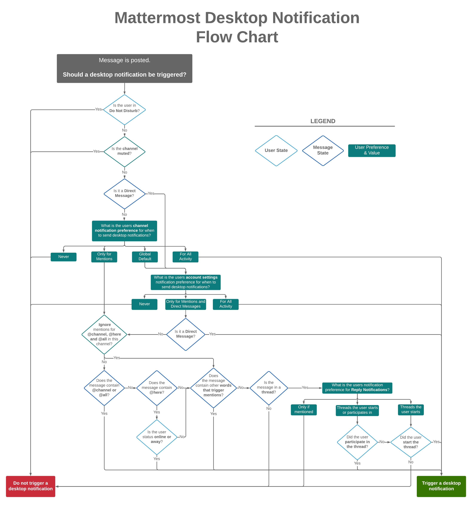

Notifications Questions
=======================

What determines if a desktop notification should be triggered?
--------------------------------------------------------------

Desktop notifications are triggered under to following conditions. Click to expand the flow chart.

What determines if an email notification should be triggered?
-------------------------------------------------------------

Email notifications are triggered under to following conditions. Click to expand the flow chart.

.. image:: ../images/email_notification_chart.png
  :width: 239px
  :height: 232px

What determines if a mobile push notification should be triggered?
-------------------------------------------------------------------

Mobile push notifications are triggered under to following conditions. Click to expand the flow chart.

.. image:: ../images/push_notification_chart.png
  :width: 239px
  :height: 232px

.. _tpns:

Are mobile push notifications free?
-----------------------------------

Yes, push notifications are free if you compile your own `push-proxy service <https://github.com/mattermost/mattermost-push-proxy>`__. Push notifications are also free if you use the hosted Test Push Notification Service (TPNS) provided by Mattermost, Inc.

TPNS, hosted at `https://push-test.mattermost.com <https://push-test.mattermost.com>`__, offers transport-level encryption, but not production-level service level agreements (SLAs).

If you need production-level SLAs for push notifications, you can either compile your own push-proxy service, with your own key, or you can use a paid option and become a Mattermost Professional subscriber `agreeing to our Conditions of Use <https://about.mattermost.com/default-terms/>`__, which enables you to use a production-level Hosted Push Notification Service (HPNS) at ``https://push.mattermost.com``.

Learn more about `our mobile apps and push notification service <https://docs.mattermost.com/deploy/mobile-hpns.html>`__.