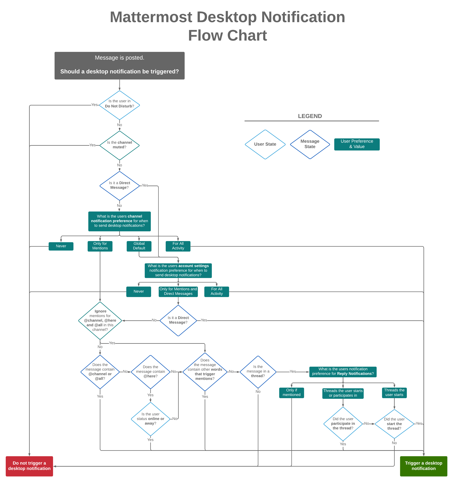
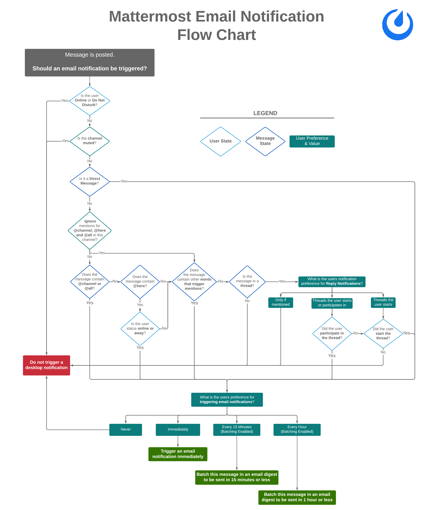
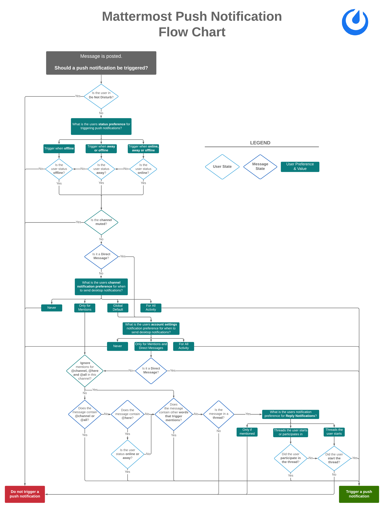
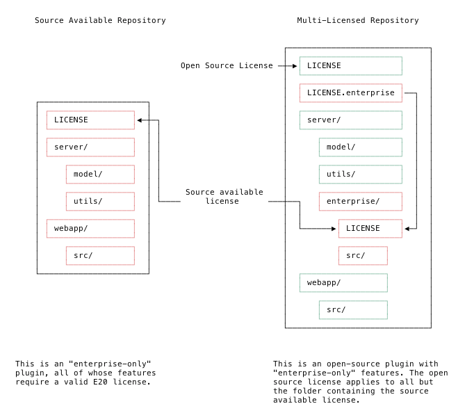

Frequently Asked Questions (FAQ)
=================================

.. toctree::
  :maxdepth: 2

General Questions
-----------------

Why was Mattermost created?
~~~~~~~~~~~~~~~~~~~~~~~~~~~

Mattermost was created to offer an alternative to proprietary SaaS services. For more information, please see the article `Why we made Mattermost <https://mattermost.org/why-we-made-mattermost-an-open-source-slack-alternative/>`__.

Why does the open source repository contain code specific to the commercial version of Mattermost?
~~~~~~~~~~~~~~~~~~~~~~~~~~~~~~~~~~~~~~~~~~~~~~~~~~~~~~~~~~~~~~~~~~~~~~~~~~~~~~~~~~~~~~~~~~~~~~~~~~~

The commercial version of Mattermost is designed to never lock-in your data. Portions of the commercial version are shared with the open source version to ensure upgrade and downgrade across editions without data loss.

Does Mattermost support 508 Compliance?
~~~~~~~~~~~~~~~~~~~~~~~~~~~~~~~~~~~~~~~~~~

Yes, please see our `VPAT <https://docs.mattermost.com/overview/vpat.html>`__ form for details. Mattermost Enterprise Edition has been purchased by multiple US public sector organizations, including US federal agencies and the Department of Defense.

What's the largest Mattermost deployment you have?
~~~~~~~~~~~~~~~~~~~~~~~~~~~~~~~~~~~~~~~~~~~~~~~~~~

Our largest contractual obligation is for over a quarter of a million registered users. Our most typical large enterprise deployment size is between 10,000 and 40,000 users in Dev and Ops organizations who use Mattermost for DevOps workflows, remote work, mission-critical and rapid response, and to address email overload.

We have done performance testing of 60,000 concurrent users and 60 million posts in the database, with a peak concurrent utilization safety factor of between 10 to 1 and 3 to 1, depending on the distribution of an organization across time zones. Peak concurrent usage in a single timezone is generally around the start of the day, probably 9 am, and lunchtime when people are messaging to meet for a meal.  Our monthly releases are tested at 20 million posts in the database.

Mattermost provides an open source, well-documented `load test simulator <https://github.com/mattermost/mattermost-load-test>`_ to verify that your Mattermost deployment can achieve the stated scale benchmarks ahead of production deployment.

How do I deploy the open source Mattermost Team Edition under an MIT license?
~~~~~~~~~~~~~~~~~~~~~~~~~~~~~~~~~~~~~~~~~~~~~~~~~~~~~~~~~~~~~~~~~~~~~~~~~~~~~

The open source Mattermost Team Edition is functionally identical to the commercial Mattermost Enterprise Edition in its free “team mode”, but there is no ability to unlock enterprise features. It deploys as a single Linux binary with MySQL or PostgreSQL under an MIT license.

We generally recommend installing Enterprise Edition, even if you don't currently need a license. This provides the flexibility to unlock Enterprise features seamlessly should you need them. However, if you only want to install software with a fully open source code base, then Team Edition is the best choice for you.

To deploy the Team Edition, download the `Mattermost Team Edition binary <https://docs.mattermost.com/administration/version-archive.html#mattermost-team-edition-server-archive>`_, and follow our standard install guides. The same applies to server upgrades.

Community Questions
-------------------

How can I contribute to Mattermost?
~~~~~~~~~~~~~~~~~~~~~~~~~~~~~~~~~~~

You can get involved and contribute to Mattermost in the following ways:

- Contribute code
- Find "Help Wanted" projects
- Join the `Developer <https://community.mattermost.com/core/channels/developers>`_ channel on the Mattermost Community server
- File bugs
- Test new features
- Share feature ideas
- Get troubleshooting help
- Help translate Mattermost

See the `Get Involved <https://github.com/mattermost/mattermost-server#get-involved>`__ section of the Mattermost GitHub ``README.md`` for more information.

Can contributors add themselves to the Mattermost company page on LinkedIn?
~~~~~~~~~~~~~~~~~~~~~~~~~~~~~~~~~~~~~~~~~~~~~~~~~~~~~~~~~~~~~~~~~~~~~~~~~~~~

Yes! If you have contributed to the Mattermost project we think you should be recognized for it professionally beyond GitHub.

To add yourself to the `Mattermost page on LinkedIn <https://www.linkedin.com/company/mattermost/>`__, do the following:

1. Log in to `LinkedIn <https://www.linkedin.com/>`__ or create an account.
2. Go to **Me > View profile**.
3. Under **Experience**, click on the **plus** symbol and edit the following:
  - Title: Enter **Developer**, if you contributed code to the open source project or created a plugin, integration, or other enhancement; **Contributor**,  if you've contributed without writing code (e.g., filed bug report, updated documentation, supported troubleshooting questions, proposed a feature, etc.); **Translator**, if you've `helped translate <https://translate.mattermost.com>`__ Mattermost.
  - Company: Find **Mattermost** (you’ll see the Mattermost logo).
  - Location: Enter where you live.
  - From: Date of first contribution or perhaps month you cloned `github.com/mattermost`.
  - Select **I currently work here**.
  - Update my industry: Leave unchecked.
  - Update my headline: Leave unchecked.
  - Description: Leave blank or write a sentence about what you have contributed.

Notifications
-------------

What determines if a desktop notification should be triggered?
~~~~~~~~~~~~~~~~~~~~~~~~~~~~~~~~~~~~~~~~~~~~~~~~~~~~~~~~~~~~~~

Desktop notifications are triggered under to following conditions. Click to expand the flow chart.

What determines if an email notification should be triggered?
~~~~~~~~~~~~~~~~~~~~~~~~~~~~~~~~~~~~~~~~~~~~~~~~~~~~~~~~~~~~~

Email notifications are triggered under to following conditions. Click to expand the flow chart.

What determines if a mobile push notification should be triggered?
~~~~~~~~~~~~~~~~~~~~~~~~~~~~~~~~~~~~~~~~~~~~~~~~~~~~~~~~~~~~~~~~~~

Mobile push notifications are triggered under to following conditions. Click to expand the flow chart.

.. _tpns:

Are mobile push notifications free?
~~~~~~~~~~~~~~~~~~~~~~~~~~~~~~~~~~~

Yes, push notifications are free if you compile your own `push-proxy service <https://github.com/mattermost/mattermost-push-proxy>`__. Push notifications are also free if you use the hosted Test Push Notification Service (TPNS) provided by Mattermost, Inc.

TPNS, hosted at `https://push-test.mattermost.com <https://push-test.mattermost.com>`_, offers transport-level encryption, but not production-level service level agreements (SLAs).

If you need production-level SLAs for push notifications, you can either compile your own push-proxy service, with your own key, or you can use a paid option and become a Mattermost Enterprise Edition E10 subscriber `agreeing to our Conditions of Use <https://about.mattermost.com/default-terms/>`_, which enables you to use a production-level Hosted Push Notification Service (HPNS) at ``https://push.mattermost.com``.

Learn more about `our mobile apps and push notification service <https://docs.mattermost.com/deployment/push.html>`__.

Video, Audio, and Screen Sharing
---------------------------------

What support is available for video and audio calling and screen sharing?
~~~~~~~~~~~~~~~~~~~~~~~~~~~~~~~~~~~~~~~~~~~~~~~~~~~~~~~~~~~~~~~~~~~~~~~~~

Our `Integrations Directory <https://integrations.mattermost.com>`_ has several integrations to connect by voice or video call, or to share your screen with team members in Mattermost.

You can learn more about the most popular options, including self-hosted on-prem, self-hosted private cloud solutions, and vendor-hosted SaaS solutions (e.g. SIP PBX, Zoom, and Skype for Business), in the `Voice, video, and screensharing guide <https://docs.mattermost.com/deployment/video-and-audio-calling.html>`_.

Note that you can also neatly link video, audio and screensharing solutions, like Zoom and Skype for Business, to channels by using markdown formatting in the channel header. Example: ``[Click for video call](https://link_to_solution)``.

Enterprise Edition
------------------

What is Mattermost Enterprise Edition?
~~~~~~~~~~~~~~~~~~~~~~~~~~~~~~~~~~~~~~

Mattermost Enterprise Edition is a commercial workplace messaging solution for large organizations operating under compliance and security requirements built on top of the open source Mattermost Team Edition.

How can I be assured that my data will not be locked in to commercial software?
~~~~~~~~~~~~~~~~~~~~~~~~~~~~~~~~~~~~~~~~~~~~~~~~~~~~~~~~~~~~~~~~~~~~~~~~~~~~~~~~

Users of Mattermost Enterprise Edition can downgrade to the open source version without losing any data. Moreover, you always have control over your server and database, where the entirety of your Mattermost deployment is stored.

How does Mattermost scale from teams to enterprises?
~~~~~~~~~~~~~~~~~~~~~~~~~~~~~~~~~~~~~~~~~~~~~~~~~~~~

Growing your Mattermost installation from supporting a team to supporting an enterprise requires two types of scaling:

    1. Technical scaling: Maintaining system responsiveness as large quantities of new users are added.
    2. Functional scaling: Adding advanced features to support the increased complexity of large organizations.

**Technical Scaling:** Whether used for teams or enterprises, the Mattermost server is designed to support tens of thousands of users on a single server with appropriate hardware. The server is built using Golang, the language developed by Google to create internet-scale applications, and supports highly scalable databases like MySQL, which is `used extensively by Facebook <https://www.facebook.com/notes/facebook-engineering/mysql-and-database-engineering-mark-callaghan/10150599729938920/>`__. Beyond tens of thousands of users, Mattermost Enterprise Edition can offer high availability/horizontal scaling configurations using multiple servers to support even larger organizations.

**Functional Scaling:** Scaling from a team to an enterprise is like going from a "virtual office" to a "virtual campus". Advanced features like enterprise authentication, granular permissions, compliance and auditing, and advanced reporting become increasingly important as organizations grow beyond teams. Organizations needing this flexibility can easily upgrade from Mattermost Team Edition to Mattermost Enterprise Edition as well as downgrade without data loss, should their needs change.

For more information on how Mattermost scales, technically, and functionally, please `contact the Enterprise team <https://mattermost.com/contact-us/>`__ and `read about scaling for Enterprise <https://docs.mattermost.com/deployment/scaling.html>`__.

What does it take to manage a Mattermost deployment?
~~~~~~~~~~~~~~~~~~~~~~~~~~~~~~~~~~~~~~~~~~~~~~~~~~~~

For a small deployment of Mattermost up to a few hundred users, we'd recommend a part-time, mid-level IT admin with a senior IT admin for supervision and as a backup resource. They should have the ability to administer a basic Linux server, a MySQL or PostgreSQL database, and web proxy configuration with web sockets.

For a medium deployment of 500 to 2000 users, we'd recommend a senior IT administrator who has the capability to configure Mattermost in a High Availability cluster with redundant database and application servers. They should also be able to activate performance monitoring and health check features in Prometheus and Grafana.

How do you manage multiple messaging solutions in an enterprise?
~~~~~~~~~~~~~~~~~~~~~~~~~~~~~~~~~~~~~~~~~~~~~~~~~~~~~~~~~~~~~~~~

Our customers address multiple collaboration solutions in different ways depending on whether the organization is more top down or bottom up.

**For top-down, customers want to simplify and leverage investments in a central, flexible, innovative solution that can scale.** There's generally a lot of pain with different teams and departments running their messaging tools, creating silos, redundancy, and significant productivity loss. They'll roll out Mattermost as an official solution and centralize communication there. For an example of this, see our `Uber case study <https://mattermost.com/customers/>`__.

**For bottom-up, customers want to supplement for strategic advantage.** We've seen teams flock to Mattermost because of its productivity benefits for DevOps, remote work, rapid response, and scaling large teams where people are overloaded with email. Those organizations, which can have hundreds to thousands of users, will use Mattermost in parallel with general-purpose messaging that doesn't meet their specific needs.

One example is Wargaming, one of the world's largest real-time online video game operators, with over 150 million players on their system. They've moved their DevOps, design, analytics and support teams to Mattermost to supplement Skype for Business. This is their company-wide, general-purpose messenger that isn't optimized for large DevOps organizations and the degree of integration and flexibility they need - specifically for DevOps. People want support for Linux and Mac desktops, lots of APIs and hooks to integrate. They also need help for plugins to embed certain types of reports and interactive controls into messages, friendly keyboard shortcuts, and dozens of other enhancements that provide a distinct advantage to their counterparts at other companies.

What are the options to purchase a subscription to Mattermost Enterprise Edition?
~~~~~~~~~~~~~~~~~~~~~~~~~~~~~~~~~~~~~~~~~~~~~~~~~~~~~~~~~~~~~~~~~~~~~~~~~~~~~~~~~~

To simplify procurement and to keep prices low, Mattermost offers the following options to purchase:

1. **Purchase a subscription online via credit card** (https://mattermost.com/pricing-self-managed/) under standard Mattermost terms (https://mattermost.com/enterprise-edition-terms/) used by hundreds of other Enterprise Edition customers.

2. **Purchasing via a Mattermost reseller** (https://mattermost.com/partners/) under terms agreed between the customer and reseller, and then agreeing to **Mattermost Enterprise Edition Subscription Terms for Purchase by Resale** (https://about.mattermost.com/customer-terms-and-conditions/) prior to being provided a license key for the purchase by Mattermost, Inc.

3. **Purchase via a purchase order referencing a Mattermost quotation number**, and where the quotation is valid, unexpired and references the **Mattermost Enterprise Edition Subscription Terms** (https://mattermost.com/enterprise-edition-terms/):

   i. Suppose the PO references any special terms and conditions. In that case, it cannot be accepted by Mattermost, Inc. without the following special note: ``This Purchase Order is governed solely by the terms and conditions of the Mattermost Enterprise Edition Subscription Terms at https://mattermost.com/enterprise-edition-terms/. Despite anything contrary, no other terms and conditions printed on, or incorporated into or referenced by, shall apply.``

4. **Purchase via a purchase order referencing a Master Services Agreement** or similar agreement executed by Mattermost and the customer for subscription purchases over $100,000 USD.

   i. If the PO references any special terms and conditions, it cannot be accepted by Mattermost, Inc. without the following clause included in the prior signed agreement: ``THE PARTIES AGREE THAT ANY ADDITIONAL OR DIFFERENT TERMS AND CONDITIONS CONTAINED ON OR INCORPORATED INTO YOUR PURCHASE ORDER ARE EXPRESSLY REJECTED AND SHALL NOT BE CONSIDERED AN AMENDMENT TO THIS AGREEMENT.`` If the agreement does not include such a clause, the following purchase order note is required: ``This purchase order is governed solely by the terms and conditions of the [AGREEMENT_TITLE] dated [AGREEMENT_DATE] between [CUSTOMER_NAME] and Mattermost, Inc..  All other terms and conditions contained on or referenced by this purchase order shall not apply.``
  
What happens when the Enterprise Edition subscription expires?
~~~~~~~~~~~~~~~~~~~~~~~~~~~~~~~~~~~~~~~~~~~~~~~~~~~~~~~~~~~~~~~

Sixty days prior to expiry, System Administrators receive notifications that the Enterprise Edition license key will expire on the anniversary of its purchase. After expiry, there is a 10-day grace period to upload a new license key. After the grace period, Enterprise features will be disabled. At any time, Enterprise Edition can be downgraded to the free Team Edition without data loss by switching off any Enterprise features enabled and then removing the license key.

What are Mattermost's policies around licensing, terms of service, and privacy?
~~~~~~~~~~~~~~~~~~~~~~~~~~~~~~~~~~~~~~~~~~~~~~~~~~~~~~~~~~~~~~~~~~~~~~~~~~~~~~~~

The following outlines the licensing, terms of service and privacy policies across Mattermost software and services.

Mattermost Software
^^^^^^^^^^^^^^^^^^^^

+----------------------------------------------------+---------------------------------------------------------------------------------------------------------------------------+-------------------------------------------------------------------------------------------------------------------------------+----------------------------------------------------------------------------------------------------------------------------+
| Software                                           | License                                                                                                                   | Terms of Service                                                                                                              | Privacy Policy                                                                                                             |
+====================================================+===========================================================================================================================+===============================================================================================================================+============================================================================================================================+
| Mattermost Team Edition (Open Source)              | Open Source **MIT License**.                                                                                              | `Mattermost Trademark Policy <https://mattermost.org/trademark-standards-of-use/>`__                                          | `Mattermost Server Privacy Policy <https://github.com/mattermost/mattermost-server/blob/master/build/PRIVACY_POLICY.md>`__ |
|                                                    |                                                                                                                           |                                                                                                                               | with `GDPR Data Processing Addendum <https://about.mattermost.com/default-data-processing-addendum/>`__.                   |
|                                                    | Open Source Add-ons available under `Apache v2 and other licenses <https://mattermost.org/licensing/>`__.                 | `Mattermost Server Conditions of Use <https://about.mattermost.com/default-terms/>`__                                         |                                                                                                                            |
+----------------------------------------------------+---------------------------------------------------------------------------------------------------------------------------+-------------------------------------------------------------------------------------------------------------------------------+                                                                                                                            |
| Mattermost Enterprise Edition with no subscription | `Commercial Enterprise Edition License <https://about.mattermost.com/enterprise-edition-license/>`__.                     | No subscription terms apply when operating without a subscription                                                             |                                                                                                                            |
|                                                    |                                                                                                                           |                                                                                                                               |                                                                                                                            |
|                                                    | You are welcome to use the Enterprise Edition of Mattermost free of charge in perpetuity when the subscription feature    |                                                                                                                               |                                                                                                                            |
+----------------------------------------------------+ are not enabled by a license key.                                                                                         +-------------------------------------------------------------------------------------------------------------------------------+                                                                                                                            |
| Mattermost Enterprise Edition with subscription    |                                                                                                                           | `Enterprise Edition Subscription Terms <https://about.mattermost.com/enterprise-edition-terms/>`__                            |                                                                                                                            |
|                                                    | If you choose to purchase a subscription for paid features, terms and conditions are offered                              |                                                                                                                               |                                                                                                                            |
|                                                    | as part of the subscription purchase (see “Terms”).                                                                       | `Enterprise Edition Subscription Terms for Purchase by Resale <https://about.mattermost.com/customer-terms-and-conditions/>`__|                                                                                                                            |
+----------------------------------------------------+---------------------------------------------------------------------------------------------------------------------------+-------------------------------------------------------------------------------------------------------------------------------+----------------------------------------------------------------------------------------------------------------------------+

Mattermost Service Agreements
^^^^^^^^^^^^^^^^^^^^^^^^^^^^^^^^^^^

+-----------------------------------------------------------------------------+-------------------------------------------------------------------------------------------------------------------------------------------------+----------------------------------------------------------------------------------------------------------------------------+
| Service                                                                     | Terms of Service                                                                                                                                | Privacy Policy                                                                                                             |
+=============================================================================+=================================================================================================================================================+============================================================================================================================+
| Mattermost Enterprise Edition Support, including Premier Support            | `Mattermost Support Terms of Service <https://mattermost.com/support/>`__                                                                       | `Mattermost Server Privacy Policy <https://github.com/mattermost/mattermost-server/blob/master/build/PRIVACY_POLICY.md>`__ |
+-----------------------------------------------------------------------------+-------------------------------------------------------------------------------------------------------------------------------------------------+ with `GDPR Data Processing Addendum <https://about.mattermost.com/default-data-processing-addendum/>`__.                   |
| Mattermost Hosted Push Notification Service                                 | `Hosted Push Notifications Service Terms <https://about.mattermost.com/hpns-terms/>`__                                                          |                                                                                                                            |
+-----------------------------------------------------------------------------+-------------------------------------------------------------------------------------------------------------------------------------------------+                                                                                                                            |
| Mattermost Professional Services                                            | To be posted.                                                                                                                                   |                                                                                                                            |
+-----------------------------------------------------------------------------+-------------------------------------------------------------------------------------------------------------------------------------------------+----------------------------------------------------------------------------------------------------------------------------+

Mattermost Websites
^^^^^^^^^^^^^^^^^^^^

+----------------------------+------------------------------------------------------------------------------------------------------------------------------------------------------------------+---------------------------------------------------------------------------------------+---------------------------------------------------------------------------------------------------------------------------+
| Website                    | License                                                                                                                                                          | Terms of Service                                                                      | Privacy Policy                                                                                                            |
+============================+==================================================================================================================================================================+=======================================================================================+===========================================================================================================================+
| Mattermost Websites:       | Open source under                                                                                                                                                | `Mattermost Websites Terms of Service <https://mattermost.com/terms-of-service/>`__   | `Mattermost Websites Privacy Policy <https://about.mattermost.com/privacy/>`__                                            |
|                            | `Creative Commons Attribution-NonCommercial-ShareAlike 3.0 Unported License (CC BY-NC-SA 3.0) <https://creativecommons.org/licenses/by-nc-sa/3.0/deed.en_US>`__. |                                                                                       |                                                                                                                           |
|  - about.mattermost.com    |                                                                                                                                                                  |                                                                                       |                                                                                                                           |
|  - mattermost.com          |                                                                                                                                                                  |                                                                                       |                                                                                                                           |
|  - mattermost.org          |                                                                                                                                                                  |                                                                                       |                                                                                                                           |
|  - forum.mattermost.org    |                                                                                                                                                                  |                                                                                       |                                                                                                                           |
|  - docs.mattermost.com     |                                                                                                                                                                  |                                                                                       |                                                                                                                           |
+----------------------------+------------------------------------------------------------------------------------------------------------------------------------------------------------------+---------------------------------------------------------------------------------------+---------------------------------------------------------------------------------------------------------------------------+

Mattermost Partnership Agreements
^^^^^^^^^^^^^^^^^^^^^^^^^^^^^^^^^^^

+-----------------------------------------------------------------------------+-------------------------------------------------------------------------------------------------------------------+
| Partnership Agreement                                                       | Agreement                                                                                                         |
+=============================================================================+===================================================================================================================+
| Mattermost Authorized Reseller Agreement                                    | `Mattermost Authorized Reseller Agreement <https://about.mattermost.com/mattermost-authorized-reseller-terms/>`__ |
+-----------------------------------------------------------------------------+-------------------------------------------------------------------------------------------------------------------+

Mattermost Confidentiality Agreements
^^^^^^^^^^^^^^^^^^^^^^^^^^^^^^^^^^^^^^^^

+-----------------------------------------------------------------------------+---------------------------------------------------------------------------------------------------------------------------------------+
| Confidentiality Agreement                                                   | Agreement                                                                                                                             |
+=============================================================================+=======================================================================================================================================+
| Mattermost Mutual Non-Disclosure Agreement                                  | `Mattermost Mutual Non-Disclosure Agreement <https://docs.google.com/document/d/1Ev3VFjiJBKSf1D5Kmf2BScbHBgSQbMzTzOhY3Of28vY/edit>`__ |
+-----------------------------------------------------------------------------+---------------------------------------------------------------------------------------------------------------------------------------+

Working for Mattermost
^^^^^^^^^^^^^^^^^^^^^^^

+-----------------------------------------------------------------------------+--------------------------------------------------------------------------------------------------------------------------------------------------+
| Service                                                                     | Terms of Service                                                                                                                                 |
+=============================================================================+==================================================================================================================================================+
| Mattermost Professional Consulting Services                                 | `Mattermost Professional Consulting Services Agreement <https://docs.google.com/document/d/1tgEkO5Q-xqAgVEcx5Y-z28OC36HptpltKORpivQGLoY/edit>`__ |
+-----------------------------------------------------------------------------+--------------------------------------------------------------------------------------------------------------------------------------------------+
| Mattermost Consulting                                                       | `Mattermost Consulting Terms <https://about.mattermost.com/mattermost-consulting-terms/>`__                                                      |
+-----------------------------------------------------------------------------+--------------------------------------------------------------------------------------------------------------------------------------------------+

How does the licensing key work?
~~~~~~~~~~~~~~~~~~~~~~~~~~~~~~~~~

See our `frequently asked questions about licensing <https://docs.mattermost.com/overview/license-and-subscription.html#frequently-asked-questions>`_.

Do you have a program for official non-profits and charities?
~~~~~~~~~~~~~~~~~~~~~~~~~~~~~~~~~~~~~~~~~~~~~~~~~~~~~~~~~~~~~~~

See our `frequently asked questions about licensing <https://docs.mattermost.com/overview/license-and-subscription.html#frequently-asked-questions>`_.

Do you have discounted licenses for academic institutions?
~~~~~~~~~~~~~~~~~~~~~~~~~~~~~~~~~~~~~~~~~~~~~~~~~~~~~~~~~~

See our `frequently asked questions about licensing <https://docs.mattermost.com/overview/license-and-subscription.html#frequently-asked-questions>`_.

Mattermost Source Available License
------------------------------------

What is the Mattermost Source Available License?
~~~~~~~~~~~~~~~~~~~~~~~~~~~~~~~~~~~~~~~~~~~~~~~~~

A source available license gives access to source code, but places restrictions on its use. The Mattermost Source Available License allows free-of-charge and unrestricted use of the source code in development and testing environments, but requires a valid Mattermost Enterprise E20 License in a production environment.

How can I identify code licensed as source available?
~~~~~~~~~~~~~~~~~~~~~~~~~~~~~~~~~~~~~~~~~~~~~~~~~~~~~~

When the Mattermost Source Available ``LICENSE`` file appears at the root of a repository, the restrictions apply to all source code within the repository. A note in the ``README.md`` often identifies the use of this license and links to this FAQ.

When the Mattermost Source Available ``LICENSE`` file appears in a specific directory, the restrictions apply to all source code within that directory. This directory is often called "enterprise". For additional clarity, an additional ``LICENSE.enterprise`` file may appear in the root directory, symlinked to the ``enterprise/LICENSE`` file.

In all cases, any third party components remain licensed under their original license.

An example directory layout is shown below:

Why are you changing the licensing model?
~~~~~~~~~~~~~~~~~~~~~~~~~~~~~~~~~~~~~~~~~~~

Our plugin framework delivers substantial value to our enterprise customers but requires significant development and support resources. This change to the licensing model allows us to continue developing open source features while selectively charging for features.

How are repositories changing?
~~~~~~~~~~~~~~~~~~~~~~~~~~~~~~~

As we add enterprise-only functionality, we will update the license on affected Mattermost-authored plugin repositories. The intent is to work alongside the existing, open source functionality in our plugins while reserving certain enterprise functionality to customers who pay us for enterprise licenses.

To which repositories does this apply?
~~~~~~~~~~~~~~~~~~~~~~~~~~~~~~~~~~~~~~~

We plan to apply this license to the enterprise directories of our `Jira <https://github.com/mattermost/mattermost-plugin-ee-jira>`_, `Microsoft Calendar <https://github.com/mattermost/mattermost-plugin-mscalendar>`_, and `Microsoft Teams Meetings <https://github.com/mattermost/mattermost-plugin-msteams-meetings>`_ plugins. We also intend to release our `Incident Collaboration <https://github.com/mattermost/mattermost-plugin-incident-collaboration>`_ and `Channel Export <https://github.com/mattermost/mattermost-plugin-channel-export>`_ plugins, currently in beta, under the Mattermost Source Available License. New, Mattermost-authored plugins will generally be released under the Mattermost Source Available License. When we update the licenses, we will release a new version and note the change in the ``README.md`` file of the GitHub repository and any release notes.

We expect to keep plugins without an enterprise component under our open source license. No licensing changes are planned to non-plugin repositories, such as `mattermost-server <https://github.com/mattermost/mattermost-server>`_ or `mattermost-webapp <https://github.com/mattermost/mattermost-webapp>`_.

Will the repositories be public?
~~~~~~~~~~~~~~~~~~~~~~~~~~~~~~~~~

Yes, existing repositories will stay public. We are now also able to make public several enterprise-only plugins under the Mattermost Source Available License previously developed in private.

Can I still contribute?
~~~~~~~~~~~~~~~~~~~~~~~~

Yes, we continue to welcome all contributions. Mattermost may select some contributions as enterprise features and license them under the Mattermost Source Available License. We will aim to communicate such decisions as early as possible in the contribution process.

As with all Mattermost repositories, you will still need to sign the `Mattermost CLA <https://mattermost.org/mattermost-contributor-agreement/>`_. We will not accept contributions without signing the Mattermost CLA.

Do I need to re-sign the `Mattermost CLA <https://mattermost.org/mattermost-contributor-agreement/>`_?
~~~~~~~~~~~~~~~~~~~~~~~~~~~~~~~~~~~~~~~~~~~~~~~~~~~~~~~~~~~~~~~~~~~~~~~~~~~~~~~~~~~~~~~~~~~~~~~~~~~~~~~

No, if you have already signed the `Mattermost CLA <https://mattermost.org/mattermost-contributor-agreement/>`_, you do not need to sign it again.

Can I compile your plugins by myself?
~~~~~~~~~~~~~~~~~~~~~~~~~~~~~~~~~~~~~~

Yes. If you have a Mattermost Enterprise E20 license, you are free to compile and use a plugin under the Mattermost Source Available License. Furthermore, if you are developing against or testing with such a plugin, you are free to compile and test a plugin even without a Mattermost Enterprise E20 license. Without an Enterprise E20 license, source available plugins may have reduced functionality or refuse to start altogether. Request a `trial license <https://mattermost.com/trial/>`_ if your testing requires access to enterprise functionality.

Several of our customers value complete access to our source code and compile our plugins from source before deploying to their production servers. By adopting the Mattermost Source Available License, we can develop enterprise-only features in public without impacting this workflow.

Will you distribute open source plugin binaries without any licensing restrictions?
~~~~~~~~~~~~~~~~~~~~~~~~~~~~~~~~~~~~~~~~~~~~~~~~~~~~~~~~~~~~~~~~~~~~~~~~~~~~~~~~~~~~~~

At this time, we have no plans to distribute more than one version of each of our plugins. Without a Mattermost Enterprise E20 License, plugins may have reduced functionality or refuse to start altogether.

Can I continue to use the existing open source repositories without restriction?
~~~~~~~~~~~~~~~~~~~~~~~~~~~~~~~~~~~~~~~~~~~~~~~~~~~~~~~~~~~~~~~~~~~~~~~~~~~~~~~~~

Yes, the Mattermost Source Available License will only apply from the date it is added and the versions in which it is included.

Do I need to use the Mattermost Source Available License for plugins I create?
~~~~~~~~~~~~~~~~~~~~~~~~~~~~~~~~~~~~~~~~~~~~~~~~~~~~~~~~~~~~~~~~~~~~~~~~~~~~~~~

You are free to license your code as you see fit. We will not apply the Mattermost Source Available License either to the `starter-template <https://github.com/mattermost/mattermost-plugin-starter-template>`_ or `demo <https://github.com/mattermost/mattermost-plugin-demo>`_ plugins, leaving them under a permissive open source license to give you the freedom to develop your plugins.

Can I publish my own plugin and rely on enterprise specific functionality?
~~~~~~~~~~~~~~~~~~~~~~~~~~~~~~~~~~~~~~~~~~~~~~~~~~~~~~~~~~~~~~~~~~~~~~~~~~~

As before, you are free to license your code as you see fit. Note that some server functionality is only enabled with a Mattermost Enterprise Edition E20 license regardless of how you license your plugin.

Can’t someone compile out any license restrictions?
~~~~~~~~~~~~~~~~~~~~~~~~~~~~~~~~~~~~~~~~~~~~~~~~~~~~

We trust our community to honor the Mattermost Source Available License and work alongside us to develop features across our free and paid offerings. Our Support team does not provide support to unlicensed, enterprise-only functionality.

If I make my own plugin using your source available code, can I remove the license restriction?
~~~~~~~~~~~~~~~~~~~~~~~~~~~~~~~~~~~~~~~~~~~~~~~~~~~~~~~~~~~~~~~~~~~~~~~~~~~~~~~~~~~~~~~~~~~~~~~~

No, the Mattermost Source Available License continues to apply to modifications.

Will you pursue legal action if this license is violated?
~~~~~~~~~~~~~~~~~~~~~~~~~~~~~~~~~~~~~~~~~~~~~~~~~~~~~~~~~~

Yes, if necessary. But we would always rather collaborate, so if you need to negotiate a different license, please ask us.

Is this a legal document?
~~~~~~~~~~~~~~~~~~~~~~~~~~~~

No. This FAQ is informational only. The Mattermost Source Available License stands on its own, and this FAQ does not affect its meaning.

What is the full text of the Mattermost Source Available License?
~~~~~~~~~~~~~~~~~~~~~~~~~~~~~~~~~~~~~~~~~~~~~~~~~~~~~~~~~~~~~~~~~~~~

"The Mattermost Source Available License license (the “Source Available License”)

Copyright (c) 2015-present Mattermost

With regard to the Mattermost Software:

This software and associated documentation files (the "Software") may only be used in production, if you (and any entity that you represent) have agreed to, and are in compliance with, the Mattermost Terms of Service, available at https://mattermost.com/terms-of-service/ (the “EE Terms”), or other agreement governing the use of the Software, as agreed by you and Mattermost, and otherwise have a valid Mattermost Enterprise E20 subscription for the correct number of user seats. Subject to the foregoing sentence, you are free to modify this Software and publish patches to the Software. You agree that Mattermost and/or its licensors (as applicable) retain all right, title and interest in and to all such modifications and/or patches, and all such modifications and/or patches may only be used, copied, modified, displayed, distributed, or otherwise exploited with a valid Mattermost Enterprise E20 Edition subscription for the  correct number of user seats.  Notwithstanding the foregoing, you may copy and modify the Software for development and testing purposes, without requiring a subscription.  You agree that Mattermost and/or its licensors (as applicable) retain all right, title and interest in and to all such modifications.  You are not granted any other rights beyond what is expressly stated herein.  Subject to the foregoing, it is forbidden to copy, merge, publish, distribute, sublicense, and/or sell the Software.

The full text of this EE License shall be included in all copies or substantial portions of the Software.

THE SOFTWARE IS PROVIDED "AS IS", WITHOUT WARRANTY OF ANY KIND, EXPRESS OR
IMPLIED, INCLUDING BUT NOT LIMITED TO THE WARRANTIES OF MERCHANTABILITY,
FITNESS FOR A PARTICULAR PURPOSE AND NONINFRINGEMENT. IN NO EVENT SHALL THE
AUTHORS OR COPYRIGHT HOLDERS BE LIABLE FOR ANY CLAIM, DAMAGES OR OTHER
LIABILITY, WHETHER IN AN ACTION OF CONTRACT, TORT OR OTHERWISE, ARISING FROM,
OUT OF OR IN CONNECTION WITH THE SOFTWARE OR THE USE OR OTHER DEALINGS IN THE
SOFTWARE.

For all third party components incorporated into the Mattermost Software, those components are licensed under the original license provided by the owner of the applicable component."

Integration
-----------

Can I use Mattermost to add messaging functionality to my proprietary SaaS service?
~~~~~~~~~~~~~~~~~~~~~~~~~~~~~~~~~~~~~~~~~~~~~~~~~~~~~~~~~~~~~~~~~~~~~~~~~~~~~~~~~~~~~

Mattermost is an open source, self-hosted alternative to proprietary SaaS services that lock in the data of users and customers.

While you're welcome to use the Mattermost source code under its open source license, Mattermost, Inc. does not offer support or technical advice for proprietary SaaS projects that result in customers potentially being paywalled from their data should they stop paying SaaS fees.

To learn more about why we strongly believe that users and customers should always have access to their data, please read `why we created Mattermost <https://mattermost.org/why-we-made-mattermost-an-open-source-slack-alternative/>`_.

Use Cases
------------------

Does Mattermost support external guests?
~~~~~~~~~~~~~~~~~~~~~~~~~~~~~~~~~~~~~~~~~

Yes, the Guest Account feature allows organizations to collaborate with external users within a controlled environment. See the `Guest Accounts (Beta) documentation <https://docs.mattermost.com/deployment/guest-accounts.html>`_ for more information.

Can I use Mattermost for customer service?
~~~~~~~~~~~~~~~~~~~~~~~~~~~~~~~~~~~~~~~~~~~

You are welcome to use the open source Mattermost Team Edition and its extensive API library to build your own solution.

Mattermost Enterprise Edition is designed for self-hosted, enterprise-grade communication. It is not recommended to provide customer service or customer support primarily and does not currently offer a licensing model or technical advice for this use case.

If you'd like to create an open source derivative version of Mattermost using the ``/mattermost-server`` source code to support your use case, please see below.

Does Mattermost have an official website-based plugin to offer anonymous chat to visitors?
~~~~~~~~~~~~~~~~~~~~~~~~~~~~~~~~~~~~~~~~~~~~~~~~~~~~~~~~~~~~~~~~~~~~~~~~~~~~~~~~~~~~~~~~~~~~~

Not yet. You can `upvote the feature proposal online <https://mattermost.uservoice.com/forums/306457-general/suggestions/8810731-implement-a-site-chat-feature>`__ to add your support. If you create such a plugin, we would love to see it open sourced and made available to the community.

Product Questions
-----------------

What features are available on different Mattermost clients?
~~~~~~~~~~~~~~~~~~~~~~~~~~~~~~~~~~~~~~~~~~~~~~~~~~~~~~~~~~~~~~~~

The following chart highlights the end user features of Mattermost and their support across Web, Desktop, and Mobile applications (iOS and Android).

.. csv-table::
    :header: "Feature", "Web", "Desktop", "Mobile"

    **MESSAGES**
    "Threaded messages", "X", "X", "X"
    "Markdown", "X", "X", "O"
    "Emojis", "X", "X", "X"
    "Emoji reactions", "X", "X", "X"
    "Viewing emoji reactions", "X", "X", "X"
    "File sharing", "X", "X", "X"
    "@ mentions", "X", "X", "X"
    "Hashtags", "X", "X", "X"
    "Search (with in:, from:, before:, on: and after:)", "X", "X", "X"
    "Search highlighting", "X", "X"
    "View/marking pinned or saved posts", "X", "X", "X"
    "Image link previews", "X", "X", "X"
    "Website previews", "X", "X", "X"
    "Notifications", "X", "X", "X"
    "**CHANNELS**"
    "Create a new channel", "X", "X", "X"
    "Join a channel", "X", "X", "X"
    "Leave a channel", "X", "X", "X"
    "Favorite a channel", "X", "X", "X"
    "Mute a channel", "X", "X", "X"
    "Manage members", "X", "X", "X"
    "Add members", "X", "X", "X"
    "Edit channel", "X", "X", "X"
    "Archive members", "X", "X", "X"
    **TEAMS**
    "Multi-team support for notifications", "X", "X", "X"
    "Team switching", "X", "X", "X"
    "Team-based theming", "X", "X", "X"
    "Team settings", "X", "X"
    "Join existing team", "X", "X", "X"
    "Create a new team", "X", "X"
    "Get team invite link", "X", "X",
    "Add members to team", "X", "X",
    "Manage team members", "X", "X",
    "Leave team", "X", "X"
    **FOCALBOARD**
    "Boards, cards, and views", "X", "O"
    **INTEGRATIONS**
    "Slash commands", "X", "X", "O"
    "Server-side plugins", "X", "X", "X"
    "User interface plugins", "X", "X",
    "Oauth applications", "X", "X", "X"
    "Incoming webhooks", "X", "X", "X"
    "Outgoing webhooks", "X", "X", "X"
    "Message attachments", "X", "X", "X"
    "Message buttons", "X", "X", "X"
    "Message menus", "X", "X", "X"
    **AUTHENTICATION**
    "Email-password login", "X", "X", "X"
    "AD/LDAP", "X", "X", "X"
    "SAML SSO", "X", "X", "X"
    "GitLab SSO", "X", "X", "X"
    "Office 365 SSO", "X", "X", "X"
    "Google SSO", "X", "X",
    **OTHER**
    "Localization for 16 languages", "X", "X", "X"
    "Custom user interface themes", "X", "X", "X"
    "Account settings", "X", "X", "O"

**Legend:**

* X - Full Support
* O - Partial support

..  _feature-quality-levels:

What feature quality levels does Mattermost have?
~~~~~~~~~~~~~~~~~~~~~~~~~~~~~~~~~~~~~~~~~~~~~~~~~~~

We strive to release viable features. This means that we put in a significant amount of effort to ensure we solve a use case with a high bar for quality. A feature that's viable and meets our criteria for our production quality levels will be released to production.

However, when working on large and complex features or new products, we may need to test them with a high volume of customers and users. For these scenarios, we'll release them as experimental or beta and implement feature flags and/or A/B testing to validate the effectiveness of features prior to production-level release.

We dogfood our features on our community server and provide many configuration options that ensure customers can opt-in when trying experimental or beta features.

This list describes the quality levels of Mattermost features, and what can be expected at each level.

Production Level Quality
  - Recommended for use in production environments
  - Eligible for commercial support by `Mattermost, Inc. <https://mattermost.com/support/>`__
  - Detailed documentation is available
  - Tested on several platforms
Beta Level Quality
  - Support best-effort only. `Premier Support <https://mattermost.com/support/>`__ is recommended for use in production environments
  - Core functionality is stable, but iteration based on feedback is ongoing
  - Detailed documentation may not be available yet
  - Data schema may not be complete, and may require manual migrations to future versions
Experimental Level Quality
  - Not recommended for use in production
  - Unknown level of stability
  - Feature set covers a small or specific set of use cases. Additional use and edge cases will be added over time
  - Data loss can occur as data schemas and configurations may change
  - Minimal documentation is available

High Trust Questions
----------------------

What are the trust benefits of Mattermost compared to third-party SaaS systems that let customers manage their own encryption keys?
~~~~~~~~~~~~~~~~~~~~~~~~~~~~~~~~~~~~~~~~~~~~~~~~~~~~~~~~~~~~~~~~~~~~~~~~~~~~~~~~~~~~~~~~~~~~~~~~~~~~~~~~~~~~~~~~~~~~~~~~~~~~~~~~~~~~~~~~~

**Encryption doesn't mean a third-party SaaS vendor can't read your data.** A third-party vendor who provides encryption keys to the database that stores a customer's data at rest may still be able to read a customer's data while its in transit.

For example, performing a search on message histories requires access to unencrypted messages in order to match the search term to words in your unencrypted message history.

As another example, a customer's data encryption key is unlikely to be deployed to the mobile devices of end users; therefore, when a third-party system sends a push notification to an end user's mobile device, the unencrypted text is available to the third party.

In contrast, Mattermost is hosted by the customer. Not only can data be encrypted at rest and in-transit with keys generated by the customer (which no vendors ever touch), unencrypted data for search and mobile notifications is handled by systems under your IT team's control.

If it’s unclear from the vendor’s documentation whether or not your data can be read, ask them directly.

**Moreover, high trust enterprises need more than encryption - they need privacy, total data ownership, auditability, and control of their infrastructure.**

*Privacy* means a third-party service cannot monitor the identity, IP address, location, or access patterns of your employees, nor their activity on your system, nor provide that information either intentionally through a court order (which you may never be informed about) or unintentionally through a data breach.

*Total data ownership* means a third party cannot prevent you from accessing your data at any time. It means no third party can read your data, analyze it or monetize it. It means that should you end your commercial relationship, you maintain your records with any backups. It also means you can delete your data at any time and verify that no additional copies remain.

*Audibility* means being able to fully observe, monitor, and trace the operations of your systems.

*Control of infrastructure* means being able to operate and customize your system to the specific needs of your business, including the ability to run on public and private networks, as well as on-prem, and interoperate with critical legacy systems with full observability and transparency down to reading the source code.

As an open source self-hosted system, Mattermost provides privacy, total data ownership, and control of infrastructure required by high trust teams.

What are the fundamental security challenges with Massive, Multi-Tenant Applications (MMTA)?
~~~~~~~~~~~~~~~~~~~~~~~~~~~~~~~~~~~~~~~~~~~~~~~~~~~~~~~~~~~~~~~~~~~~~~~~~~~~~~~~~~~~~~~~~~~~

The key risk of allowing confidential data to enter a Massively Multi-Tenant Applications (MMTA) is having the system breached, never knowing your data has been compromised, and having stolen data used to breach your other systems.

Marketers from MMTA vendors pay highly credentialed security professionals to offer "Death Star Logic" to gain a customer’s trust: "MMTA's SaaS offering is the most secure system in the galaxy because it outspends its customers on security investments, therefore the MMTA is more secure than a customer's self-hosted infrastructure."

The problem with Death Star Logic is that it omits the fact that hosting confidential data from thousands of enterprise customers makes it the prime target for cyber attacks, which increases risk to customers for three key reasons:

1) Over time, MMTA vendors become Nation State Targets

The effort behind a cyber attack is proportional to the value of breaching the system. As the value of the data held by an MMTA vendor increases, so does the scale of its cyber threats.

Vendors become "Nation State Targets" when the value of the breaching their system is so high it attracts the attention of the cyberwarfare branches of hostile nations. From there, even the smallest errors in system security can result in a significant breach.

2) MMTA systems can't protect customers from unknown vulnerabilities

A single bug in an MMTA system can put all customers at risk. For example, `Slack reported a bug that exposed message histories and files for nearly 4 million users <https://www.wired.com/2017/03/hack-brief-slack-bug-everyones-worst-office-nightmare/>`_ (2017), and `a bug left 400 million Microsoft accounts exposed to account takeover <https://www.hackread.com/critical-bug-in-microsoft-left-400m-accounts-exposed/>`_ (2018).

For multi-tenant systems, bugs in infrastructure can present vulnerabilities as well. For example, in 2018 researchers discovered that chip-level exploits like `Meltdown and Spectre <https://www.wired.com/story/intel-meltdown-spectre-storm/>`_, which had been around for decades, could make it possible for malicious code run by one tenant to affect the operations of another tenant that shared the same CPU.

Keeping MMTA systems secure depends on the ability of internal and external security researches to continually stay ahead of cyber-attackers.

3) Customers don't know when breaches occur

When an MMTA is breached, it is most likely from an unknown bug or an unknown vulnerability. Because of this, it may not be clear that a system has been breached, and customers may not be notified. Moreover, following a breach, there's often no way for the customer's security team to audit the MMTA vendor and understand how their confidential data may have been accessed or stolen.

The end result is confidential information passing through an MMTA may be used to exploit other systems the customer operates, with no way to trace the root of the breach to mitigate it in future.

As an example, when `OneLogin reported a security breach that allowed the attacker to decrypt encrypted data impacting 2000 customers and 70 SaaS apps <https://krebsonsecurity.com/2017/06/onelogin-breach-exposed-ability-to-decrypt-data/>`_ (2017), details were vague and there was little customers could do to analyze their risk or reduce risk in future.

In contrast, an open source, self-hosted collaboration solution remains within the layers of physical security and network security enterprises use to protect their most valuable assets, with full access to logging and system histories to know when, where and how an attack might have occurred.

Moreover, as a single-tenant solution, the strength of cyberattacks is typically limited to the breach value of just your confidential data and not the aggregate breach value of all customer data held by an MMTA. Plus, the sum of security investments your company makes to protect systems in its private networks accrues to your collaboration system - and for banks, this could be hundreds of millions of dollars a year.

4) MMTA systems risk cross-bleeding your data

MMTA also runs the risk of bugs or misconfigurations in a vendor’s multi-tenant system bleeding your data into another customer’s space, or vice versa. Bleeds can occur via logging systems, in application logic, middleware, and data layer errors. In 2019, `Facebook admitted to accidentally storing hundreds of millions of user passwords in clear text for years due to a configuration oversight <https://krebsonsecurity.com/2019/03/facebook-stored-hundreds-of-millions-of-user-passwords-in-plain-text-for-years/>`_.

Design Decisions
----------------

Why does Mattermost disclose whether or not an account exists when a user enters an incorrect password?
~~~~~~~~~~~~~~~~~~~~~~~~~~~~~~~~~~~~~~~~~~~~~~~~~~~~~~~~~~~~~~~~~~~~~~~~~~~~~~~~~~~~~~~~~~~~~~~~~~~~~~~~

Mattermost's core design principle is to be `"fast, obvious, forgiving" <https://docs.mattermost.com/developer/fx-guidelines.html#fast-obvious-forgiving>`__ and, telling users that they made a mistake in entering their password, is in service of our principle of prioritizing user interests.

When using username-password authentication, especially with AD/LDAP, there's the possibility of usernames being email addresses, Mattermost username, AD/LDAP username, AD/LDAP ID, or other AD/LDAP attributes and our design principle intends to help end users understand whether their login error came from having the wrong password or the wrong email/username.

We believe this design increases productivity, speeds up user adoption, and reduces help desk tickets and support costs - and that these benefits outweigh the trade-offs.

The trade-off with this design is that if physical security is not in effect, network security is not in effect (i.e., no VPN or a malicious user within the private network), and username-password authentication is used, an attacker may be able to enumerate email addresses or usernames by sending HTTP requests to the system, up to the maximum number of requests per second defined in Mattermost's `API rate limiting settings <https://docs.mattermost.com/administration/config-settings.html#rate-limiting>`__.

For organizations who choose to deploy in such a configuration, please consider the following mitigations:

  1. Instead of username-password, use a Single Sign-On (SSO) provider in Mattermost Enterprise Edition like OneLogin, Okta, or ADFS, or use the open source GitLab SSO option available with Mattermost Team Edition.
  2. Per the recommended install instructions, use a VPN client to apply network security to your deployment.
  3. Enable monitoring and alerting from your proxy server to detect and isolate malicious behavior reaching your deployment.

Above all, make sure to subscribe to the `Mattermost Security Bulletin <https://mattermost.com/security-updates/#sign-up>`__ and apply security patches as recommended.

Business Questions
------------------

How can I create an open source derivative work of Mattermost?
~~~~~~~~~~~~~~~~~~~~~~~~~~~~~~~~~~~~~~~~~~~~~~~~~~~~~~~~~~~~~~~

If you're looking to customize the look and feel of Mattermost, see `documentation on customization <https://github.com/mattermost/docs/issues/1006>`__. For advanced customization, the system's user experience is available in different repositories for web, mobile apps, and desktop apps and custom experiences can be developed and integrated with either Mattermost Team Edition or Mattermost Enterprise Edition via the system APIs and drivers.

If, instead of using Mattermost Team Edition or Mattermost Enterprise Edition, you choose to compile your own version of the system using the open source code from ``/mattermost-server``, there are a number of factors to consider:

Security
^^^^^^^^

- If you run a fork of the Mattermost server, we highly recommend you only deploy the system securely behind a firewall and to pay close attention to `Mattermost security updates <https://mattermost.com/security-updates/>`__. Mattermost Team Edition and Mattermost Enterprise Edition release security update patches when reports of new attacks are received and verified. Mattermost waits until 14 days after a security patch is released before publicly detailing its nature so that users and customers can upgrade before the security vulnerability is widely known. A malicious user can potentially make use of Mattermost security disclosures to exploit a fork of Mattermost if the security upgrade is not promptly incorporated into the forked version.

Rebranding
^^^^^^^^^^

- When you create a derivative version of Mattermost and share it with others as a product, you need to replace the Mattermost name and logo from the system, among other requirements, per the `Mattermost trademark policy <https://mattermost.org/trademark-standards-of-use/>`__.
- You can rebrand your system using convenience tools for `custom branding <https://docs.mattermost.com/administration/config-settings.html#customization>`__.
- For advanced whitelabelling, and to whitelabel in Team Edition under MIT license without Enterprise Edition branding tools, you can manually update files on the Mattermost server `per product documentation. <https://github.com/mattermost/docs/issues/1006>`__ This can also be done without forking.

Copyright and Licensing of ``/mattermost-server`` open source code
^^^^^^^^^^^^^^^^^^^^^^^^^^^^^^^^^^^^^^^^^^^^^^^^^^^^^^^^^^^^^^^^^^

- Compiling and distributing your own version of the open source Mattermost ``/mattermost-server`` repo requires a) compliance with licenses in the repo, including `NOTICE.txt <https://github.com/mattermost/mattermost-server/blob/master/NOTICE.txt>`__, and b) the compiled version of the ``/mattermost-server`` source code should have the same open source license as the source code, `per our licensing policy <https://mattermost.org/licensing/>`__.

Other considerations
^^^^^^^^^^^^^^^^^^^^

- Mattermost has a default `Conditions of Use <https://docs.mattermost.com/administration/config-settings.html#terms-of-service-link>`__ agreement for the Terms of Service link at the bottom of login screen that should be incorporated into any additional Terms of Use you may add.
- The Mattermost copyright notices on the user interface should remain.
- There may be additional legal and regulatory issues to consider and we recommend you employ legal counsel to fully understand what's involved in creating and selling a derivative work.

Will Mattermost complete questionnaires requiring confidential data without an NDA?
~~~~~~~~~~~~~~~~~~~~~~~~~~~~~~~~~~~~~~~~~~~~~~~~~~~~~~~~~~~~~~~~~~~~~~~~~~~~~~~~~~~

No, Mattermost will not complete questionnaires requiring confidential data without a non-disclosure agreement. You can find `Mattermost's standard mutual non-disclosure agreement online <https://docs.google.com/document/d/10Qc2kxxZGYNzp9b19oEhItRM01OPyrWRISJ2rbm1gvc/edit>`__.

Why does Mattermost have a discount for certain kinds of non-profits but not for others?
~~~~~~~~~~~~~~~~~~~~~~~~~~~~~~~~~~~~~~~~~~~~~~~~~~~~~~~~~~~~~~~~~~~~~~~~~~~~~~~~~~~~~~~~

While we welcome anyone to use the open source version of Mattermost Team Edition free of charge, Mattermost, Inc., like any software company, has specific discounting programs for its commercial Mattermost Enterprise Edition based on business objectives. Objectives of the discounting programs include the suitability of potential case studies, references, word-of-mouth promotion and public promotion of solutions, among many other factors.

Learn more about our non-profit discount program at https://about.mattermost.com/mattermost-mondays/.

Can I create a derivative work of the Mattermost /mattermost-server repository that is not open source?
~~~~~~~~~~~~~~~~~~~~~~~~~~~~~~~~~~~~~~~~~~~~~~~~~~~~~~~~~~~~~~~~~~~~~~~~~~~~~~~~~~~~~~~~~~~~~~~~~~~~~~~

The Mattermost open source project was created by `a group of developers who had their data paywalled by a proprietary online messaging service <https://mattermost.org/why-we-made-mattermost-an-open-source-slack-alternative/>`__ and felt it was unfair.

Because of this, the Mattermost /mattermost-server repository uses an open source license that requires derivative works to use the same open source license. This prevents the creation of derivative works that are not open source, and the situation where end users would not have access to the source code of the systems they use, and hence be at risk of "lock in".

For companies purchasing Enterprise Edition subscriptions for use by internal staff, who need to modify /mattermost-server, and who also have legal departments that won't allow their staff to work under an open source software license, a special "Advanced Licensing Option" can be purchased to modify /mattermost-server for internal use under a commercial software license. This option is not available for companies that would offer a modified, non-open source version of Mattermost to external parties.

Will Mattermost, Inc. offer the ability to resell Mattermost software without a reseller agreement?
~~~~~~~~~~~~~~~~~~~~~~~~~~~~~~~~~~~~~~~~~~~~~~~~~~~~~~~~~~~~~~~~~~~~~~~~~~~~~~~~~~~~~~~~~~~~~~~~~~~~

No.

If there is a case where the reseller agreement is under review and a customer urgently needs an order, Mattermost may, with internal approvals, accept a reseller purchase order with the following language:

"Any statements, clauses, or conditions included on or referenced by buyer's purchase order forms, which forms modify, add to, or are inconsistent with Mattermost’s standard terms and conditions are expressly rejected. Such orders will only be accepted by Mattermost upon the condition and with the express understanding that despite any such statements, clauses, or conditions contained in any order forms of the buyer are void and have no effect.

EXCEPT AS OTHERWISE EXPRESSLY AGREED BY THE PARTIES IN WRITING, MATTERMOST MAKES NO WARRANTIES OR REPRESENTATIONS WITH RESPECT TO ANY MATTERMOST PRODUCTS, DOCUMENTATION OR SUPPORT, AND HEREBY DISCLAIMS ALL OTHER EXPRESS AND ALL IMPLIED WARRANTIES, INCLUDING BUT NOT LIMITED TO IMPLIED WARRANTIES OF MERCHANTABILITY, FITNESS FOR A PARTICULAR PURPOSE, AND NON-INFRINGEMENT."

Does Mattermost answer questions about open source licenses authored by other organizations?
~~~~~~~~~~~~~~~~~~~~~~~~~~~~~~~~~~~~~~~~~~~~~~~~~~~~~~~~~~~~~~~~~~~~~~~~~~~~~~~~~~~~~~~~~~~~

No, if you have questions about an open source license please consult the original author, or FAQs they offer.

Illicit Use 
-----------

How do I report illicit use of Mattermost software? 
~~~~~~~~~~~~~~~~~~~~~~~~~~~~~~~~~~~~~~~~~~~~~~~~~~~

Illicit use of Mattermost software to harm others, infringe on their rights, break laws or policies is explicitly against our `Conditions of Use <https://about.mattermost.com/default-terms/>`_.

If the illicit use is happening on a web address ending in ``“mattermost.com”``, it means the suspected perpetrators are using Mattermost software controlled by our company, Mattermost, Inc. In this case, please get in touch with us at ``support@mattermost.com`` to report the issue for us to investigate.

If the illicit use is happening on a different web address, then it means the suspected perpetrators may be using Mattermost software controlled by a person or company other than Mattermost, Inc. In this case, you need to contact the person or company who controls the web address by using a lookup service such as https://www.whois.net/ to find the contact email to report abuse. You can use a link to this FAQ as a reference to our `Conditions of Use <https://about.mattermost.com/default-terms/>`_ policy for Mattermost software.
