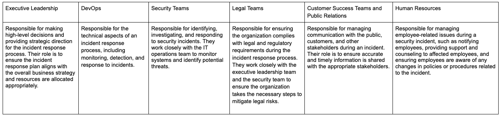

Incident response collaboration
===============================

Teams require collaboration to respond to incidents and outages quickly and effectively. This involves coordinating efforts between developers, operations, and customer support teams to identify and resolve issues, communicate with stakeholders, and implement preventive measures to avoid similar incidents in the future. 

In an incident response situation, various stakeholders can be involved, each with their own roles and responsibilities.

Incident reponse pains
----------------------

Collaborating in an incident response situation can be a challenging and stressful experience, and there are many different pains individuals and teams can come up against:

- Miscommunication or incomplete information can delay response times, cause confusion and misunderstandings, and ultimately prolong the incident.
- There may be a large number of tasks and activities to be completed during an incident, and it can be difficult to prioritize them effectively.
- Teams may have different perspectives on the incident, and there may be a lack of visibility into what is happening at different stages of the incident.
- In some organizations, different teams may be working in silos, which can result in a lack of coordination and a failure to share critical information.
- If teams are not adequately prepared for incident response, they may struggle to respond quickly and effectively, leading to longer recovery times, increased costs, and a greater impact on the company and its customers.
- Technical challenges such as compatibility issues, infrastructure problems, and cybersecurity threats can make collaboration difficult and impede the incident response process.
- The high-stress environment of incident response can lead to tensions between team members, resulting in a breakdown of collaboration and communication.

There are a variety of incident types that can arise within an organization and each requires a different set of procedures and tools. For example, some organizations have regulatory requirements to produce an audit of all activities performed during an incident. But, one aspect they all share is the need to collaborate effectively toward quick resolution along with the common goal of minimizing the impact on an organization's operations and reputation. 

Learn more
----------

Join us on `Mattermost Academy <https://academy.mattermost.com>`__ to enroll in the following incident response collaboration courses and learn how Mattermost can help you solve collaboration pains:

- `Service Outages Incident Management <https://academy.mattermost.com/p/service-outage-incident-management>`__ - Learn how technical teams use Mattermost to prepare for and address outages by detecting, analyzing, and responding to incidents that affect IT services or systems, such as system failures, network outages, and software bugs.
- `Cybersecurity Incident Management <https://academy.mattermost.com/p/cybersecurity-incident-management>`__ - Learn how technical teams use Mattermost to prepare for, detect, analyze, respond to, and reduce the impact of cybersecurity incidents on an organization's operations and assets.
- `Customer Escalation Management <https://academy.mattermost.com/p/customer-escalation-management>`__ - Learn how technical teams use Mattermost to build and retain customers by preparing for, collecting messages pertaining to, responding to, and creating followup improvements based on customer problems.