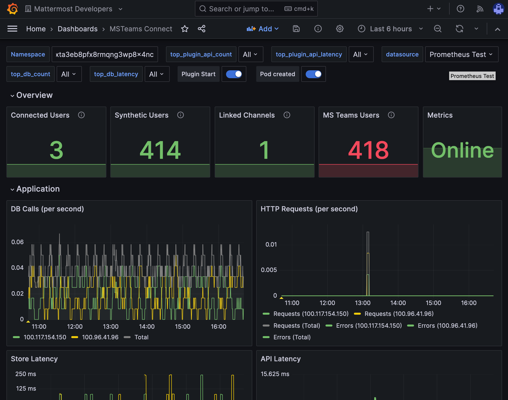

Install the Mattermost for Microsoft Teams plugin
=================================================

.. include:: ../_static/badges/ent-cloud-selfhosted.rst
  :start-after: :nosearch:

.. tip::

  Looking to :doc:`embed Mattermost within Microsoft Teams </about/embed-mattermost-app-within-microsoft-teams>` instead?

To install the :ref:`Microsoft Teams plugin <configure/plugins-configuration-settings:microsoft teams (beta)>` in Mattermost:

1. Log in to your Mattermost workspace as a system administrator.
2. Download the latest version of `the plugin binary release <https://github.com/mattermost/mattermost-plugin-msteams/releases>`__, compatible with Mattermost v8.0.1 and later. If you are using an earlier version of Mattermost, :doc:`follow our documentation </upgrade/upgrading-mattermost-server>` to upgrade to Mattermost v8.0.1 or later.
3. Go to **System Console > Plugins > Plugin Management > Upload Plugin**, and upload the plugin binary you downloaded in the previous step.
4. Go to **System Console > Plugins > Plugin Management**. In the **Installed Plugins** section, scroll to **MS Teams**, and select **Enable Plugin**.

Set up an OAuth application in Azure
-------------------------------------

Step 1: Create Mattermost App in Azure
~~~~~~~~~~~~~~~~~~~~~~~~~~~~~~~~~~~~~~~

1. Sign into `portal.azure.com <https://portal.azure.com>`__ using an admin Azure account.
2. Navigate to `App Registrations <https://portal.azure.com/#blade/Microsoft_AAD_IAM/ActiveDirectoryMenuBlade/RegisteredApps>`__.
3. Select **New registration** at the top of the page.

  .. image:: ../images/new-azure-registration.png
    :alt: In Azure, create a new app registration.

4. Fill out the form with the following values:

 - **Name**: ``Mattermost MS Teams``
 - **Supported account types**: ``Default value (Single tenant)``
 - **Platform**: ``Web``
 - **Redirect URI**: ``https://(MM_SITE_URL)/plugins/com.mattermost.msteams/oauth-redirect``

Replace ``(MM_SITE_URL)`` with your Mattermost server's Site URL. Select **Register** to submit the form.

  .. image:: ../images/register-azure-app.png
    :alt: In Azure, register the new Mattermost app.

5. Navigate to **Certificates & secrets** in the left pane.

6. Select **New client secret**. Enter the description and select **Add**. After the creation of the client secret, copy the new secret value, not the secret ID. We'll use this value later in the Mattermost System Console.

  .. image:: ../images/azure-certs-secrets.png
    :alt: In Azure, enter client secret details.

7. Navigate to **API permissions** in the left pane.

8. Select **Add a permission**, then **Microsoft Graph** in the right pane.

  .. image:: ../images/azure-configured-permissions.png
    :alt: In Azure, manage API permissions for the Mattermost app.

9. Select **Delegated permissions**, and scroll down to select the following permissions:

 - ``Channel.ReadBasic.All``
 - ``ChannelMessage.Read.All``
 - ``ChannelMessage.ReadWrite``
 - ``ChannelMessage.Send``
 - ``Chat.Create``
 - ``Chat.ReadWrite``
 - ``ChatMessage.Read``
 - ``Directory.Read.All``
 - ``Files.Read.All``
 - ``Files.ReadWrite.All``
 - ``offline_access``
 - ``Team.ReadBasic.All``
 - ``User.Read``

10. Select **Add permissions** to submit the form.

11. Next, add application permissions via **Add a permission > Microsoft Graph > Application permissions**.

12. Select the following permissions:

 - ``Channel.ReadBasic.All``
 - ``ChannelMessage.Read.All``
 - ``Chat.Read.All``
 - ``Files.Read.All``
 - ``Group.Read.All``
 - ``Team.ReadBasic.All``
 - ``User.Read.All``

13. Select **Add permissions** to submit the form.

14. Select **Grant admin consent for...** to grant the permissions for the application.

Step 2: Create a user account to act as a bot
~~~~~~~~~~~~~~~~~~~~~~~~~~~~~~~~~~~~~~~~~~~~~~

1. Create a regular user account. We will connect this account later from the Mattermost side.
2. This account is needed for creating messages on Microsoft Teams on behalf of users who are present in Mattermost but not on Microsoft Teams.
3. This account is also needed when users on Mattermost have not connected their accounts and some messages need to be posted on their behalf. See the screenshot below:

   .. image:: ../images/teams-user-as-bot.png
    :alt: In Microsoft Teams, create a user account to act as a bot.

.. note::
  
  After you've connected the bot user to the account on Microsoft Teams, all the messages that are posted from the account on Microsoft Teams won't be synchronized back to Mattermost since it's a "bot", and messages from bots are ignored.

Step 3: Ensure you have the metered APIs enabled (and the pay subscription associated to it)
~~~~~~~~~~~~~~~~~~~~~~~~~~~~~~~~~~~~~~~~~~~~~~~~~~~~~~~~~~~~~~~~~~~~~~~~~~~~~~~~~~~~~~~~~~~~

Follow the steps here: https://learn.microsoft.com/en-us/graph/metered-api-setup

.. important::

  If you don't configure the metered APIs, you must use the **Evaluation model** (configurable in Mattermost) that is limited to a low rate of changes per month. We strongly recommend that you avoid using the Evaluation model configuration in live production environments because you can stop receiving messages due the rate limit. See `this Microsoft documentation <https://learn.microsoft.com/en-us/graph/teams-licenses>`__ for more details.

You're all set for configuration inside Azure.

Configure how users will connect accounts
------------------------------------------

Mattermost admins can configure Mattermost to automatically prompt users to connect their Mattermost user account to their Microsoft Teams user account on login.

1. Go to **System Console > Plugins > MS Teams**.
2. Enable **Enforce connected accounts** to prompt users to connect if they haven't done so.
3. (Optional) Enable **Allow to temporarily skip connect user** to allow users to skip the connection prompt temporarily. Users are prompted on refresh and login.

Configure the plugin
--------------------

Additional configuration settings are available for this plugin. See the :ref:`Microsoft Teams plugin configuration settings <configure/plugins-configuration-settings:microsoft teams (beta)>` documentation for details.

Monitor plugin performance
--------------------------

You can set up :doc:`performance monitoring </scale/performance-monitoring>` and :doc:`performance alerting </scale/performance-alerting>` for this plugin using Prometheus and Grafana.

- Monitoring enables you to proactively review the overall health of the plugin, including database calls, HTTP requests, and API latency.
- Alerting enables you to detect and take action as issues come up, such as the integration being offline.

Grafana dashboards `are available on GitHub <https://github.com/mattermost/mattermost-plugin-msteams/blob/main/server/metrics/dashboards/cloud.json>`__ for Mattermost Cloud deployments as a useful starting point. These dashboards are designed for use in Mattermost Cloud, and filter to a given ``namespace``. 

.. note:: 
  
  Modifications will be necessary for self-hosted Mattermost deployments. See the `Get help <#get-help>`__ section below for details on how to contact us for assistance.

Get started with the plugin
---------------------------

See our :doc:`collaborate using the Microsoft Teams plugin </collaborate/collaborate-within-connected-microsoft-teams>` documentation for details on how to collaborate across both Mattermost and Microsoft Teams at the same time.

Trobleshooting FAQ
------------------

**Can I connect my Mattermost account to a Microsoft Teams account of a different email address?**

No. Currently, only accounts with the same email addresses are allowed to be connected. Specify the email address that matches your Mattermost account. 

If connecting a Mattermost account to a Microsoft Teams account with a different email address is something your workspace requires, there is an open `Github issue <https://github.com/mattermost/mattermost-plugin-msteams/issues/519>`__ for you to share your feedback.

Get help
--------

If you face issues while installing this plugin, gather relevant information, including reproduction steps to accelerate troubleshooting. You're welcome to open a new issue in the `Mattermost for Microsoft Teams GitHub repository <https://github.com/mattermost/mattermost-plugin-msteams/issues/new>`__.

- **Mattermost Commercial Customers (including Enterprise and Professional plans)**: Visit `Mattermost Support <https://mattermost.com/support/>`__ to `submit a support ticket <https://support.mattermost.com/hc/en-us/requests/new>`__.

- **Mattermost Team Edition and Free customers** Visit the Mattermost `peer-to-peer troubleshooting forum <https://forum.mattermost.com/c/trouble-shoot/16>`__ where you can access the global Mattermost Community for assistance.
