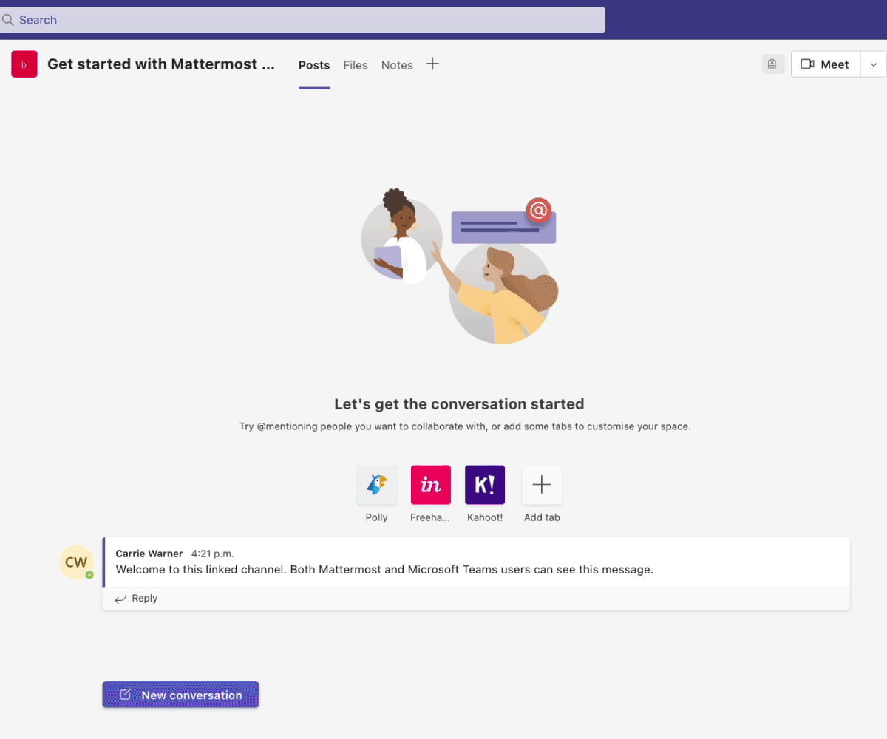

Mattermost for Microsoft Teams (Beta)
=====================================

.. include:: ../_static/badges/ent-cloud-selfhosted.rst
  :start-after: :nosearch:

The Mattermost for Microsoft Teams plugin enables you to collaborate with technical and operations teams seamlessly through the Mattermost app, without leaving Microsoft Teams. Two integrations are available: a `connected integration <#connect-mattermost-with-microsoft-teams>`__ and an `embedded integration <#embed-mattermost-within-mattermost-teams>`__.

.. include:: ../_static/badges/academy-msteams.rst
  :start-after: :nosearch:

See the following product documentation to install and use the Mattermost for Microsoft Teams integration:

Connect Mattermost with Microsoft Teams
---------------------------------------

A connected Mattermost integration with Microsoft Teams enables direct message, group message, and chat synchronization as well as the ability to link and synchronize channel-based collaboration.

Install this integration by visiting the :doc:`install the Mattermost for Microsoft Teams plugin </about/install-mattermost-for-microsoft-teams-plugin>` documentation.

Visit the :doc:`collaborate within a Microsoft Teams instance </collaborate/collaborate-within-connected-microsoft-teams>` to learn how to use this integration. 

Embed Mattermost within Mattermost Teams
----------------------------------------

Embedding a Mattermost instance within a Microsoft Teams workspace across desktop and web clients enables Central IT organizations to provide an extended customization experience for technical and operational teams while staying firmly integrated into the Microsoft 365 all-employee platform.

Embed Mattermost into Microsoft Teams by visiting the :doc:`embed Mattermost within Microsoft Teams </about/embed-mattermost-app-within-microsoft-teams>` documentation.

.. important::

    You must :doc:`install the Microsoft Teams plugin in Mattermost </about/install-mattermost-for-microsoft-teams-plugin>` before you can embed the Mattermost app within Microsoft Teams.

Visit the :doc:`collaborate in an embedded Microsoft Teams instance </collaborate/collaborate-within-embedded-microsoft-teams>` to learn how to use this integration.

Benefits of embedding Mattermost
~~~~~~~~~~~~~~~~~~~~~~~~~~~~~~~~

- **Improved reaction time in the event of an incident** by accessing alerting features in Mattermost directly from within Microsoft Teams.

  Mattermost is open-source and can be extensively customized to integrate with various system monitoring and alerting tools. If your tech team has set up unique alerting features in Mattermost, use the app to access these directly from within Teams, including system status updates, improving reaction time in the event of an incident.

- **Simplified workflows through a single interface** for communication and DevOps management.

  If your technical team uses specific DevOps tools (such as Jenkins, Jira, GitHub, etc.) that are tightly integrated with Mattermost, embedding Mattermost in Teams can give direct access to these integrated services. This simplifies workflows by providing a single interface for DevOps use cases.

- **Quickly run scripts within Microsoft Teams**.

  Mattermost supports the use of a CLI, which can be a major advantage for tech teams. If you need to run scripts or execute commands via Mattermost, embedding it within Teams allows you to use this functionality from either platform.

- **Embed custom functionality to accelerate technical workflows**.

  If your tech team has created custom bots and plugins that function with Mattermost, embedding it within Microsoft Teams will allow everyone to access these utilities. These may include custom bots for streamlining incident management, security operations and red/blue team workflows.