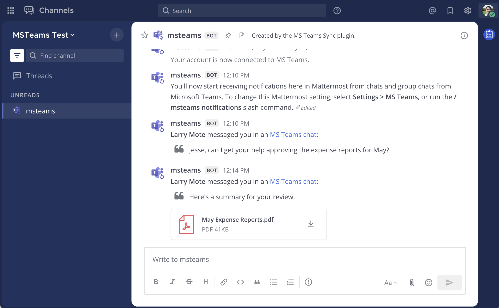

Mattermost for Microsoft Teams
==============================

.. include:: ../_static/badges/ent-cloud-selfhosted.rst
  :start-after: :nosearch:

The Mattermost for Microsoft Teams plugin enables you to break through siloes in a mixed Mattermost and Teams environment by forwarding real-time chat notifications from Teams to Mattermost.

.. include:: ../_static/badges/academy-msteams.rst
  :start-after: :nosearch:

Connect Mattermost with Microsoft Teams
---------------------------------------

Install this integration by visiting the :doc:`install the Mattermost for Microsoft Teams plugin </integrate/microsoft-teams-interoperability>` documentation.

Visit the :doc:`collaborate within a Microsoft Teams instance </collaborate/collaborate-within-connected-microsoft-teams>` to learn how to use this integration.

