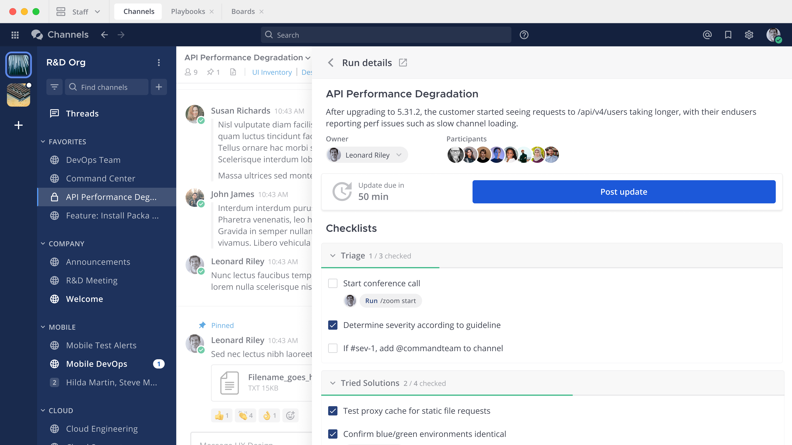

===================
Mattermost Overview
===================

**Mattermost** is an open source platform for secure communication, collaboration, and orchestration of work across teams and tools.

Mattermost is built specifically for software development and engineering use cases and integrates deeply with a rich ecosystem of third-party developer tools. Mattermost gives companies full control over their data; with self-hosted and private cloud deployment options and access to the source code, developers can contribute directly to a shared, flexible, and extensible platform built just for them.

We support key developer collaboration use cases:

 - **Agile software development** for developers who build and operate software to provide higher productivity. Technical features and deep integrations with the tools developers use support all phases of agile software development including planning, building, releasing, and operating.

 - **Developer workflow orchestration** for senior technical roles and Engineering/IT management in companies that consider software development mission-critical. We make their digital enterprise operations successful with advanced developer workflows and integration with mission-critical applications at scale.

 - **Incident resolution** for developer teams responding to time-critical incidents that provide faster time-to-resolution and less error-prone incident response with continuous process improvement.

 - **Secure collaboration** for InfoSec and CIO/CISO in companies that require the highest levels of security, privacy, compliance, and data control. We provide an on-premise, self-hosted collaboration solution that is fully secured, highly customizable, and managed internally with strict access controls, and integrates easily with in-house security/compliance frameworks that can’t be achieved with SaaS. 

The Mattermost platform
------------------------
Mattermost is an integrated platform of productivity tools that provides workflow orchestration and eliminates context switching between. Mattermost offers solutions incorporating channel-based communication, structured workflow execution, and project workflows. The platform provides a single secure deployment, shared user management, and a common user experience with a comprehensive toolset enabling enterprise-grade collaboration.

The platform is fully extensible by design, supporting a rich ecosystem of third-party applications and integrations. Mattermost is easily enhanced and customized using open APIs, developer frameworks, open-source customizations, and community-driven enhancements. Mattermost also supports 20 languages to meet the needs of global teams.   

Collaboration Workflows Addressed by Mattermost
-----------------------------------------------
The Mattermost platform integrates three primary tools that cover a wide range of collaboration use cases. Each tool focuses on a primary workflow and can be used seamlessly in combination for real-time collaboration and for processes and projects with durations ranging from days to months.  

Use Channels to stay connected and support your communication workflows
~~~~~~~~~~~~~~~~~~~~~~~~~~~~~~~~~~~~~~~~~~~~~~~~~~~~~~~~~~~~~~~~~~~~~~~

Channel-based communication workflows require real-time information sharing, flexibility, and ad hoc activities where the life cycle of communication workflows is typically measured in seconds to hours. 

`Channels <https://docs.mattermost.com/guides/channels.html>`__ enable you to organize your team’s real-time 1:1 and group communications with an unlimited and fully searchable message history. Share materials such as files, images, links; share sentiments with emojis and GIFs; and express ideas with rich markdown formatting, code syntax highlighting, and multi-language support. Facilitate face-to-face connections with integrated voice/video conferencing. Channels are ideal for bug triage, daily standups, posting announcements, and team conversations. 

.. image:: ../images/Channels_Hero.png

Use Playbooks to support your prescribed workflows and trust the process
~~~~~~~~~~~~~~~~~~~~~~~~~~~~~~~~~~~~~~~~~~~~~~~~~~~~~~~~~~~~~~~~~~~~~~~~

Structured workflows are specific scenarios and use cases that require a reliable and repeatable process. These use cases lend themselves well to shared checklists, automation, and retrospectives where the life cycle is measured in hours to weeks. Some examples include incident collaboration and software releases.

`Playbooks <https://docs.mattermost.com/guides/playbooks.html>`__ streamline complex, recurring processes that enable teams to achieve a specific and predictable outcome. Orchestrate prescribed workflows with built-in checklists, triggers, automation, tool integrations, and retrospectives. Increase stakeholder visibility with status updates and cumulative statistics. Customize a playbook to align with organizational practices, and adjust on the fly to respond quickly in highly dynamic situations. Playbooks are critical in incident collaboration to avoid and minimize costly business disruptions, and in software release processes to ship high-quality software on time. 

Use Boards to hit your milestones and support your project workflows
~~~~~~~~~~~~~~~~~~~~~~~~~~~~~~~~~~~~~~~~~~~~~~~~~~~~~~~~~~~~~~~~~~~~

Project workflows include use cases driving milestone achievement such as project planning, execution, and task management where teams require alignment on a shared set of tasks, milestones, and goals. Typical life cycles for project workflows are measured in weeks to months. Project workflows can include various scopes, from introducing a new product or feature to planning a team offsite.

`Boards <https://docs.mattermost.com/guides/boards.html>`__ is a deliverable and task management solution to help teams achieve project milestones using a familiar kanban board structure. Align work across the organization, and invest time and effort into what matters most. Stay on schedule with clearly defined tasks, owners, checklists, and deadlines. Increase transparency and keep all resources available including documents, images, and links. Additionally, boards are perfect for tracking tasks for sprints and features in roadmap planning.

.. image:: ../images/Boards_Hero.png

About the Mattermost Open-Source Project
-----------------------------------------
At its core, Mattermost is an open-source alternative to proprietary SaaS collaboration for teams. The software, developed in partnership with thousands of contributors from around the world, is designed to increase the agility, efficiency, and innovation in high trust organizations while keeping data and operations under IT control.

Core committers, including both community contributors and paid staff at Mattermost, Inc., determine the project roadmap. For enterprises with needs beyond the scope of the open-source project, commercial plans are available from Mattermost, Inc. Partnership with our core committer community, along with revenue from our commercial plans, which ensures the continued improvement of all editions.
