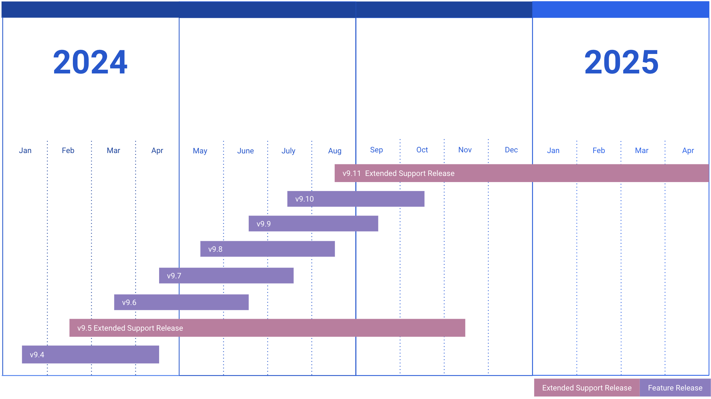

# Release policy

```{include} ../_static/badges/allplans-selfhosted.md
```

This page describes Mattermost’s release policy, and our recommended practices around releases, including extended support releases, so that you can allocate your IT resources effectively.

To ensure a secure, functional, performant, and efficient Mattermost deployment, system admins managing a self-hosted deployment need to be proactive in:
- monitoring Mattermost release cycles and planning upgrades before life cycles end,
- considering the use of [extended support releases](#extended-support-releases) for longer-term stability, and
- keeping both server and client applications updated.

(release-types)=
## Release types

Mattermost releases include feature, extended support, and major releases. Each release has a specified life cycle start and end date, and life cycles depend on the release type. 

- **Feature**: Feature releases contain new features and include high severity and high impact security backported to the previous 3 monthly releases. This is to ensure your organization's Mattermost deployment remains secure and stable. It's crucial to apply feature updates to maintain the security of your Mattermost deployment.
- **Extended**: Releases maintained for a longer period of time that receive backports for security fixes and major bug fixes for the length of their life cycle. Learn more about [Mattermost extended support releases](#extended-support-releases) below.
- **Major**: Annual mid-year releases that follow a release theme, and include multiple new features.

With multiple release types, you can plan the upgrade path that best suits your organization's needs and compliance requirements. Align your plan with your organization's IT strategy and risk management policies to ensure continuous operation without exposure to security vulnerabilities.

See the full list of all Mattermost Server and desktop app releases and life cycles.

(extended-support-releases)=
## Extended support releases

```{include} ../_static/badges/ent-only.md
```

Mattermost Extended Support Releases (ESRs) are a strategic choice for organizations looking for stability and reduced frequency of updates. Using ESRs can minimize disruptions associated with frequent upgrades, making them an attractive option for environments where stability is paramount. 

Mattermost [server](/about/mattermost-server-releases) and [desktop app](/about/mattermost-desktop-releases) ESRs are released twice a year, every February and August release. Extended releases are supported for 9 months to provide customers with enough time to test and upgrade to the next ESR.

We strongly recommend planning ahead for upgrades before the end of an ESR's life cycle to ensure continuity in receiving security updates.

ESRs don’t include changes to product functionality or new features. ESRs are intended for organizations who value stability over having the newest features and improvements, or who have a long internal testing and certification process to undergo when upgrading. Consider using ESRs for more stable and long-term deployments, especially in environments where frequent updates are challenging. If your organization prefers to have the newest features and improvements, Extended Support Releases may not be the best fit for you.

To install extended support releases, follow our [install](/guides/deployment) or [upgrade](/upgrade/upgrading-mattermost-server) documentation. To restore a previous ESR, restore the database and previous version if you need to revert an upgrade. Previous ESR versions continue remain subject to a [life cycle end date](/about/mattermost-server-releases).

```{Important}
- We strongly recommend reviewing [upgrade best practices](https://docs.mattermost.com/upgrade/prepare-to-upgrade-mattermost.html#upgrade-best-practices) for upgrading, and [important upgrade notes](/upgrade/important-upgrade-notes) for all the versions beyond the current ESR version you have currently installed. See the [Mattermost v9 changelog](/deploy/mattermost-v9-changelog) for a list of database, API, and `config.json` updates for all v9.x releases.
- Your license key is decoupled from the Mattermost server version, so you can upgrade to the latest ESR using a legacy E10/E20 license.
We highly recommend working with your Mattermost Account Team to plan for a migration to our new plans, and to access the latest features such as persistent notifications, advanced compliance features, call recordings, and more.
```



```{mermaid}

gantt
    dateFormat  YYYY-MM-DD
    axisFormat  %b
    
    section 2024
    v9.4                   :done,    2024-01-01, 2024-04-30
    v9.5 Extended Support  :crit,    2024-04-01, 2024-12-31
    v9.6                   :active,  2024-04-01, 2024-06-30
    v9.7                   :active,  2024-05-01, 2024-08-31
    v9.8                   :active,  2024-06-01, 2024-09-30
    v9.9                   :active,  2024-07-01, 2024-10-31
    v9.10                  :active,  2024-08-01, 2024-11-30
    v9.11 Extended Support :crit,    2024-09-01, 2025-04-30

    section 2025
    v9.11 Extended Support :crit,    2024-09-01, 2025-04-30
```

(esr-notifications)=
### ESR Notifications

```{include} ../_static/badges/ent-only.md
```

When an ESR is at the end of its life cycle, there will be announcements ahead of time to provide time for people to test, certify, and deploy a newer ESR version before support ends. After a release reaches its end-of-life, no further updates will be provided for that version. 

To receive updates about Extended Support Releases, sign up for [our mailing list](https://eepurl.com/dCKn2P).

For a new upcoming ESR, an email is sent out 3 months before the end of support for an ESR version. This email includes a note about the new ESR that was just published. A second email is sent out during the month when an ESR version is reaching the end of support.

For deprecated ESRs, an email announcement is sent 3 months in advance. We also add reminders on our release announcements, changelogs, important upgrade notes, and the [Mattermost Discussion Forums](https://forum.mattermost.com/) site.