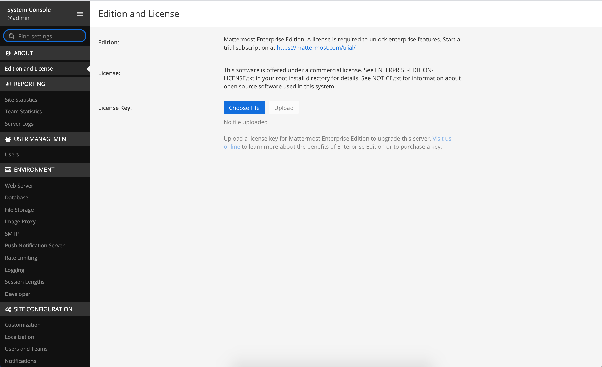
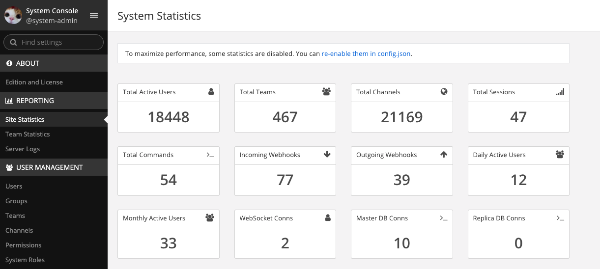

Self-Hosted Subscriptions
=========================

Purchase a subscription
-----------------------

Open the `Customer Portal page <https://customers.mattermost.com>`__. Enter the required information, and check the box to confirm **I have read and agree to the Privacy Policy**. Select **Next** and validate your email address to proceed with the steps below. 

If you have an existing Customer Portal account, you can log in with your previously created login credentials.  

Once you're logged in to the Customer Portal:

1. Choose a subscription, and enter the number of users in the **Order summary** field. This indicates the number of users you can have on this subscription's instance. For more information about how users are defined, see our `FAQ <https://mattermost.com/pricing-self-managed/#faq>`__.
2. (Optional for Enterprise subscriptions) You can add `Premier Support <https://mattermost.com/support/>`__, the cost of which is automatically added to your order total.
3. Select **Next Step**.
4. Enter your billing and payment information.
5. Accept the **Terms**.
6. Select **Complete**.
7. Choose **Download the license key**.

.. note::
   If you experience any problems with your transaction, please contact our Support Team via the form provided in the Customer Portal. If possible, keep the error message/number that you received on hand as it may assist with their investigation.

Once downloaded, your Mattermost license is ready to use and be applied via the Mattermost System Console.

System Admin access is required in order to apply the license. If you're not a Mattermost System Admin, contact your organization's Mattermost System Admin for assistance.

**If you already have Mattermost installed**

On the Customer Portal **Subscriptions** page, select **Download License** to download the license key for your subscription. In Mattermost, follow the steps provided in **System Console > About > Edition and License** to apply your license key.

You can also use the `mmctl <https://docs.mattermost.com/manage/mmctl-command-line-tool.html#mmctl-license>`__ to apply the license.

**If you don't have Mattermost installed**

If you haven't yet installed and deployed a Mattermost instance, visit the `Deployment Guide <https://docs.mattermost.com/deploy/deployment-overview.html>`__ to get started. For information on creating a System Admin account, visit our `Administrator Tasks <https://docs.mattermost.com/getting-started/admin-onboarding-tasks.html>`__ documentation.

View subscription information
-----------------------------

Self-hosted subscriptions purchased via the `Customer Portal <https://customers.mattermost.com>`__ are stored and listed in the Customer Portal.

Here you can view license details, including their start date, end date and licensed number of users, and have full access to your billing history, making it easier to manage purchases and renewal dates.

You can access your Customer Portal account to view information about your:

- Subscription purchases
- Licenses
- Customer Portal account password
- Organization information
- Payment methods
- Renewals
- Active users (available in a future release)

Subscription and licenses not purchased via the Customer Portal won't be listed.

Add more users to a subscription
--------------------------------

To add more users to your existing subscription, `contact us <https://mattermost.com/contact-us/>`__.

When you subscribe to an annual plan with Mattermost, you agree to provide quarterly reports of the actual number of registered users within your system if you are above the amount you subscribed in your purchase order. A registered user is a user who has an account in a workspace and does not show as *Inactive* in **System Console > User Management > Users**.

We will send you an email notice around the end of the quarter reminding you to send us your report.  To send this report, you can simply take a screenshot of **System Console > Site Statistics** and send in a reply email back to us.  Please ensure your screenshot is taken from the top of the page and includes the **Total Active Users** metric.  

If you have more total active users than what you purchased in your annual subscription, we will provide you with an invoice and an amendment to your purchase order for the new users added. The additional invoice will be pro-rated based on the number of months left in your subscription term, including the months for the calendar quarter for the time you pull the report. We will not provide downward adjustments. Mattermost will invoice based on Mattermost’s `current list prices <www.mattermost.com/pricing>`__ .  

Renew a subscription
--------------------

From Mattermost Server v5.32 and later, you can renew your self-hosted Mattermost subscription with a credit card if you have a standard Mattermost contract. When you renew your license, you can also increase the number of active users.

If you haven't upgraded to v5.32, you can contact Support (support@mattermost.com) to renew your license.

If you're a reseller, have a non-standard contract, or want to adjust the number of active users on your license during the license period, please contact sales@mattermost.com.

System Admins will be alerted 60 days prior to license expiry via a banner in Mattermost. Select **Renew license now** to start the renewal process in the Customer Portal. You can also dismiss the banner and renew your license at a later date via **System Console > Edition and License**.

When you select **Renew license now**, you're taken to the renewal page in the Customer Portal, which lists your license information and account details. This is pre-populated based on the email address associated with your existing license subscription.

**To process your license renewal**

1. Enter your **Account Details**, **Additional Contact**, and **Payment Details**.
2. Confirm the `Mattermost Edition <https://mattermost.com/pricing-self-managed>`_.

  * You can upgrade within the Customer Portal, but it's not possible to downgrade.

3. Confirm the listed number of active users is correct. 

 * You can increase the number of licensed users, but you can't decrease it.

4. Select **Complete purchase**. 

An email with the new license key and information on how to upload the license in the System Console will be sent to the email address provided.

You can watch a video overview of the renewal process on `YouTube <https://www.youtube.com/watch?v=Sz_1nhVufHY>`__.

.. raw:: html
  
   <iframe width="560" height="315" src="https://www.youtube.com/embed/Sz_1nhVufHY" frameborder="0" allow="autoplay; encrypted-media" allowfullscreen></iframe>

Frequently Asked Questions
~~~~~~~~~~~~~~~~~~~~~~~~~~

How do I renew my license subscription if I don't have internet access?
^^^^^^^^^^^^^^^^^^^^^^^^^^^^^^^^^^^^^^^^^^^^^^^^^^^^^^^^^^^^^^^^^^^^^^^

If you don't have access to the internet, please email support@mattermost.com for assistance.

Can I use the same license key on multiple self-hosted servers?
^^^^^^^^^^^^^^^^^^^^^^^^^^^^^^^^^^^^^^^^^^^^^^^^^^^^^^^^^^^^^^^

License keys for unlocking the advanced features in Mattermost can only be applied to a single deployment. A deployment consists of either a single Mattermost server or multiple linked Mattermost servers in a High Availability configuration with access to a single database.

Customers who are eligible to purchase the `Premier Support add-on <https://mattermost.com/support/>`__ are licensed to run with a single deployment of Mattermost license key in production and up to four non-production deployments of Mattermost (for example: development, staging, user acceptance testing, etc.)

Is my license available immediately?
^^^^^^^^^^^^^^^^^^^^^^^^^^^^^^^^^^^^

Yes, once your payment is successfully processed your license is available to download immediately.

How will I know when to renew my license?
^^^^^^^^^^^^^^^^^^^^^^^^^^^^^^^^^^^^^^^^^

You'll be notified 60 days prior to your license expiry that your license is due for renewal, via a blue banner displayed at the top of your Mattermost window. This banner is only visible to System Admins.

You can select **Renew license now** to begin the renewal process. You can also select the **x** to dismiss the notification. The notification is reactivated when your browser is refreshed or you reload the Mattermost Desktop App.

How long does it take to renew a license?
^^^^^^^^^^^^^^^^^^^^^^^^^^^^^^^^^^^^^^^^^

Once you’ve started the renewal process, we'll be in contact with you to confirm your order and send you the order form. There may be additional paperwork required. Once we have the signed order form and (if applicable) the necessary paperwork from you, we're able to process the renewal and issue your license key within 24 hours.

What happens to my license if I don't renew in time?
^^^^^^^^^^^^^^^^^^^^^^^^^^^^^^^^^^^^^^^^^^^^^^^^^^^^

If you don't renew within the 60-day renewal period, a 10-day grace period is provided for you to upload a new license key. During this period your Mattermost installation runs as normal, with full access to commercial features. During the grace period, the notification banner is not dismissable.

When the grace period expires, your Professional or Enterprise plan is downgraded to the Starter plan and other plan features are disabled.
 
What happens when my license expires?
^^^^^^^^^^^^^^^^^^^^^^^^^^^^^^^^^^^^^

If you don't renew your license within the 10-day grace period, your Mattermost version is automatically downgraded to Starter plan so you can still access and use Mattermost. However, subscription features will no longer be available, and if you are currently using them, the functionality will no longer be accessible.

When you renew, the subscription features will become available with the previous configuration (provided no action such as user migration has been taken).

Why can't I dismiss the expiry notification banner?
^^^^^^^^^^^^^^^^^^^^^^^^^^^^^^^^^^^^^^^^^^^^^^^^^^^

If there's a red expiry announcement banner stating: "Enterprise license is expired and some features may be disabled. Please contact your System Administrator for details." it means your grace period has expired. This announcement banner persists until the license is renewed, and is visible to all users.

Once a new license is applied, the banner will no longer be visible.

If you don't plan to renew your subscription, revoke the expired license in **System Console > Edition and License**.

Can other members of my organization use the Customer Portal account to manage our subscription?
^^^^^^^^^^^^^^^^^^^^^^^^^^^^^^^^^^^^^^^^^^^^^^^^^^^^^^^^^^^^^^^^^^^^^^^^^^^^^^^^^^^^^^^^^^^^^^^

We currently support a single account/user per organization. The ability to add multiple users per organization will be available in a future release.

Where can I find the license agreement for Mattermost Enterprise Edition?
^^^^^^^^^^^^^^^^^^^^^^^^^^^^^^^^^^^^^^^^^^^^^^^^^^^^^^^^^^^^^^^^^^^^^^^^^^

Mattermost Enterprise Edition is the name for the binary of the Mattermost self-hosted Professional and Enterprise editions. This edition can be used for free without a license key as commercial software functionally equivalent to the open source Mattermost Team Edition licensed under MIT. When a license key is purchased and applied to Mattermost Enterprise Edition, additional features unlock. The license agreement for Mattermost Enterprise Edition is included in the software and also available `here <https://mattermost.com/enterprise-edition-license/>`__.

How do I delete my Customer Portal account?
^^^^^^^^^^^^^^^^^^^^^^^^^^^^^^^^^^^^^^^^^^^

Please contact Mattermost Support for assistance with deleting your Customer Portal account.

What happens to my license when I delete my account?
^^^^^^^^^^^^^^^^^^^^^^^^^^^^^^^^^^^^^^^^^^^^^^^^^^^^

When an account is deleted, the license remains valid. When the license is close to expiring, you'll need to create a new profile in order to purchase a new license.
