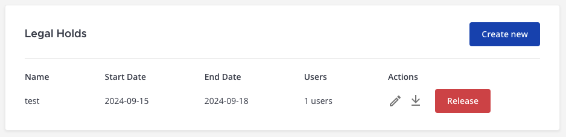
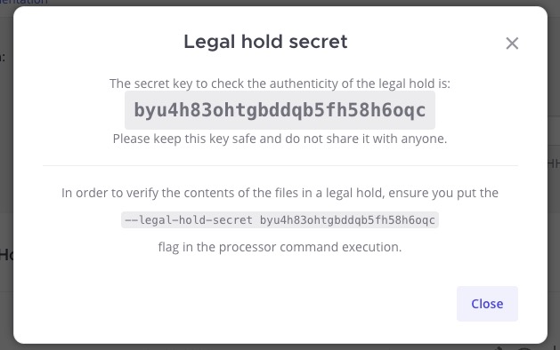

Legal Hold
===========

.. include:: ../../_static/badges/ent-plus.rst
  :start-after: :nosearch:

A Legal Hold, also known as a litigation hold, is a process that an organization uses to preserve all forms of relevant information when litigation is reasonably anticipated. It's a requirement established by the Federal Rules of Civil Procedure (FRCP) in the United States and similar laws in other jurisdictions.

Primary use cases include:

1. **Litigation**: In anticipation or in the event of a lawsuit, organizations need to preserve all relevant documents and electronic data to ensure they can adequately defend their position. A failure to do so could result in court penalties.
2. **Regulatory investigation**: If an organization is being investigated by a regulatory body, it may be required to preserve and produce certain documents or data.
3. **Audits**: During an audit, whether internal or external, an organization might need to put a hold on certain data that is relevant to the audit.
4. **Records management**: In some cases, organizations might use a Legal Hold to temporarily suspend the deletion of data that would otherwise be purged as part of its records management policy.

Mattermost is used as a secure collaboration hub by technical and operational teams, with critical documents and data shared on a daily basis. Thus, Legal Hold is a key requirement for Enterprises and public sector organizations who have deployed Mattermost for their teams, to meet compliance & auditory requirements while minimizing risk.

Mattermost Legal Hold can be combined with :doc:`eDiscovery </administration-guide/comply/electronic-discovery>` integration and :doc:`data retention policies </administration-guide/comply/data-retention-policy>` to customize the data retained and deleted to comply with compliance requirements.

Legal Hold demo (Sneak Peek)
----------------------------

Check out this `YouTube sneak peek demo <https://www.youtube.com/watch?v=86c8NoOxlQw&feature=youtu.be>`_ to learn about Mattermost's Legal Hold workflow.

.. raw:: html
  
   <iframe width="560" height="315" src="https://www.youtube.com/embed/86c8NoOxlQw" alt="Mattermost Legal Hold workflow" frameborder="0" allow="autoplay; encrypted-media" allowfullscreen></iframe>

Below are step-by-step instructions on how to carry out a Legal Hold for Mattermost using the Mattermost Legal Hold plugin.

How to carry out a Legal Hold
-----------------------------

Step 1: Upgrade to Mattermost Enterprise
~~~~~~~~~~~~~~~~~~~~~~~~~~~~~~~~~~~~~~~~~

Legal Hold is available in :ref:`Mattermost Enterprise <product-overview/editions-and-offerings:mattermost enterprise edition>`. Learn more about the Enterprise plan & request a quote online at https://mattermost.com/pricing/

Step 2: Establish a Legal Hold policy
~~~~~~~~~~~~~~~~~~~~~~~~~~~~~~~~~~~~~

Establish a policy for when to implement a Legal Hold. This should be developed in consultation with your legal counsel and should include procedures for identifying relevant users (those who have potentially relevant information).

Establishing a Legal Hold policy first enables you to configure the Mattermost system correctly to meet your compliance & auditory requirements, minimizing associated risk.

Step 3: Set up the Mattermost Legal Hold plugin
~~~~~~~~~~~~~~~~~~~~~~~~~~~~~~~~~~~~~~~~~~~~~~~~

Install the plugin
^^^^^^^^^^^^^^^^^^

1. Log in to your Mattermost :doc:`workspace </end-user-guide/end-user-guide-index>` as a system administrator.
2. Download the latest version of the `plugin binary release <https://github.com/mattermost/mattermost-plugin-legal-hold/releases/>`_, compatible with Mattermost v8.0.1 and later. If you are using an earlier version of Mattermost, :doc:`follow our documentation </administration-guide/upgrade/upgrading-mattermost-server>` to upgrade to Mattermost v8.0.1 or later.
3. Go to **System Console > Plugins > Plugin Management > Upload Plugin**, and upload the plugin binary you downloaded in the previous step.
4. In the **Installed Plugins** section, scroll to **Legal Hold Plugin**, and select **Enable**.

Configure the plugin
^^^^^^^^^^^^^^^^^^^^^

When the Legal Hold integration is enabled, you can configure when it runs using the format ``HH:MM ±HHMM`` and ``+0000`` for UTC. 

You can configure a custom Amazon S3 bucket for Legal Holds by specifying Amazon S3 configuration settings. If no S3 configuration is specified, the  Mattermost server file store used. Learn more about file storage configuration options in our :ref:`product documentation <administration-guide/configure/environment-configuration-settings:file storage>`.

(Optional) Configure a data retention policy
^^^^^^^^^^^^^^^^^^^^^^^^^^^^^^^^^^^^^^^^^^^^^

You can optionally configure a :doc:`data retention policy </administration-guide/comply/data-retention-policy>` to control how long data and file attachments are retained in the Mattermost database.

Step 4: Create a Legal Hold
~~~~~~~~~~~~~~~~~~~~~~~~~~~~

In Mattermost, create a Legal Hold by completing the following steps:

1. Go to **System Console > Plugins > Legal Hold Plugin**, and select **Create new**.
2. Enter a name for the Legal Hold.
3. Specify the user names or user groups of users you want to place on Legal Hold.
4. (Optional) Public channels are excluded by default. You can choose to include public channels that the specified users or user groups are members of, if preferred; however, doing so will significantly increase the amount of data held based on the number public channels available.
5. Specify the number of days that users are placed in Legal Hold with a start date. An end date is optional.
6. Select **Create Legal Hold**. `Downloadable data <#download-legal-hold-data>`__ won't be available until the next scheduled job runs.

Manage Legal Holds
^^^^^^^^^^^^^^^^^^

While a Legal Hold is in place, you can edit details of the Legal Hold, access the Legal Hold Secret, as well as download a copy of the preserved data to your local machine.

Edit a Legal Hold
::::::::::::::::::

Select the **Edit** |edit-on-github| icon to change the name of the Legal Hold, add or remove users, change the end date, as well as include or exclude public channels.

Access a Legal Hold secret
:::::::::::::::::::::::::::

A Legal Hold secret enables you to verify the authenticity of the data for a Legal Hold in Mattermost.

Select the **Show** |preview-icon| icon to display the Legal Hold secret key. Keep a copy of this key in a secure location.

To verfiy the contents of the files in this Legal Hold, you must append the processor command with the following flag: ``--legal-hold-secret <KEY>``. The output verifies the file and returns the authenticity state of files along with the rest of the output for the processor, as follows:

Success:

.. code-block:: text

  Secret key was provided, verifying legal holds...
  - Verifying Legal Hold *processor9*: Verified

Error:

.. code-block:: text

  ...
  Secret key was provided, verifying legal holds...
  - Verifying Legal Hold *processor9*: [Error] hash mismatch for file: legal_hold/processor9_i7k1dbkipiyojeess6ozi4agyr/index.json
  ...

Download Legal Hold data
:::::::::::::::::::::::::

Select the **Download** |download-icon| icon to download a copy of the preserved data to a location on your local machine. Note, no data will be available to download until at least one scheduled job is completed. This may take up to 24 hours.

Step 5: Release a Legal Hold
~~~~~~~~~~~~~~~~~~~~~~~~~~~~~

Once the Legal Hold has completed, release it to take users off of the Legal Hold by selecting the **Release** option to the right of the Legal Hold task. 

.. important::

  Once a Legal Hold is released, all data is irretrievably deleted from Mattermost and can't be recovered.

Frequently asked questions
---------------------------

Who can implement Legal Hold?
~~~~~~~~~~~~~~~~~~~~~~~~~~~~~

Only Mattermost system admins can implement a Legal Hold.

Does a user know if they're placed under a Legal Hold in Mattermost?
~~~~~~~~~~~~~~~~~~~~~~~~~~~~~~~~~~~~~~~~~~~~~~~~~~~~~~~~~~~~~~~~~~~~

No, users won't be notified if they're placed under a Legal Hold, and no reference to Legal Holds will be visible in their Mattermost client or accessible via the Mattermost API. This allows for investigations to be conducted without influencing user behavior and without conflicts of interest.

What types of content does Legal Hold cover?
~~~~~~~~~~~~~~~~~~~~~~~~~~~~~~~~~~~~~~~~~~~~

The Legal Hold covers all messages and file uploads shared in conversations where the Legal Hold is active, including messages posted by plugins, bots or webhooks. This includes messages or files shared in public channels, private channels, direct messages and group messages.

However, Legal Hold does not apply to reactions, collaborative playbooks, or audio calls.

Can users delete their messages while on a Legal Hold?
~~~~~~~~~~~~~~~~~~~~~~~~~~~~~~~~~~~~~~~~~~~~~~~~~~~~~~

Yes, users can delete messages, but they are retained for the purposes of Legal Hold when implemented with the aforementioned steps.

Can a Legal Hold be applied retroactively to collect past data?
~~~~~~~~~~~~~~~~~~~~~~~~~~~~~~~~~~~~~~~~~~~~~~~~~~~~~~~~~~~~~~~

Yes, but this is only guaranteed for existing and future messages/files once Legal Hold is activated. It won't recover messages or files that were deleted before the Legal Hold was activated.

Is Legal Hold the same as e-discovery?
~~~~~~~~~~~~~~~~~~~~~~~~~~~~~~~~~~~~~~

No. While they serve a related use case, they are not the same.

Legal Hold is an initial step to ensure relevant electronically stored information (ESI) is preserved. On the other hand, e-discovery is a multi-step process that uses this preserved data to identify, collect, preserve, process, review, and produce ESI in the context of a legal or investigative process.

How do I enable e-discovery for Mattermost?
~~~~~~~~~~~~~~~~~~~~~~~~~~~~~~~~~~~~~~~~~~~

Learn more about extracting data for e-discovery in our :doc:`product documentation </administration-guide/comply/electronic-discovery>`.

How do I manage storage costs and version retention in S3?
~~~~~~~~~~~~~~~~~~~~~~~~~~~~~~~~~~~~~~~~~~~~~~~~~~~~~~~~~~

If you plan to use an existing S3 bucket for Legal Hold data storage, and your existing S3 bucket has versioning enabled, we strongly recommend using a dedicated S3 bucket with versioning disabled. 

The Legal Hold plugin frequently modifies files in the ``legalhold`` directory, and when S3 bucket versioning is enabled, each modification creates a new version. This can result in a rapid accumulation of object versions, increased storage costs, potential performance impact, higher S3 API usage, and complicating version management over time. See the `S3 Lifecycle Rules <https://docs.aws.amazon.com/AmazonS3/latest/dev/object-lifecycle-mgmt.html>`_ documentation for additional details.

How to view the downloaded Legal Hold zip file
~~~~~~~~~~~~~~~~~~~~~~~~~~~~~~~~~~~~~~~~~~~~~~~

To make use of the Legal Hold data, you use the `processor tool <https://github.com/mattermost/mattermost-plugin-legal-hold/releases#:~:text=processor%2Dv1.0.2%2Ddarwin%2Damd64>`_ available on the Mattermost GitHub repository. This will output a self-contained HTML site you can open with your browser.

**Download and setup the processor tool:**

1. Download the appropriate processor binary for your platform from the `GitHub releases page <https://github.com/mattermost/mattermost-plugin-legal-hold/releases>`_.
2. On macOS and Linux, make the processor executable:

.. code-block:: bash

   $ chmod +x processor-vX.X.X-<platform>   # Replace with the actual filename you downloaded

**Usage:**

.. code-block:: bash

   $ ./processor --legal-hold-data ./legalholddata.zip --output-path ./path/to/where/you/want/the/html/output --legal-hold-secret "your secret"

**Arguments:**

- ``--legal-hold-data``: Path to the Legal Hold zip file downloaded from Mattermost
- ``--output-path``: Directory where the HTML output will be generated
- ``--legal-hold-secret``: (Optional) Used as a security measure for an operator to ensure the authenticity of a downloaded zip file. The operator can copy the key corresponding to a particular "hold" from the Legal Hold Plugin settings page in the System Console by selecting the **Show** |preview-icon| icon next to the Legal Hold entry.

Is data gathered when a channel has been archived?
~~~~~~~~~~~~~~~~~~~~~~~~~~~~~~~~~~~~~~~~~~~~~~~~~~~

Yes. Filtering isn't done based on archive or deleted status. However, archived channels can be permanently deleted based on Data Retention settings, at which point they will no longer appear in legal hold reports.

Is data gathered when a user was a member of a channel for a period of time but has since left the channel?
~~~~~~~~~~~~~~~~~~~~~~~~~~~~~~~~~~~~~~~~~~~~~~~~~~~~~~~~~~~~~~~~~~~~~~~~~~~~~~~~~~~~~~~~~~~~~~~~~~~~~~~~~~~~

Yes. Channels are included when a target user was a member at any time during the legal hold start and end dates.

Is data gathered from a direct message or group message with a user who has since been deactivated?
~~~~~~~~~~~~~~~~~~~~~~~~~~~~~~~~~~~~~~~~~~~~~~~~~~~~~~~~~~~~~~~~~~~~~~~~~~~~~~~~~~~~~~~~~~~~~~~~~~~~

Yes. Filtering isn't done based on user deactivation state.

Is data collected from group messages?
~~~~~~~~~~~~~~~~~~~~~~~~~~~~~~~~~~~~~~~

Yes. Data is collected from group messages like any public or private channel or direct message.
