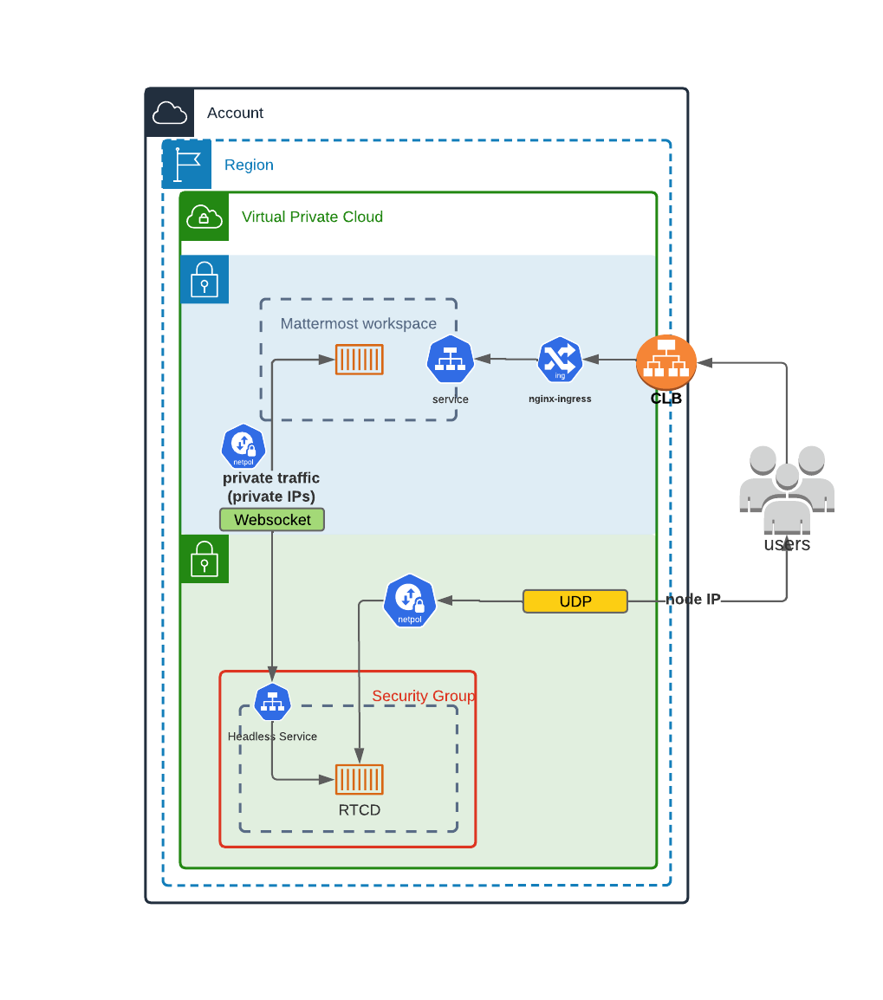

# Calls Deployment on Kubernetes

```{include} ../../_static/badges/all-commercial.md
```

This guide provides detailed information for deploying Mattermost Calls on Kubernetes environments.

## Overview

Mattermost Calls has been designed to integrate well with Kubernetes to offer improved scalability and control over the deployment. For Kubernetes deployments, the RTCD service is strongly recommended and is the only officially supported approach.

## Architecture



This diagram shows how the RTCD standalone service can be deployed in a Kubernetes cluster. In this architecture:

1. Calls traffic is handled by dedicated RTCD pods
2. RTCD services are exposed through load balancers
3. Scaling is managed through Kubernetes deployment configurations
4. Call recording and transcription is handled by the calls-offloader service (see [Calls Offloader Setup and Configuration](calls-offloader-setup.md))

If Mattermost isn't already deployed in your Kubernetes cluster and you want to use this deployment type, visit the [Kubernetes operator guide](/install/mattermost-kubernetes-operator.md).

## Helm Chart Deployment

The recommended way to deploy Calls-related components in a Kubernetes environment is to use the officially provided Helm charts:

### RTCD Helm Chart

The RTCD Helm chart deploys the RTCD service needed for call media handling:

```bash
helm repo add mattermost https://helm.mattermost.com
helm repo update

helm install mattermost-rtcd mattermost/mattermost-rtcd \
  --set service.annotations."service\\.beta\\.kubernetes\\.io/aws-load-balancer-backend-protocol"=udp
```

For complete configuration options, see the [RTCD Helm chart documentation](https://github.com/mattermost/mattermost-helm/tree/master/charts/mattermost-rtcd).

### Calls-Offloader Helm Chart

If you need call recording and transcription capabilities, deploy the calls-offloader service:

```bash
helm install mattermost-calls-offloader mattermost/mattermost-calls-offloader \
  --set ingress.enabled=true \
  --set ingress.host=calls-offloader.example.com
```

For complete configuration options, see the [Calls-Offloader Helm chart documentation](https://github.com/mattermost/mattermost-helm/tree/master/charts/mattermost-calls-offloader).

## Kubernetes-Specific Configuration

### Network Configuration

For Kubernetes deployments, you need to ensure specific connectivity paths:

1. **Client to RTCD connectivity**: UDP and TCP traffic on port 8443 is properly routed from clients to RTCD pods (for media, with TCP acting as a fallback).
2. **Mattermost to RTCD API connectivity**: There needs to be a clear connectivity path between Mattermost and RTCD on the API port (TCP 8045)
3. **Load balancer configuration**: Load balancers must be properly configured to handle UDP and TCP traffic routing to RTCD pods
4. **Network policies**: Network policies must allow the required communications between Mattermost and RTCD services

### Resource Requirements

Resource requirements for RTCD pods depend heavily on the expected call volume, participant count, and whether screen sharing is used. 

We strongly recommend reviewing the [Performance Baselines](calls-metrics-monitoring.md#performance-baselines) to determine the appropriate CPU, memory, and network requests and limits for your specific deployment needs rather than relying on generic defaults.

### Scaling Considerations

Horizontal scaling of RTCD pods is possible, but remember:

1. Each call is hosted entirely on a single RTCD pod
2. DNS-based load balancing should be used to distribute calls among pods
3. Health checks should ensure that only healthy pods receive new calls
4. Calls remain on their assigned pod for their entire duration

### Limitations

Due to the inherent complexities of hosting a WebRTC service, some limitations apply when deploying Calls in a Kubernetes environment.

One key requirement is that each `rtcd` process must live in a dedicated Kubernetes node. This is necessary to forward the data correctly while allowing for horizontal scaling. Data should generally direct directly to the pod running the `rtcd` process, as routing this traffic through a standard ingress is not recommended for RTCD deployments.

The general recommendation is to expose one external IP address per `rtcd` instance (Kubernetes node). This makes it simpler to scale as the application is able to detect its own external address (through STUN) and advertise it to clients to achieve connectivity with minimal configuration.


## Monitoring and Metrics

For detailed information on metrics collection and monitoring, see the [Calls Metrics and Monitoring](calls-metrics-monitoring.md) guide.

## Troubleshooting

For Kubernetes-specific troubleshooting:

1. Check pod logs: `kubectl logs -f deployment/mattermost-rtcd`
2. Verify service connectivity: `kubectl port-forward service/mattermost-rtcd 8045:8045`
3. Ensure UDP and TCP traffic is properly routed through your load balancer
4. Verify network policies allow required communication paths

For detailed troubleshooting steps, see the [Calls Troubleshooting](calls-troubleshooting.md) guide.

## Other Calls Documentation

- [Calls Overview](calls-deployment.md): Overview of deployment options and architecture
- [RTCD Setup and Configuration](calls-rtcd-setup.md): Comprehensive guide for setting up the dedicated RTCD service
- [Calls Offloader Setup and Configuration](calls-offloader-setup.md): Setup guide for call recording and transcription
- [Calls Metrics and Monitoring](calls-metrics-monitoring.md): Guide to monitoring Calls performance using metrics and observability
- [Calls Troubleshooting](calls-troubleshooting.md): Detailed troubleshooting steps and debugging techniques
3. If you encounter issues, see [Calls Troubleshooting](calls-troubleshooting.md)