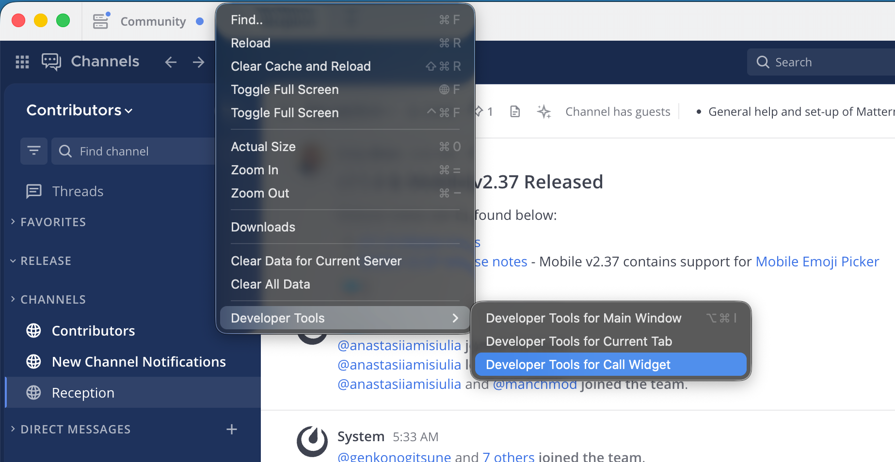

# Troubleshooting Mattermost Calls

```{include} ../../_static/badges/all-commercial.md
```

When troubleshooting Mattermost Calls, gathering the appropriate log files for analysis is critical. The required logs include:

## RTCD logs

The location of the RTCD log file is determined by the settings in your RTCD `config.toml` file. If you are running Calls using the integrated RTCD, these logs are included within the standard Mattermost server logs.

## Client logs

You can retrieve basic client logs by running the `/call logs` slash command to output the log for the most recent call. However, capturing the JavaScript console logs is often more helpful. The method for capturing these logs depends on your client:

- **Desktop App:** While a call is in progress, navigate to **View > Developer Tools > Developer Tools for Call Widget**. Next to the **Filter** field, select **Verbose** from the log level drop-down menu to view the debug output. To save the log, right-click within the console and select **Save as...**.



- **Chrome browser:** Select the **More menu** (three vertical dots) next to the address bar, then go to **More Tools > Developer Tools**. Select the **Console** tab to view the output. Next to the **Filter** field, select **Verbose** from the log level drop-down menu to view the debug output. To save the log, right-click within the console and select **Save as...**.

## Client statistics

You can gather client call statistics by running the `/call stats` slash command. While you can run this command during an active call, it is best to run it immediately after a call concludes. This command provides valuable information regarding the negotiated connection between the client and RTCD, as well as statistics on media packets sent and lost.

## Mattermost server logs

The Mattermost server logs often contain entries related to the Calls plugin. If you are using an external RTCD instance, these logs are generally less critical than the RTCD and client logs.

```{note}
Interpreting RTCD and client logs can be challenging, as the Interactive Connectivity Establishment (ICE) negotiation during call setup often logs expected and benign failure or error messages. We strongly recommend providing the complete set of logs to Mattermost Support for analysis.
```