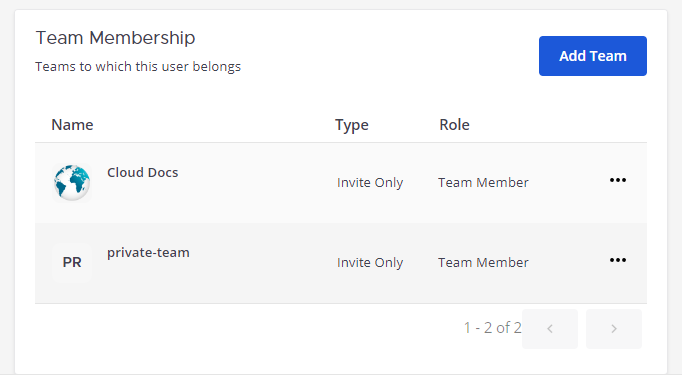
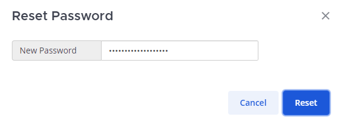
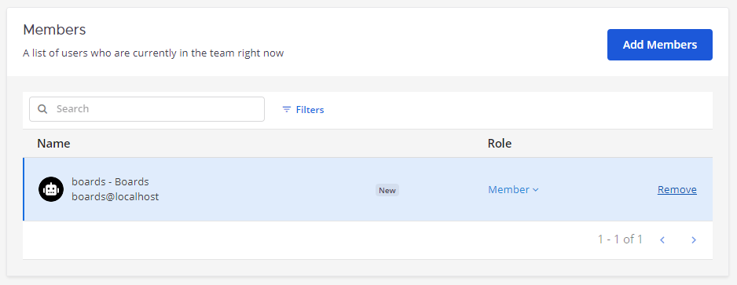

User management configuration settings
======================================

.. include:: ../../_static/badges/all-commercial.rst
  :start-after: :nosearch:

Review and manage the following in the System Console by selecting the **Product** |product-list| menu, selecting **System Console**, and then selecting **User Management**:

- `Users <#users>`__
- `Groups <#groups>`__
- `Teams <#teams>`__
- `Channels <#channels>`__
- `Permissions <#permissions>`__
- `System roles <#system-roles>`__

----

Users
-----

Mattermost system admins can provision and manage user accounts, team membership, roles and permissions, and update user email addresses.

Provision users
~~~~~~~~~~~~~~~

Getting people set up with a Mattermost account is typically something that system admins do when deploying and configuring the Mattermost deployment. A Mattermost admin can :doc:`provision Mattermost users </administration-guide/onboard/user-provisioning-workflows>` using one or more of the following methods:

- :ref:`Enable account creation <administration-guide/configure/authentication-configuration-settings:enable account creation>`.
- Use :ref:`mmctl user create <administration-guide/manage/mmctl-command-line-tool:mmctl user create>` or Mattermost `APIs <https://api.mattermost.com/#tag/users>`__ to create user accounts.
- :ref:`Migrate user accounts <administration-guide/onboard/migrating-to-mattermost:migration guide>` from other collaboration systems and :doc:`bulk load </administration-guide/onboard/bulk-loading-data>` that user data into Mattermost.
- Connect an authentication service to assist with user provisioning, such as :doc:`AD/LDAP authentication </administration-guide/onboard/ad-ldap>` or :doc:`SAML authentication </administration-guide/onboard/sso-saml>`.

Review user data
~~~~~~~~~~~~~~~~

From Mattermost v9.6, you can review the following user data in the System Console:

- **Email**: The user's email address.
- **Member since**: The number of days since the user joined the Mattermost server.
- **Last login**: The date of the user's last successful login to the server.
- **Last activity**: The total number of days since the user was last active on the server, which is typically based on the :ref:`user's availability <end-user-guide/preferences/set-your-status-availability:set your availability>`.
- **Last post**: The total number of days since the user's last sent message on the server.
- **Days active**: (PostgreSQL only) The total number of days in which the user has sent a message in Mattermost.
- **Messages posted**: (PostgreSQL only) The total number of messages the user has sent on the server.

From Mattermost v11.0, you can also review the following authentication data for each user:

- **Authentication Method**: Shows how users authenticate with the Mattermost server, including external authentication system details such as LDAP Distinguished Name (DN), SAML NameID, OAuth ID, or other external authentication identifiers. This information helps system administrators troubleshoot authentication issues and correlate Mattermost users with their external authentication systems.

By default, you see all columns of data and data for all time. 

- Show or hide data all data columns exccept **User details** and **Actions**, as preferred.
- Filter results to the last 30 days, the previous month, and the last 6 months for **Last post**, **Days active**, and **Messages posted** user data.

Find users
~~~~~~~~~~

Find a user using the System Console.

1. Go to **System Console > User Management > Users** to access all user accounts.
2. Search for specific users by entering a partial or full username, user ID, first name, last name, or email address in the **Search** field and pressing :kbd:`Enter`.

.. image:: ../../images/find-users.png
  :alt: Find a Mattermost user using the System Console.

Filter user searches
~~~~~~~~~~~~~~~~~~~~

Filter System Console user searches to narrow down results based on the team membership, role, and user status.

1. Go to **System Console > User Management > Users** to access all user accounts.
2. Select **Filters** located to the right of the **Search users** field to access available filter options.
3. Select **Apply** to filter user search results.

.. image:: ../../images/user-search-filters.png
  :alt: Filter the user list based on team membership, role, and user status using the System Console.

Identify a user's ID
~~~~~~~~~~~~~~~~~~~~

Users can be specified in Mattermost by username or user ID. Usernames automatically resolve when a match is detected.
Identify a user's ID using the System Console, the Mattermost API, or mmctl.

1. Go to **System Console > User Management > Users** to access all user accounts. 
2. Select a **User** to review their ID in the User Configuration page. 

.. image:: ../../images/user-id.png
  :alt: Find the User ID under User Management using the System Console.

Alternatively, identify a user's ID using the Mattermost API or mmctl:

- Using the Mattermost API, make an HTTP GET request to the following endpoint: ``https://your-mattermost-url/api/v4/users/username/username_here``. Replace ``your-mattermost-url`` with the URL of your Mattermost instance and ``username_here`` with the username you are looking for. The API response contains a JSON object that includes the user's ID among other details.
- Using mmctl, in a terminal window, use the following command to list all users and their IDs: ``mmctl user list`` to return a list of user IDs.

Export user data
~~~~~~~~~~~~~~~~~

From Mattermost v9.6, Mattermost Enterprise and Professional customers can export user data as a CSV report. 

1. Go to **System Console > User Management > Users** to access all user accounts.
2. `Filter <#filter-user-searches>`__ the user data as needed.
3. Select **Export** located in the top right corner of the System Console interface, and then select **Export data**. You'll receive the report in CSV format as a direct message in Mattermost.

.. config:setting:: deactivate-users
  :displayname: Deactivate users
  :systemconsole: Site Configuration > Users and Teams
  :configjson: N/A
  :environment: N/A

Deactivate users
~~~~~~~~~~~~~~~~~

To delete a user from your Mattermost deployment, you can deactivate the user's account. Deactivated users have an deactivated status, are logged out of Mattermost as soon as they are deactivated, and deactivated users can no longer log back in. You can manage the user's role, password, and email address while a user's account is deactivated.

.. note::

  - From Mattermost v10.10, when a user account is deactivated, the account's :ref:`availability <end-user-guide/preferences/set-your-status-availability:set your availability>` is automatically set to offline.
  - LDAP-managed users must be deactivated through LDAP, and can't be deactivated using the System Console or the API.

1. Go to **System Console > User Management > Users** to access all user accounts.
2. Select a **User** that you wish to activate or deactivate.
3. If the selected user is currently active, you can find the **Deactivate** button in the **User Configuration** page.
4. Select **Deactivate**, and confirm the deactivation. You can re-activate a deactivated user by selecting **Activate**.

.. image:: ../../images/deactivate-user.png
  :alt: Deactivate a user in Mattermost using the System Console.

.. tip::

  Re-activate a deactivated user by selecting **Activate**.

What happens to deactivated user integrations?
^^^^^^^^^^^^^^^^^^^^^^^^^^^^^^^^^^^^^^^^^^^^^^

If you deactivate a Mattermost user who has integrations tied to their user account, consider the following consequences and recommendations based on the integration type:

- **Slash commands** will continue to work after user deactivation. Consider deleting the existing slash command and creating a new slash command associated with a different user account to decouple sensitive token data from the deactivated user account. Alternatively, consider regenerating the token of the existing slash command. Check that the deactivated user doesn't have access to the slash command **Request URL** which is the callback URL to receive the HTTP POST or GET event request when the slash command is run.
- **Outgoing webhooks** will continue to work after user deactivation. Consider regenerating the webhook token and check that the deactivated user no longer has access to the callback URLs, as having access would result in the deactivating user receiving the outgoing webhooks.
- **Incoming webhooks** will continue to work after user deactivation. Because the `URL produced <https://developers.mattermost.com/integrate/webhooks/incoming/#create-an-incoming-webhook>`_ includes ``xxx-generatedkey-xxx``, anyone who has the URL can post messages to the Mattermost instance. We recommend removing the incoming webhook and creating a new one associated with a different user account. 
- **Bot accounts** won't continue to work after user deactivation when the :ref:`disable bot accounts when owner is deactivated <administration-guide/configure/integrations-configuration-settings:disable bot accounts when owner is deactivated>` is enabled. This configuration setting is enabled by default.
- **OAuth apps** won't continue to work after user deactivation, and associated tokens are deleted. Manual action is needed to keep these integrations running.

Manage user attributes
~~~~~~~~~~~~~~~~~~~~~~

From Mattermost v11.1, you can can view and update user attribute values for individual users directly from the System Console. This capability provides a centralized way to manage user profile attributes without requiring users to update their own profiles or using :ref:`mmctl user attribute commands <administration-guide/manage/mmctl-command-line-tool:mmctl cpa>`.

1. Go to **System Console > User Management > Users** to access all user accounts.
2. Select a **User** to open their User Configuration page.
3. Scroll to the **User Attributes** section to view and edit the user's attribute values.
4. Update attribute values as needed and save your changes.

.. note::

  - User attributes must be created first through **System Console > Site Configuration > System Attributes > User Attributes** before they can be edited in individual user profiles. See the :doc:`User attributes </administration-guide/manage/admin/user-attributes>` documentation for details on creating and configuring attributes.
  - Users can edit their own attributes if that attribute is configured as :ref:`user-editable <administration-guide/manage/admin/user-attributes:admin-managed vs user-editable attributes>`.

Delete users
~~~~~~~~~~~~~

From Mattermost v10.11, when using email/password for authentication, you can enable users to permanently delete their own accounts, or you can delete user accounts as a system administrator.

.. config:setting:: delete-users
  :displayname: Delete users
  :systemconsole: Site Configuration > Users and Teams
  :configjson: DeleteAccountLink
  :environment: N/A

Enable account deletion
^^^^^^^^^^^^^^^^^^^^^^^

Define the URL for a **Delete Account Link** that users can access by going to their profile and selecting **Security > Delete Your Account**. Leave this field blank to hide the abiltiy for users to delete their account. 

+-----------------------------------------------------------------------------------------------------------+
| This feature's ``config.json`` setting is ``"ServiceSettings.DeleteAccountLink": ""`` with string input.  |
+-----------------------------------------------------------------------------------------------------------+

When a user deletes their account, deleted accounts cannot be reactivated, and the user is automatically removed from all teams and channels.

What data is removed?
^^^^^^^^^^^^^^^^^^^^^

When an account is permanently deleted, the following data is permanently removed:

- User profile information (name, email, username)
- User preferences and settings
- User authentication credentials
- Direct message channel memberships
- Team and channel memberships
- User session data
- All posts and replies authored by the deleted user
- File uploads and attachments shared in channels by the user
- All webhooks, slash commands and OAuth apps created by the user

What data is retained?
^^^^^^^^^^^^^^^^^^^^^^^

After account deletion, audit logs referencing the user's actions, channel and team membership are retained.

Manage user's roles
~~~~~~~~~~~~~~~~~~~~

Apply roles to users using the System Console. The current available roles are **System admin** and **Member**.

1. Go to **System Console > User Management > Users** to access all user accounts.
2. Under **Actions**, select **Manage roles**.
3. Specify whether the user has the role of **System admin** or **Member**, and then select **Save**.

.. image:: ../../images/manage-roles.png
  :alt: Manage a user's Mattermost role using the System Console.

Manage user's teams
~~~~~~~~~~~~~~~~~~~~

Add or remove users from teams using the System Console.

1. Go to **System Console > User Management > Users** to access all user accounts.
2. Select the user you want to manage.
3. You can include the user in one new team or a group of teams. Select **Add Team**, select one or more teams, and then select **Add**.

4. To remove the user from a specific team, select **More** |more-icon| next to the team name, and select **Remove from team**.

.. image:: ../../images/remove-user-from-team.png
  :alt: Remove a user from a Mattermost team using the System Console.

.. tip::
  You can also remove the user from a specific team from the **Actions** column on the **Users** page. Select **Manage Teams**, and then select **Remove from Team** for applicable teams.

Manage user's settings
~~~~~~~~~~~~~~~~~~~~~~

.. include:: ../../_static/badges/ent-plus.rst
  :start-after: :nosearch:

From Mattermost v9.11, system admins can help end users customize their Mattermost notifications by editing the user's :doc:`notification settings </end-user-guide/preferences/manage-your-notifications>` on the user's behalf within the System Console. Users can view, modify, and override their own settings at any time.

1. Go to **System Console > User Management > Users** to access all user accounts.
2. Select the user you want to manage.
3. Select **Manage User Settings**.
4. In **Admin Mode**, modify the user's settings as needed. Saved changes take effect immediately in the user's account.

Reset login attempts
~~~~~~~~~~~~~~~~~~~~~

If a user, whose account details are synchronized with AD/LDAP, can't access their Mattermost account due to too many failed login attempts, you can reset the number of failed login attempts for their user account in the System Console.

1. Go to **System Console > User Management > Users** to access all user accounts.
2. Under **Actions**, select **Reset login attempts**.

.. note::

  To adjust the maximum login attempts allowed for all users, go to **System Console > Authentication > AD/LDAP > Maximum Login Attempts**. Lowering this :ref:`configuration setting <administration-guide/configure/authentication-configuration-settings:maximum login attempts>` value below the maximum threshhold allowed on your AD/LDAP server will ensure that your users won’t get locked out of AD/LDAP due to failed login attempts in Mattermost.

Update user's email
~~~~~~~~~~~~~~~~~~~

Update the emails of users using the System Console.

.. note::

  From Mattermost v10.9, email addresses enclosed in angle brackets (e.g., ``<billy@example.com>``) will be rejected. To avoid issues, ensure all user emails comply with the plain address format (e.g., ``billy@example.com``). In addition, we strongly recommend taking proactive steps to audit and update Mattermost user data to align with this product change, as impacted users may face issues accessing Mattermost or managing their user profile. You can update these user emails manually using :ref:`mmctl user email <administration-guide/manage/mmctl-command-line-tool:mmctl user email>`.

1. Go to **System Console > User Management > Users** to access all user accounts.
2. Select the user, and enter a new email in the **Email** field.
3. Select **Save**.

.. image:: ../../images/user-email-update.png
  :alt: Update the email of a Mattermost user using the System Console.

.. tip::
  You can also update the email from the **Actions** column on the **Users** page. Select **Update email**, enter the new email for the user, and then select **Save**.

Reset user's password
~~~~~~~~~~~~~~~~~~~~~~

Reset a user's password using the System Console.

1. Go to **System Console > User Management > Users** to access all user accounts.
2. Select the user from the list, and then select **Reset Password**.
3. Enter a new password and select **Reset**.

You can also reset the password using the **Actions** column for the specific user on the **Users** page. Select **Reset password** from the **Actions** column dropdown, enter the new password in the pop-up dialog box and select **Reset**.

Revoke a user's session
~~~~~~~~~~~~~~~~~~~~~~~

Revoke the user sessions in case of an emergency to secure the user account using the System Console. This logs the user out of all devices.

1. Go to **System Console > User Management > Users** to access all user accounts.
2. Under the **Actions** column for the specific user, select **Remove sessions**.
3. Select **Revoke** to remove all sessions for that user.

Review user profile details
~~~~~~~~~~~~~~~~~~~~~~~~~~~

View user profile details using the System Console. Gather information including the user's ID, username, email, authentication method, and team memberships.

1. Go to **System Console > User Management > Users** to access all user accounts.
2. Select the user from the list, and browse user details.

.. image:: ../../images/user-profile-details.png
  :alt: Review user details using the System Console

----

Groups
------

+---------------------------------------------------------------+-------------------------------------------------------------+
| Manage default teams and channels by linking AD/LDAP groups   | - System Config path: **User Management > Groups**          |
| to Mattermost groups.                                         | - ``config.json setting``: N/A                              |
|                                                               | - Environment variable: N/A                                 |
+---------------------------------------------------------------+-------------------------------------------------------------+
| See the :doc:`AD/LDAP groups </administration-guide/onboard/ad-ldap-groups-synchronization>` documentation for              |
| details.                                                                                                                    |
+---------------------------------------------------------------+-------------------------------------------------------------+

----

Teams
-----

Find Teams
~~~~~~~~~~

You can find existing teams in your Mattermost instance using the System Console.

1. Go to **System Console > User Management > Teams** to access all available teams.
2. Enter the team name in the **Search** box.

.. tip::

  From Mattermost v9.6, you can search for specific teams by entering a partial or full team name in the **Search** field and pressing :kbd:`Enter`.

Filter team searches
~~~~~~~~~~~~~~~~~~~~

Filter your team search to narrow down results based on the team management type (anyone can join, invite only, or group sync).

1. Go to **System Console > User Management > Teams** to access all available teams.
2. Select **Filters** located to the right of the **Search** field to access available filter options.
3. Choose any filter and select **Apply** to filter team search results.

.. image:: ../../images/team-search-filters.png
  :alt: Filter the teams based on team membership types using the System Console.

Review team configuration
~~~~~~~~~~~~~~~~~~~~~~~~~

View team configuration details using the System Console. Gather information including the team name, team description, team management options, groups, and members.

1. Go to **System Console > User Management > Teams** to access all available teams.
2. Select the team from the list to view its configuration page.

Manage team membership
~~~~~~~~~~~~~~~~~~~~~~

Admins can directly add or remove member from the team and customize how members are added to the team using the System Console.

Add members
^^^^^^^^^^^

1. Go to **System Console > User Management > Teams** to access all available teams.
2. Select the team from the list to view its configuration page.
3. In the **Members** section, select **Add Members**.
4. Select an user or available bot from the list or try using the **Search** to find a specific one.
5. Select **Add** to add the user or bot.
6. Select **Save**.

Remove members
^^^^^^^^^^^^^^

1. Go to **System Console > User Management > Teams** to access all available teams.
2. Select the team from the list to view its configuration page.
3. In the **Members** section, select **Remove** for the user or bot that you want to remove.
4. Select **Save**.

Sync group members
^^^^^^^^^^^^^^^^^^

When enabled, adding and removing users from groups will add or remove them from this team. The only way of inviting members to this team is by adding the groups they belong to. See the :ref:`Synchronize teams and channels <administration-guide/onboard/ad-ldap-groups-synchronization:synchronize teams and channels>` documentation for further details.

1. Go to **System Console > User Management > Teams** to access all available teams.
2. Select the team from the list to view its configuration page.
3. In the **Team Management** section, enable the **Sync Group Members** option.
4. Select **Save**.

Anyone can join this team
^^^^^^^^^^^^^^^^^^^^^^^^^

This team can be discovered allowing anyone with an account to join this team.

1. Go to **System Console > User Management > Teams** to access all available teams.
2. Select the team from the list to view its configuration page.
3. In the **Team Management** section, enable the **Anyone can join this team** option.
4. Select **Save**.

Only specific email domains can join this team
^^^^^^^^^^^^^^^^^^^^^^^^^^^^^^^^^^^^^^^^^^^^^^

Users can only join the team if their email matches one of the specified domains.

1. Go to **System Console > User Management > Teams** to access all available teams.
2. Select the team from the list to view its configuration page.
3. In the **Team Management** section, enable the **Only specific email domains can join this team** option and add the specific domains.
4. Select **Save**.

Synchronize team members
~~~~~~~~~~~~~~~~~~~~~~~~~

Admins can choose between inviting members to a team manually or synchronizing members automatically from AD/LDAP groups. See the :ref:`using AD/LDAP synchronized groups  <administration-guide/onboard/ad-ldap-groups-synchronization:synchronize ad/ldap groups to mattermost>` documentation for details on managing team or private channel membership.

Archive the team
~~~~~~~~~~~~~~~~

1. Go to **System Console > User Management > Teams** to access all available teams.
2. Select the team from the list to view its configuration page.
3. In the **Team Profile** section, select **Archive Team**.
4. Select **Save**.

.. image:: ../../images/archive-a-team.png
  :alt: Archive a team using the System Console.

----

Channels
--------

Find Channels
~~~~~~~~~~~~~

Find existing channels in your Mattermost instance using the System Console.

1. Go to **System Console > User Management > Channels** to access all available channels.
2. Enter the channel name in the **Search** box.

Filter channel searches
~~~~~~~~~~~~~~~~~~~~~~~

Filter your channel search to narrow down results based on the channel type (as public, private or archived), channel management type (group sync or manual invites) or based on the team the channel belongs to.

1. Go to **System Console > User Management > Channels** to access all available channels.
2. Select **Filters** located to the right of the **Search** field to access available filter options.
3. Choose any filter and select **Apply** to filter channel search results.

Review channel configuration
~~~~~~~~~~~~~~~~~~~~~~~~~~~~

View channel configuration details using the System Console. Gather information including the channel profile, advanced access controls, channel management options, groups, and members.

1. Go to **System Console > User Management > Channels** to access all available channels.
2. Select a channel from the list to review its channel configuration details.

Advanced Access Control
~~~~~~~~~~~~~~~~~~~~~~~

Manage the Management actions available to channel members and guests.

Create Posts
^^^^^^^^^^^^

The ability for members and guests to create posts in the channel.

1. Go to **System Console > User Management > Channels** to access all available channels.
2. Select a channel from the list to view its configuration page.
3. In the **Create Posts** section under the **Advanced Access Control** tab, select the option for **Guests**, **Members**, or both to enable those users to post messages in the channel.
4. Select **Save**.

Post Reactions
^^^^^^^^^^^^^^

The ability for members and guests to react with emojis on messages in the channel.

1. Go to **System Console > User Management > Channels** to access all available channels.
2. Select a channel from the list to view its configuration page.
3. In the **Post Reactions** section under the **Advanced Access Control** tab, select the option for **Guests**, **Members**, or both to enable those users to react with emojis on messages posted to the channel.
4. Select **Save**.

Manage Members
^^^^^^^^^^^^^^

The ability for members to add and remove people from the channels. Guests can't add or remove people from channels.

1. Go to **System Console > User Management > Channels** to access all available channels.
2. Select a channel from the list to view its configuration page.
3. In the **Manage Members** section under the **Advanced Access Control** tab, select **Members** to enable those users to manage members for the channel.
4. Select **Save**.

Channel Mentions
^^^^^^^^^^^^^^^^

The ability for members and guests to use channel mentions, including **@all**, **@here**, and **@channel**, in the channel.

1. Go to **System Console > User Management > Channels** to access all available channels.
2. Select the channel from the list to view its configuration page.
3. In the **Channel Mentions** section under the **Advanced Access Control** tab, select the option for **Guests**, **Members**, or both to enable those users to use channel mentions.
4. Select **Save**.

.. tip::

  **Guests** and **Members** can't use channel mentions without the ability to **Create Posts**. To enable this permission, these users must have been granted **Create Posts** permission first.

Manage Bookmarks
^^^^^^^^^^^^^^^^

The ability for members to add, delete, and sort bookmarks. Guests can't add, remove, or sort bookmarks for the channel.

1. Go to **System Console > User Management > Channels** to access all available channels.
2. Select the channel from the list to view its configuration page.
3. In the **Manage Bookmarks** section under the **Advanced Access Control** tab, select **Members** to enable those users to add, sort, or remove bookmarks for the channel.
4. Select **Save**.

.. tip::

  The ability to manage bookmarks for the channel is available for **Members** only. **Guests** can't add, remove or sort bookmarks for the channel.

Channel Management
~~~~~~~~~~~~~~~~~~

Choose between inviting members manually or sychronizing members automatically from groups.

Sync Group Members
^^^^^^^^^^^^^^^^^^

When enabled, adding and removing users from groups will add or remove them from this team. The only way of inviting members to this team is by adding the groups they belong to. See the :ref:`Synchronize teams and channels <administration-guide/onboard/ad-ldap-groups-synchronization:synchronize teams and channels>` documentation for further details.

1. Go to **System Console > User Management > Channels** to access all available channels.
2. Select the channel from the list to view its configuration page.
3. In the **Channel Management** tab, enable the **Sync Group Members** option.
4. Select **Save**.

Public channel or private channel
^^^^^^^^^^^^^^^^^^^^^^^^^^^^^^^^^

Public channels are discoverable and any user can join. Private channels require invitations to join.

1. Go to **System Console > User Management > Channels** to access all available channels.
2. Select the channel from the list to view its configuration page.
3. In the **Public channel or private channel** section under the **Channel Management** tab, toggle between **Public** or **Private** to change channel visibility.
4. Select **Save**.

.. tip::                                                                                                                                                                
  When Group Sync is enabled, private channels can't be converted to public channels.

Members
~~~~~~~

Choose between inviting members manually or synchronizing members automatically from groups.

Add members
^^^^^^^^^^^

1. Go to **System Console > User Management > Channels** to access all available channels.
2. Select the channel from the list to view its configuration page.
3. In the **Members** section, select **Add Members**.
4. Use the **Search** box to find a specific user or group to add to the channel.
5. Select **Add** to add the user or group as a **Member**.
6. Select **Save**.

Remove members
^^^^^^^^^^^^^^

1. Go to **System Console > User Management > Channels** to access all available channels.
2. Select the channel from the list to view its configuration page.
3. In the **Members** section, select **Remove** for the user that you want to remove.
4. Select **Save**.

Archive a channel
~~~~~~~~~~~~~~~~~~

1. Go to **System Console > User Management > Channels** to access all available channels.
2. Select the channel from the list to view its configuration page.
3. In the **Channel Profile** section, select **Archive Channel**.
4. Select **Save**.

.. tip::                                                                                                                                                                
  Channels can be deleted with all content, including posts in the database, using the :ref:`mmctl channel delete <administration-guide/manage/mmctl-command-line-tool:mmctl channel delete>` tool.

----

Permissions
-----------

+---------------------------------------------------------------------+-------------------------------------------------------------+
| Restrict actions in Mattermost to authorized users only.            | - System Config path: **User Management > Permissions**     |
|                                                                     | - ``config.json setting``: N/A                              |
|                                                                     | - Environment variable: N/A                                 |
+---------------------------------------------------------------------+-------------------------------------------------------------+
| See :doc:`advanced permissions </administration-guide/onboard/advanced-permissions>` documentation for details                    |
+---------------------------------------------------------------------+-------------------------------------------------------------+

----

System roles
------------

.. include:: ../../_static/badges/pro-plus.rst
  :start-after: :nosearch:

+----------------------------------------------------------------------+------------------------------------------------------------+
| Restrict System Console access to authorized users only.             | - System Config path: **User Management > System Roles**   |
|                                                                      | - ``config.json setting``: N/A                             |
|                                                                      | - Environment variable: N/A                                |
+----------------------------------------------------------------------+------------------------------------------------------------+
| See the :doc:`delegated granular administration </administration-guide/onboard/delegated-granular-administration>`                |
| documentation for details                                                                                                         |
+----------------------------------------------------------------------+------------------------------------------------------------+
