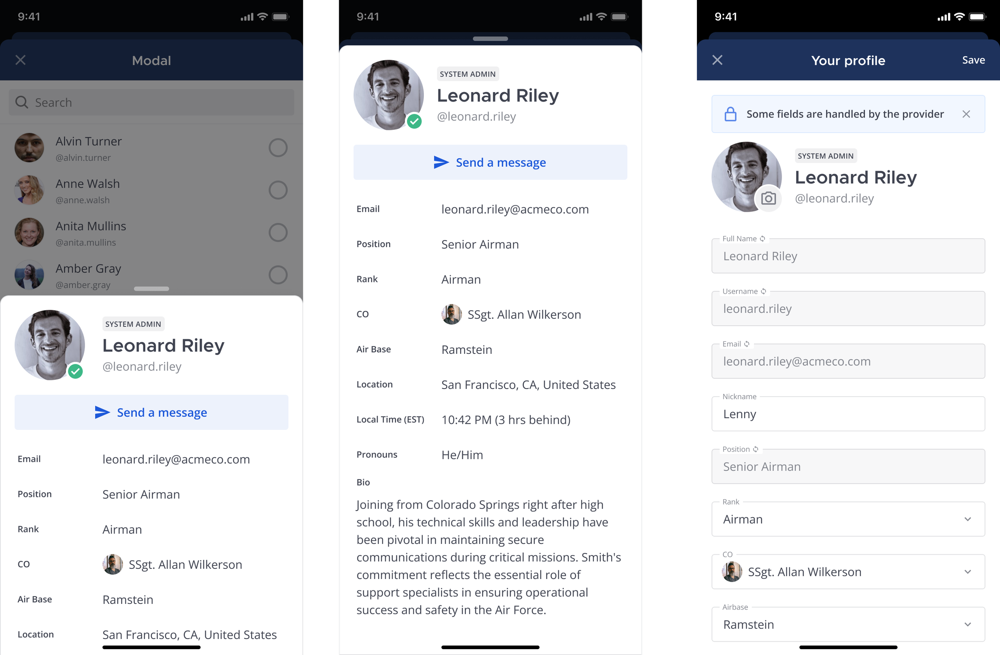

User attributes
=================

.. include:: ../../../_static/badges/ent-plus.rst
  :start-after: :nosearch:

From Mattermost v10.8, ensure your teams always have the critical information they need to collaborate effectively by defining and managing organization-specific user profile attributes as system attributes that you can synchronize with your AD/LDAP or SAML identity provider. 

System attributes enable you to customize user profile attributes to match your organization's unique needs and streamline collaboration while keeping user data centralized and consistent. 

From Mattermost v11, you have enhanced control over these user attributes through admin-managed vs user-editable settings. By default, attributes are admin-managed for security, but you can explicitly allow user editing for specific attributes that don't impact access control or sensitive organizational data. These user attributes supplement existing user details visible from the user's profile picture.

Before you begin
-----------------

If you plan to synchronize system properties with your AD/LDAP or SAML identity provider, ensure AD/LDAP or SAML synchronization is already enabled and configured. See the :doc:`AD/LDAP groups </administration-guide/onboard/ad-ldap-groups-synchronization>` product documentation or :ref:`SAML 2.0 <administration-guide/configure/authentication-configuration-settings:saml 2.0>` configuration settings documentation for details.

.. tab:: Mattermost v11 or later

  From Mattermost v11, user attributes have enhanced admin controls with a security-first approach. All attributes are admin-managed by default, providing better security and governance. System administrators can explicitly enable user editing for specific attributes through the System Console interface.

  If your organization uses :doc:`attribute-based access control (ABAC) </administration-guide/manage/admin/attribute-based-access-control>`, which requires an Enterprise Edition Advanced license, attributes used in access control policies should remain admin-managed for security reasons. You can enable user-managed attributes for ABAC by setting ``EnableUserManagedAttributes`` in ``config.json``, or via an environment variable as noted below, but this should be done with caution:

  - ``config.json`` setting: ``".AccessControlSettings.EnableUserManagedAttributes: false",`` with options ``true`` and ``false``.
  - Environment variable: ``MM_ACCESSCONTROLSETTINGS_ENABLEUSERMANAGEDATTRIBUTES``

  This configuration setting isn't managed using the System Console, and is disabled by default to ensure that access control policies remain secure and can't be circumvented by users modifying their own profile attributes. Learn more about `admin-managed versus user-editable attributes <#admin-managed-vs-user-editable-attributes>`__.

  Additionally, from mobile app v2.31.0, user attributes are fully supported on mobile devices. Mobile users can both view and manage profile attributes (if allowed by admin settings) directly from the mobile app. Mobile attribute support requires the same server-side configuration, and no additional mobile-specific setup is required.

.. tab:: Mattermost v10.11 or later
  
  From Mattermost v10.11, user-managed attributes are excluded from ABAC rules for security reasons. If your organization uses ABAC (which requires Enterprise Edition Advanced), a system admin can explicitly enable user-managed attributes for ABAC by setting ``EnableUserManagedAttributes`` in ``config.json`` or via an environment variable as noted below. This configuration setting isn't managed using the System Console, and is disabled by default to ensure that access control policies remain secure and can't be circumvented by users modifying their own profile attributes.

  - ``config.json`` setting: ``".AccessControlSettings.EnableUserManagedAttributes: false",`` with options ``true`` and ``false``.
  - Environment variable: ``MM_ACCESSCONTROLSETTINGS_ENABLEUSERMANAGEDATTRIBUTES``

  Additionally, from mobile app v2.31.0, user attributes are fully supported on mobile devices. Mobile users can both view and manage profile attributes directly from the mobile app. Mobile attribute support requires the same server-side configuration, and no additional mobile-specific setup is required.

.. tab:: Mattermost v10.9 or later

  From Mattermost Enterprise v10.9, the ability to create and manage system properties as a Mattermost system admin requires no manual setup. 

.. tab:: Mattermost v10.8

  You'll need Mattermost Enterprise v10.8 or later, and be a Mattermost system admin to enable the system properties feature flag, ``MM_FEATUREFLAGS_CUSTOMPROFILEATTRIBUTES`` to create and manage system properties. See the Mattermost developer documentation for details on `enabling feature flags in a self-hosted deployment <https://developers.mattermost.com/contribute/more-info/server/feature-flags/#self-hosted-and-local-development>`_. Mattermost Cloud customers can request this feature flag be enabled by contacting their Mattermost Account Manager or by `creating a support ticket <https://support.mattermost.com/hc/en-us/requests/new?ticket_form_id=11184911962004>`_ request.

Admin-managed vs user-editable attributes
-------------------------------------------

From Mattermost v11, system administrators have enhanced control over user attributes through admin-managed vs user-editable settings. This distinction provides better security and governance for organizational profile data.

**Admin-managed attributes** (default behavior):

- Controlled exclusively by system administrators
- Users cannot edit these values in their profiles
- Recommended for security-sensitive information like roles, clearance levels, or organizational identifiers
- Ideal for attributes used in ABAC (Attribute-Based Access Control) policies
- Values can only be updated by admins or through identity provider synchronization

**User-editable attributes**:

- Users can update these values in their own profiles
- System administrators can still modify these attributes
- Appropriate for non-sensitive information like personal preferences, skills, or contact details
- Should not be used for attributes that impact security access controls

.. note::
   For security reasons, attributes used in ABAC policies are admin-managed by default and cannot be edited by users unless explicitly enabled by a system administrator through the **Allow user editing** option.

**Best practices:**

- Keep attributes that affect access control or contain sensitive organizational data as admin-managed
- Only enable user editing for attributes that don't impact security policies
- Regularly review user-editable attributes to ensure they remain appropriate for user management
- Consider your organization's data governance requirements when determining attribute editability

Add attributes
---------------

You can define and manage up to 20 system attributes using the System Console. Each attribute becomes a user profile option users can populate, unless you disable the **Editable by Users** option, available from Mattermost v11. Once you reach the maximum of 20 attributes, you can't create new attributes until you `delete attributes <#manage-attributes>`__ you no longer need.

.. note::

  When you disable the **Editable by Users** option for an attribute, only admins can set its value using :ref:`mmctl cpa <administration-guide/manage/mmctl-command-line-tool:mmctl cpa>` commands.

1. In the System Console, go to **Site Configuration > System Attributes > User Attributes** and select **Add Attribute**.
2. Enter the following details:

    - **Attribute name**: Enter a unique name for the attribute. Attribute names can be up to 40 characters long.
    - **Type**: Specify the type of attribute as one of the following:

      - **Text** for text-based profile attributes.
      - **Phone** for phone number-based profile attributes.
      - **URL** for web site address-based profile attributes.
      - **Select** for a list of profile attribute values users can choose from. Specify each value followed by pressing **TAB** or **ENTER**. Values can be up to 64 characters long, and users can choose a single value.
      - **Multi-select** for a list of profile attribute values users can select from. Specify each value followed by pressing **TAB** or **ENTER**. Values can be up to 64 characters long, and users can choose multiple values.

3. Specify the attribute's visibility as one of the following:

  - **Always show**: The attribute is always visible in user profiles.
  - **Hide when empty**: The attribute is only visible in user profiles when it has a value.
  - **Always hide**: The attribute is never visible in user profiles.

.. note::
  If an attribute is created or updated without explicit visibility or sort order (for example via API or automation), Mattermost returns default values in responses even if those attributes weren't stored. Visibility defaults to the server's default visibility, and sort order defaults to ``0``.

4. Configure user editing permissions (Mattermost v11 or later) by enabling or disabling the **Editable by users** option.

5. Save your changes.

.. tip::

  Duplicate existing attributes by selecting **More** |more-icon| and selecting **Duplicate attribute**. This creates a new attribute with the same name and type as the original attribute. You can then edit the new attribute to change its name, type, and visibility as needed.

Manage attributes
------------------

- **Modify**: Select the attribute fields to make inline changes to the attribute's name, type, or values. Select **More** |more-icon| to change a attribute's visibility.

- **Order**: Control the order you want attributes to appear in user profiles by dragging and dropping them in the list.

- **Delete**: Delete attributes you no longer need or want by selecting **More** |more-icon| and selecting **Delete property**.

.. note::
  When updating custom profile attributes via API or automation, the ``attrs`` object replaces existing attribute settings rather than merging. If you send only visibility, the sort order resets to ``0`` unless you include ``sort_order`` in the same request. If a patch fails, the API may return the error string "Unable to patch Custom Profile Attribute field".

- **User Edit Permissions**: From Mattermost v11, all user attributes are admin-managed by default for enhanced security. To allow user editing for specific attributes, administrators can enable this through the **More** |more-icon| menu and selecting **Allow user editing**. This should only be enabled for attributes that do not impact security access controls or organizational policies. Attributes used in ABAC policies should remain admin-managed unless there's a specific business need and the security implications are fully understood.

- **Edit User Attribute Values**: From Mattermost v11.1, you can view and update custom profile attribute values for individual users through the System Console. See the :ref:`Manage user attributes <administration-guide/configure/user-management-configuration-settings:manage user attributes>` documentation for details.

In cases where multiple system admins manage system attributes, refresh your web browser instance to see real-time updates to system attributes made by other admins.

Sync attributes with your identity provider
--------------------------------------------

1. Synchronize a attribute with AD/LDAP or SAML by selecting **More** |more-icon| and selecting **Link attribute to AD/LDAP** or **Link attribute to SAML**. Mattermost takes you directly to the **AD/LDAP** or **SAML 2.0** configuration settings page in the System Console where you can map the attributes you want to synchronize.

2. Scroll to the **User attributes sync** section to specify the attribute used to populate the attribute in user profiles.

3. Specify the attribute mapping for the attribute by entering the attribute name in the system attribute's **Attribute** field. The attribute name must match the attribute name in your identity provider.

4. Save your changes.
