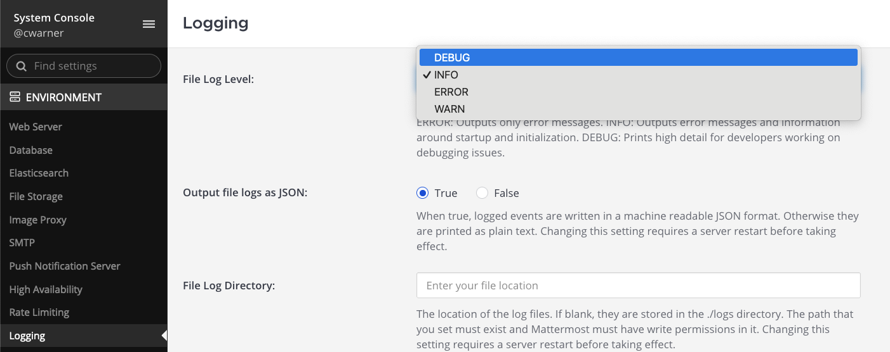

Mattermost logging
===================

.. include:: ../../_static/badges/all-commercial.rst
  :start-after: :nosearch:

.. important::

    **From Mattermost v11, notification log settings have been consolidated into the standard console logs and mattermost.log file**. You can no longer disable notification logging without using advanced logging settings, as the main log level setting now controls both server and notification logs.

    You can use the ``AdvancedLoggingJSON`` configuration with discrete notification log levels: ``NotificationError``, ``NotificationWarn``, ``NotificationInfo``, ``NotificationDebug``, and ``NotificationTrace`` to split notification logs into separate files and reduce troubleshooting noise. See the section below on `advanced logging <#advanced-logging>`__ for details.

Mattermost provides independent logging systems that can be configured separately with separate log files and rotation policies to meet different operational and compliance needs:

.. csv-table::
   :header: "Logging Type & Capture", "Production Recommendation", "Configuration Priority"
   :widths: 45, 25, 30

   "**Log Settings**

   All general Mattermost server operations, errors, startup/initialization, API calls, and system events. From v11.0, also includes notification subsystem events.", "Always enabled. Console: INFO, File: INFO", "**High** - Essential for operations"
   "**Audit Log Settings**

   Security and compliance events, user actions, API access, authentication events, and administrative changes.", "Enable if compliance is required", "**Medium** - Based on regulatory needs"
   "**Notification Log Settings** *(applicable to v10.12 and earlier releases only)*

   Notification subsystem events, push notifications, email delivery, mobile notification processing.", "Enable for notification troubleshooting", "**Low** - Enable when debugging issues"

By default, all Mattermost plans write logs to both the console and to the ``mattermost.log`` file in a machine-readable JSON format for log aggregation tools. Mattermost Enterprise and Professional customers can additionally log directly to syslog and TCP socket destination targets. Audit logging is designed to be asynchronous to minimize performance impact.

System admins can customize the following logging options based on your business practices and needs by going to **System Console > Environment > Logging** or by editing the ``config.json`` file directly.

.. note::

    From Mattermost v11.3, AdvancedLoggingJSON configuration includes enhanced validation that enforces proper separation between standard and audit log levels:
    
    - Standard logging configurations reject audit-specific log levels (``audit-api``, ``audit-content``, ``audit-permissions``, ``audit-cli``)
    - Audit logging configurations reject standard log levels (``debug``, ``info``, ``warn``, ``error``, ``fatal``, ``panic``, etc.)
    - Configuration validation occurs at startup and when updating settings, preventing invalid log level combinations

Console logs
------------

Console logs feature verbose debug level log messages for general activities that are written to the console using the standard output stream (stdout). You can customize console logs for general activities. 

From Mattermost v11.0, notification logs are automatically included in the main console logs. See the :ref:`Logging configuration settings <administration-guide/configure/environment-configuration-settings:output logs to console>` for details.

File logs
---------

File logs feature info level log messages for general activities including errors and information around startup, and initialization and webhook debug messages. The file is stored in ``./logs/mattermost.log``, rotated at 100 MB, and archived to a separate file in the same directory. You can customize file logs for general activities. 

From Mattermost v11.0, notification logs are automatically included in the main ``mattermost.log`` file. See the :ref:`Logging configuration settings <administration-guide/configure/environment-configuration-settings:output logs to file>` for details.

.. tip::

    Download the ``mattermost.log`` file locally by going to **System Console > Reporting > Server Logs**, and selecting **Download Logs**.

You can optionally output log records to any combination of `console <#console-target-configuration-options>`__, `local file <#file-target-configuration-options>`__, `syslog <#syslog-target-configuration-options>`__, and `TCP socket <#tcp-target-configuration-options>`__ targets, each featuring additional customization. See `Advanced Logging <#advanced-logging>`__ for details.

Define logging output
---------------------

Define logging output for general activities in JSON format in the System Console by going to **Environment > Logging > Advanced Logging** or by editing the ``config.json`` file directly. 

You can use the sample JSON below as a starting point.

.. tab:: v11 or later

    .. code-block:: JSON

        {
            "console1": {
                "type": "console",
                "format": "json",
                "levels": [
                    {"id": 5, "name": "debug", "stacktrace": false},
                    {"id": 4, "name": "info", "stacktrace": false, "color": 36},
                    {"id": 3, "name": "warn", "stacktrace": false},
                    {"id": 2, "name": "error", "stacktrace": true, "color": 31},
                    {"id": 1, "name": "fatal", "stacktrace": true, "color": 31},
                    {"id": 0, "name": "panic", "stacktrace": true, "color": 31},
                    {"id": 10, "name": "stdlog", "stacktrace": false},

                    {"id": 300, "name": "NotificationError", "stacktrace": true, "color": 31},
                    {"id": 301, "name": "NotificationWarn", "stacktrace": false},
                    {"id": 302, "name": "NotificationInfo", "stacktrace": false, "color": 36},
                    {"id": 303, "name": "NotificationDebug", "stacktrace": false},
                    {"id": 304, "name": "NotificationTrace", "stacktrace": false}
                ],
                "options": {
                    "out": "stdout"
                },
                "maxqueuesize": 1000
            },
            "file1": {
                "type": "file",
                "format": "json",
                "levels": [
                    {"id": 5, "name": "debug", "stacktrace": false},
                    {"id": 4, "name": "info", "stacktrace": false},
                    {"id": 3, "name": "warn", "stacktrace": false},
                    {"id": 2, "name": "error", "stacktrace": true},
                    {"id": 1, "name": "fatal", "stacktrace": true},
                    {"id": 0, "name": "panic", "stacktrace": true},

                    {"id": 300, "name": "NotificationError", "stacktrace": true},
                    {"id": 301, "name": "NotificationWarn", "stacktrace": false},
                    {"id": 302, "name": "NotificationInfo", "stacktrace": false},
                    {"id": 303, "name": "NotificationDebug", "stacktrace": false},
                    {"id": 304, "name": "NotificationTrace", "stacktrace": false}
                ],
                "options": {
                    "filename": "mattermost_logging.log",
                    "max_size": 100,
                    "max_age": 1,
                    "max_backups": 10,
                    "compress": true
                },
                "maxqueuesize": 1000
            },
            "file2": {
                "type": "file",
                "format": "json",
                "levels": [
                    {"id": 2, "name": "error", "stacktrace": true},
                    {"id": 1, "name": "fatal", "stacktrace": true},
                    {"id": 0, "name": "panic", "stacktrace": true},

                    {"id": 300, "name": "NotificationError", "stacktrace": true},
                    {"id": 301, "name": "NotificationWarn", "stacktrace": false}
                ],
                "options": {
                    "filename": "mattermost_logging_errors.log", 
                    "max_size": 100,
                    "max_age": 30,
                    "max_backups": 10,
                    "compress": true
                },
                "maxqueuesize": 1000
            }
        }

.. tab:: v10.12 or earlier

    .. code-block:: JSON

        {
            "console1": {
                "type": "console",
                "format": "json",
                "levels": [
                    {"id": 5, "name": "debug", "stacktrace": false},
                    {"id": 4, "name": "info", "stacktrace": false, "color": 36},
                    {"id": 3, "name": "warn", "stacktrace": false},
                    {"id": 2, "name": "error", "stacktrace": true, "color": 31},
                    {"id": 1, "name": "fatal", "stacktrace": true, "color": 31},
                    {"id": 0, "name": "panic", "stacktrace": true, "color": 31},
                    {"id": 10, "name": "stdlog", "stacktrace": false}
                ],
                "options": {
                    "out": "stdout"
                },
                "maxqueuesize": 1000
            },
            "file1": {
                "type": "file",
                "format": "json",
                "levels": [
                    {"id": 5, "name": "debug", "stacktrace": false},
                    {"id": 4, "name": "info", "stacktrace": false},
                    {"id": 3, "name": "warn", "stacktrace": false},
                    {"id": 2, "name": "error", "stacktrace": true},
                    {"id": 1, "name": "fatal", "stacktrace": true},
                    {"id": 0, "name": "panic", "stacktrace": true}
                ],
                "options": {
                    "filename": "mattermost_logging.log",
                    "max_size": 100,
                    "max_age": 1,
                    "max_backups": 10,
                    "compress": true
                },
                "maxqueuesize": 1000
            },
            "file2": {
                "type": "file",
                "format": "json",
                "levels": [
                    {"id": 2, "name": "error", "stacktrace": true},
                    {"id": 1, "name": "fatal", "stacktrace": true},
                    {"id": 0, "name": "panic", "stacktrace": true}
                ],
                "options": {
                    "filename": "mattermost_logging_errors.log", 
                    "max_size": 100,
                    "max_age": 30,
                    "max_backups": 10,
                    "compress": true
                },
                "maxqueuesize": 1000
            }
        }

----

Audit logging
---------------

.. include:: ../../_static/badges/ent-plus.rst
  :start-after: :nosearch:

By default, Mattermost doesn't write audit logs locally to a file on the server, and the ability to enable audit logging in Mattermost is currently in :ref:`Beta <administration-guide/manage/feature-labels:beta>`.

You can enable and customize advanced audit logging in Mattermost to record activities and events performed within Mattermost, such as user access to the Mattermost REST API or mmctl. Audit logs are recorded asynchronously to reduce latency to the caller, and are stored separately from general logging. During short spans of inability to write to targets, the audit records buffer in memory with a configurable maximum record cap. Based on typical audit record volumes, it could take many minutes to fill the buffer. After that, the records are dropped, and the record drop event is logged.

.. note::

    From Mattermost v7.2, audit logging is a breaking change from previous releases in cases where customers looking to parse previous audit logs with the new format. The format and content of an audit log record has changed to become standardized for all events using a :doc:`standard JSON schema </administration-guide/comply/embedded-json-audit-log-schema>`. Existing tools which ingest or parse audit log records may need to be modified.

    From Mattermost v9.3, you can enable and customize advanced logging for AD/LDAP events separately from other logging.

.. tab:: Self-Hosted Deployments

    Go to **System Console > Compliance > Audit Logging** to customize audit logging. You can use the sample JSON below as a starting point. 
    
    You can customize console logs for :ref:`general <administration-guide/configure/environment-configuration-settings:log settings>` activities. From v11.0, :ref:`notification <administration-guide/configure/environment-configuration-settings:notification logging>` logs are automatically included unless advanced logging is configured. 
    
    Additionally, you can also output audit log records to any combination of `console <#console-target-configuration-options>`__, `local file <#file-target-configuration-options>`__, `syslog <#syslog-target-configuration-options>`__, and `TCP socket <#tcp-target-configuration-options>`__ targets, each featuring additional customization. See `Advanced Logging <#advanced-logging>`__ below for details.

.. tab:: Cloud Deployments

    From Mattermost v10.11, go to **System Console > Compliance > Audit Logging** to customize audit logging. You can use the sample JSON below as a starting point. Prior to Mattermost v10.11, customize audit logging by going to **System Console > Experimental > Features > Audit Logging**.

    .. note::

        - From Mattermost v10.11, Cloud deployments include certificate-based audit logging capabilities not available within self-hosted deployments.
        - Cloud-based deployments use the following self-hosted audit logging default values: 

            - FileEnabled: false
            - FileMaxSizeMB: 100
            - FileMaxAgeDays: 0 (no limit)
            - FileMaxBackups: 0 (retain all)
            - FileCompress: false
            - FileMaxQueueSize: 1000

        - Cloud deployments can't configure local file-based audit logging, and all file-related settings are hidden.

----

Log path restrictions
---------------------

From Mattermost v11.4, log file paths are validated to ensure they remain within a designated logging root directory. This security enhancement prevents log files from being written to or read from unauthorized locations on the file system.

Configure the logging root directory
~~~~~~~~~~~~~~~~~~~~~~~~~~~~~~~~~~~~~

From Mattermost v11.4, use the ``MM_LOG_PATH`` environment variable to define the root directory for all log files:

.. code-block:: sh

   export MM_LOG_PATH=/var/log/mattermost

If ``MM_LOG_PATH`` isn't set, Mattermost uses the default ``logs`` directory relative to the Mattermost binary location.

Log path validation
~~~~~~~~~~~~~~~~~~~

All log file paths configured via the following settings are validated:

- ``LogSettings.FileLocation`` - main :ref:`server log file location <administration-guide/configure/environment-configuration-settings:file log directory>`
- ``LogSettings.AdvancedLoggingJSON`` - all :ref:`file targets in advanced logging configuration <administration-guide/configure/environment-configuration-settings:output logs to multiple targets>`
- ``ExperimentalAuditSettings.AdvancedLoggingJSON`` - all :ref:`file targets in audit logging configuration <administration-guide/configure/environment-configuration-settings:output audit logs to multiple targets>`

**How validation works**:

1. Paths are resolved to absolute paths
2. Symlinks are resolved to their actual locations
3. The resolved path is validated against the logging root directory
4. Paths outside the root directory generate error logs and are excluded from downloads

**Validation occurs**:

- When accessing log files via **System Console > Reporting > Server Logs**
- When generating support packets
- During configuration changes (warnings are logged for invalid paths)

When a log file path is outside the allowed root directory, Mattermost logs an error and excludes the file from support packet downloads: ``"Blocked attempt to read log file outside allowed root"``. The error message includes the file path, configuration section, and validation failure details.

Configuration requirements
~~~~~~~~~~~~~~~~~~~~~~~~~~

**If using default logging**: No action required. Logs are stored in the default ``logs`` directory.

**If using custom log paths**: Ensure all log file paths in ``AdvancedLoggingJSON`` point to locations within your logging root directory.

**Valid configuration example**:

.. code-block:: sh

   export MM_LOG_PATH=/var/log/mattermost

In ``config.json``:

.. code-block:: JSON

   {
     "file1": {
       "type": "file",
       "format": "json",
       "levels": [
         {"id": 2, "name": "error", "stacktrace": true}
       ],
       "options": {
         "filename": "/var/log/mattermost/errors.log",
         "max_size": 100,
         "max_age": 7,
         "max_backups": 10,
         "compress": true
       },
       "maxqueuesize": 1000
     }
   }

This configuration is valid because ``/var/log/mattermost/errors.log`` is within the ``/var/log/mattermost`` root.

**Invalid configuration example**:

If ``MM_LOG_PATH=/var/log/mattermost``, this configuration fails:

.. code-block:: JSON

   {
     "file1": {
       "type": "file",
       "options": {
         "filename": "/tmp/logs/app.log"
       }
     }
   }

This fails because ``/tmp/logs/app.log`` is outside the ``/var/log/mattermost`` root directory. 

See the :ref:`troubleshooting <deployment-guide/server/troubleshooting:log files not accessible>` documentation for troubleshooting steps if logs aren't appearing in the System Console or support packets due to log path issues.

----

Advanced logging
-----------------

.. include:: ../../_static/badges/entry-ent.rst
  :start-after: :nosearch:

System admins can output log and audit records for general and audit activities to any combination of `console <#console-target-configuration-options>`__, `local file <#file-target-configuration-options>`__, `syslog <#syslog-target-configuration-options>`__, and `TCP socket <#tcp-target-configuration-options>`__ targets.

.. tip::

  - From Mattermost v11.0, notification activities are included in general logs by default, but can be separated using the new discrete notification log levels. Each output target features additional configuration options you can customize for your Mattermost deployment.
  - From Mattermost v9.11, system admins can configure advanced logging JSON options using the ``mmctl config set`` command. See the :ref:`mmctl config set <administration-guide/manage/mmctl-command-line-tool:mmctl config set>` documentation for an example slash command.
  - From Mattermost v9.3, system admins can configure advanced logging options in the System Console using multi-line JSON by going to **Environment > Logging**.
  - Alternatively, admins can configure advanced logging within the ``AdvancedLoggingJSON`` section of the ``config.json`` file using multi-line JSON or escaped JSON as a string.
  - Mattermost Team Edition customers can output audit log records to the console or a file.

Advanced logging options can be configured to:

- Enable trace logging for AD/LDAP to troubleshoot authentication issues.
- Capture errors and panics in a separate, monitored file that triggers alerts.
- Capture production debug and error logs in a separate file with log file rotation to reproduce issues, while enforcing a cap on the amount of disk space the debug logs are allowed to use.
- Audit every API endpoint accessed during a user workflow.

Define advanced log output
~~~~~~~~~~~~~~~~~~~~~~~~~~

.. tab:: Multi-line JSON
    :parse-titles:

    In the example below, file output is written to ``./logs/audit.log`` in plain text and includes all audit log levels & events. Older logs are kept for 1 day, and up to a total of 10 backup log files are kept at a time. Logs are rotated using gzip when the maximum size of the log file reaches 500 MB. A maximum of 1000 audit records can be queued/buffered while writing to the file.

    v11 or later
    ^^^^^^^^^^^^^

    .. code-block:: JSON

        "AdvancedLoggingJSON": {
            "file_1": {
                "type": "file",
                "format": "plain",
                "format_options": {
                    "disable_level": false
                },
                "levels": [
                    { "id": 100, "name": "audit-api" },
                    { "id": 101, "name": "audit-content" },
                    { "id": 102, "name": "audit-permissions" },
                    { "id": 103, "name": "audit-cli" }
                ],
                "options": {
                    "compress": true,
                    "filename": "./logs/audit.log",
                    "max_age": 1,
                    "max_backups": 10,
                    "max_size": 500
                },
                "maxqueuesize": 1000
            },
            "file_notifications": {
                "type": "file",
                "format": "json",
                "levels": [
                    { "id": 300, "name": "NotificationError" },
                    { "id": 301, "name": "NotificationWarn" },
                    { "id": 302, "name": "NotificationInfo" },
                    { "id": 303, "name": "NotificationDebug" },
                    { "id": 304, "name": "NotificationTrace" }
                ],
                "options": {
                    "compress": true,
                    "filename": "./logs/notifications.log",
                    "max_age": 7,
                    "max_backups": 5,
                    "max_size": 200
                },
                "maxqueuesize": 1000
            }
        }

    v10.12 or earlier
    ^^^^^^^^^^^^^^^^^^

    .. code-block:: JSON

        "AdvancedLoggingJSON": {
            "file_1": {
                "type": "file",
                "format": "plain",
                "format_options": {
                  "disable_level": false
                },
                "levels": [
                    { "id": 100, "name": "audit-api" },
                    { "id": 101, "name": "audit-content" },
                    { "id": 102, "name": "audit-permissions" },
                    { "id": 103, "name": "audit-cli" }
                ],
                "options": {
                    "compress": true,
                    "filename": "./logs/audit.log",
                    "max_age": 1,
                    "max_backups": 10,
                    "max_size": 500
                },
                "maxqueuesize": 1000
            }
        }

.. tab:: Filespec
    :parse-titles:

    Advanced logging configuration can be pointed to a filespec to another configuration file, rather than multi-line JSON, to keep the config.json file tidy:

    .. code-block:: JSON

        "AdvancedLoggingJSON": "/path/to/audit_log_config.json"

    The separate configuration file includes the multi-line JSON instead.

    In the example below, the first output is written to the console in plain text and includes all audit log levels, events, and command outputs. A pipe ``|`` delimiter is placed between fields. 

    A second output is written to ``./logs/audit.log`` in plain text in a machine-readable JSON format and includes all audit log levels, events, and command outputs. Older logs are kept for 1 day, and up to a total of 10 backup log files are kept at a time. Logs are rotated using GZIP when the maximum size of the log file reaches 500 MB. A maximum of 1000 audit records can be queued/buffered while writing to the file.

    Contents of ``audit_log_config.json`` file:

    v11 or later
    ^^^^^^^^^^^^^

    .. code-block:: JSON

        {
            "sample-console": {
                "type": "console",
                "format": "plain",
                "format_options": {
                    "delim": " | "
                },
                "levels": [
                    {"id": 100, "name": "audit-api"},
                    {"id": 101, "name": "audit-content"},
                    {"id": 102, "name": "audit-permissions"},
                    {"id": 103, "name": "audit-cli"}
                ],
                "options": {
                    "out": "stdout"
                },
                "maxqueuesize": 1000
            },
            "sample-file": {
                "type": "file",
                "format": "json",
                "levels": [
                    {"id": 100, "name": "audit-api"},
                    {"id": 101, "name": "audit-content"},
                    {"id": 102, "name": "audit-permissions"},
                    {"id": 103, "name": "audit-cli"}
                ],
                "options": {
                    "filename": "./logs/audit.log",
                    "max_size": 500,
                    "max_age": 1,
                    "max_backups": 10,
                    "compress": true
                },
                "maxqueuesize": 1000
            },
            "notifications-file": {
                "type": "file",
                "format": "json",
                "levels": [
                    {"id": 300, "name": "NotificationError"},
                    {"id": 301, "name": "NotificationWarn"},
                    {"id": 302, "name": "NotificationInfo"},
                    {"id": 303, "name": "NotificationDebug"},
                    {"id": 304, "name": "NotificationTrace"}
                ],
                "options": {
                    "filename": "./logs/notifications.log",
                    "max_size": 200,
                    "max_age": 7,
                    "max_backups": 5,
                    "compress": true
                },
                "maxqueuesize": 1000
            }
        }

    v10.12 or earlier
    ^^^^^^^^^^^^^^^^^^

    .. code-block:: JSON

        {
            "sample-console": {
                "type": "console",
                "format": "plain",
                "format_options": {
                    "delim": " | "
                },
                "levels": [
                    {"id": 100, "name": "audit-api"},
                    {"id": 101, "name": "audit-content"},
                    {"id": 102, "name": "audit-permissions"},
                    {"id": 103, "name": "audit-cli"}
                ],
                "options": {
                    "out": "stdout"
                },
                "maxqueuesize": 1000
            },
            "sample-file": {
                "type": "file",
                "format": "json",
                "levels": [
                    {"id": 100, "name": "audit-api"},
                    {"id": 101, "name": "audit-content"},
                    {"id": 102, "name": "audit-permissions"},
                    {"id": 103, "name": "audit-cli"}
                ],
                "options": {
                    "filename": "./logs/audit.log",
                    "max_size": 500,
                    "max_age": 1,
                    "max_backups": 10,
                    "compress": true
                },
                "maxqueuesize": 1000
            }
        }

Specify destination targets
~~~~~~~~~~~~~~~~~~~~~~~~~~~

Log records can be sent to any combination of `console <#console-target-configuration-options>`__, `local file <#file-target-configuration-options>`__, `syslog <#syslog-target-configuration-options>`__, and `TCP socket <#tcp-target-configuration-options>`__ targets. Log targets have been chosen based on support for the vast majority of log aggregators and other log analysis tools, without needing additional software installed.

System admins can define multiple log targets to:

- Mirror log output to files and log aggregators for redundancy.
- Log certain entries to specific destinations. For example, all ``audit-content`` records can be routed to a different destination than the other levels.
- Admins can also temporarily disable log targets by setting its ``type`` to ``none``.

Configure format preferences
~~~~~~~~~~~~~~~~~~~~~~~~~~~~

System admins can control log formatting per target by configuring the ``format_options`` section.

Plain log format configuration options
^^^^^^^^^^^^^^^^^^^^^^^^^^^^^^^^^^^^^^

+---------------------+----------+------------------------------------------------------------------------------------------------------------------------------+
| **Key**             | **Type** | **Description**                                                                                                              |
+---------------------+----------+------------------------------------------------------------------------------------------------------------------------------+
| disable_timestamp   | bool     | Disables output of the timestamp. Default is ``false``.                                                                      |
+---------------------+----------+------------------------------------------------------------------------------------------------------------------------------+
| disable_level       | bool     | Disables output of the level name. Default is ``false``.                                                                     |
+---------------------+----------+------------------------------------------------------------------------------------------------------------------------------+
| disable_msg         | bool     | Disables output of the message text. Default is ``false``.                                                                   |
+---------------------+----------+------------------------------------------------------------------------------------------------------------------------------+
| disable_fields      | bool     | Disables output of all fields. Default is ``false``.                                                                         |
+---------------------+----------+------------------------------------------------------------------------------------------------------------------------------+
| disables_stacktrace | bool     | Disables output of stack traces. Default is ``false``.                                                                       |
+---------------------+----------+------------------------------------------------------------------------------------------------------------------------------+
| enable_caller       | string   | Enables output of the file and line number that emitted a log record.  Default is ``false``.                                 |
+---------------------+----------+------------------------------------------------------------------------------------------------------------------------------+
| delim               | string   | Delimiter placed between fields. Default is single space.                                                                    |
+---------------------+----------+------------------------------------------------------------------------------------------------------------------------------+
| min_level_len       | number   | Minimum level name length. When level names are less than the minimum, level names are padded with spaces. Default is ``0``. |
+---------------------+----------+------------------------------------------------------------------------------------------------------------------------------+
| min_msg_len         | number   | Minimum message length. When message text is less than the minimum, message text is padded with spaces. Default is ``0``.    |
+---------------------+----------+------------------------------------------------------------------------------------------------------------------------------+
| timestamp_format    | string   | Format for timestamps. Default is `RFC3339 <https://www.rfc-editor.org/rfc/rfc3339>`__.                                      |
+---------------------+----------+------------------------------------------------------------------------------------------------------------------------------+
| line_end            | string   | Alternative end of line character(s). Default is ``n``.                                                                      |
+---------------------+----------+------------------------------------------------------------------------------------------------------------------------------+
| enable_color        | bool     | Enables color for targets that support color output. Default is ``false``.                                                   |
+---------------------+----------+------------------------------------------------------------------------------------------------------------------------------+

JSON log format configuration options
^^^^^^^^^^^^^^^^^^^^^^^^^^^^^^^^^^^^^^

+---------------------+----------+----------------------------------------------------------------------------------------------+
| **Key**             | **Type** | **Description**                                                                              |
+---------------------+----------+----------------------------------------------------------------------------------------------+
| disable_timestamp   | bool     | Disables output of the timestamp. Default is ``false``.                                      |
+---------------------+----------+----------------------------------------------------------------------------------------------+
| disable_level       | bool     | Disables output of the log level display name. Default is ``false``.                         |
+---------------------+----------+----------------------------------------------------------------------------------------------+
| disable_msg         | bool     | Disables output of the message text. Default is ``false``.                                   |
+---------------------+----------+----------------------------------------------------------------------------------------------+
| disable_fields      | bool     | Disables output of all fields. Default is ``false``.                                         |
+---------------------+----------+----------------------------------------------------------------------------------------------+
| disables_stacktrace | bool     | Disables output of stack traces. Default is ``false``.                                       |
+---------------------+----------+----------------------------------------------------------------------------------------------+
| enable_caller       | string   | Enables output of the file and line number that emitted a log record.  Default is ``false``. |
+---------------------+----------+----------------------------------------------------------------------------------------------+
| timestamp_format    | string   | Format for timestamps. Default is `RFC3339 <https://www.rfc-editor.org/rfc/rfc3339>`__.      |
+---------------------+----------+----------------------------------------------------------------------------------------------+

GELF log format configuration options
^^^^^^^^^^^^^^^^^^^^^^^^^^^^^^^^^^^^^^

+---------------+----------+----------------------------------------------------------------------------------------------+
| **Key**       | **Type** | **Description**                                                                              |
+---------------+----------+----------------------------------------------------------------------------------------------+
| hostname      | string   | Outputs a custom hostname in log records.                                                    |
|               |          | If omitted, hostname is taken from the operating system.                                     |
+---------------+----------+----------------------------------------------------------------------------------------------+
| enable_caller | string   | Enables output of the file and line number that emitted a log record.  Default is ``false``. |
+---------------+----------+----------------------------------------------------------------------------------------------+

Configure log levels and events
~~~~~~~~~~~~~~~~~~~~~~~~~~~~~~~

+------------+----------+-------------------------------------------------------------+
| **Key**    | **Type** | **Description**                                             |
+------------+----------+-------------------------------------------------------------+
| id         | number   | Unique identifier of the log level.                         |
+------------+----------+-------------------------------------------------------------+
| name       | string   | Name of the log level.                                      |
+------------+----------+-------------------------------------------------------------+
| stacktrace | bool     | Outputs a stack trace. Default is ``false``.                |
+------------+----------+-------------------------------------------------------------+
| color      | number   | The ANSI color code used to output parts of the log record. |
|            |          | Supported values include:                                   |
|            |          |                                                             |
|            |          | - Black: ``30``                                             |
|            |          | - Red: ``31``                                               |
|            |          | - Green: ``32``                                             |
|            |          | - Yellow: ``33``                                            |
|            |          | - Blue: ``34``                                              |
|            |          | - Magenta: ``35``                                           |
|            |          | - Cyan: ``36``                                              |
|            |          | - White: ``37``                                             |
+------------+----------+-------------------------------------------------------------+

Log levels
^^^^^^^^^^

The following log levels support audit logs:

+--------+-----------------------+------------------------------------------------------------------------+
| **ID** | **Name**              | **Description**                                                        |
+--------+-----------------------+------------------------------------------------------------------------+
| 100    | ``audit-api``         | API events                                                             |
+--------+-----------------------+------------------------------------------------------------------------+
| 101    | ``audit-content``     | Content changes. This log level can generate considerably more records |
|        |                       | than the other audit log levels.                                       |
+--------+-----------------------+------------------------------------------------------------------------+
| 102    | ``audit-permissions`` | Permission changes                                                     |
+--------+-----------------------+------------------------------------------------------------------------+
| 103    | ``audit-cli``         | CLI operations                                                         |
+--------+-----------------------+------------------------------------------------------------------------+

The following log levels support application logs: 

+--------+-----------------------+------------------------------------------------------------------------+
| **ID** | **Name**              | **Description**                                                        |
+--------+-----------------------+------------------------------------------------------------------------+
| 140    | ``LDAPError``         | AD/LDAP authentication errors                                          |
+--------+-----------------------+------------------------------------------------------------------------+
| 141    | ``LDAPWarn``          | AD/LDAP authentication warnings                                        |
+--------+-----------------------+------------------------------------------------------------------------+
| 142    | ``LDAPInfo``          | AD/LDAP authentication information logs                                |
+--------+-----------------------+------------------------------------------------------------------------+
| 143    | ``LDAPDebug``         | AD/LDAP authentication debug logs                                      |
+--------+-----------------------+------------------------------------------------------------------------+
| 144    | ``LDAPTrace``         | AD/LDAP authentication trace logs. Replaces ``LdapSetings.trace`` from |
|        |                       | Mattermost v9.3.                                                       |
+--------+-----------------------+------------------------------------------------------------------------+

Configure target-specific settings
~~~~~~~~~~~~~~~~~~~~~~~~~~~~~~~~~~

Console target configuration options
^^^^^^^^^^^^^^^^^^^^^^^^^^^^^^^^^^^^^

Console targets can be either ``stdout`` or ``stderr``.

- The standard output stream, ``stout``, is typically used for command output that prints the results of a command to the user. 
- The standard error stream, ``sterr``, is typically used to print any errors that occur when a program is running.

File target configuration options
^^^^^^^^^^^^^^^^^^^^^^^^^^^^^^^^^^

File targets support rotation and compression triggered by size and/or duration.

+-------------+----------+---------------------------------------------------------------------------------------------------------------------+
| **Key**     | **Type** | **Description**                                                                                                     |
+-------------+----------+---------------------------------------------------------------------------------------------------------------------+
| filename    | string   | Full path to the output file. From v11.4, should be within the directory specified by ``MM_LOG_PATH``.              |
+-------------+----------+---------------------------------------------------------------------------------------------------------------------+
| max_size    | number   | Maximum size, in megabytes (MB), the log file can grow before it gets rotated. Default is ``100`` MB.               |
+-------------+----------+---------------------------------------------------------------------------------------------------------------------+
| max_age     | number   | Maximum number of days to retain old log files based on the timestamp encoded in the filename.                      |
|             |          | Default is ``0`` which disables the removal of old log files.                                                       |
+-------------+----------+---------------------------------------------------------------------------------------------------------------------+
| max_backups | number   | Maximum number of old log files to retain. Default is ``0`` which retains all old log files.                        |
|             |          | **Note**: Configuring ``max_age`` can result in old log files being deleted regardless of this configuration value. |
+-------------+----------+---------------------------------------------------------------------------------------------------------------------+
| compress    | bool     | Compress rotated log files using `gzip <https://www.gnu.org/software/gzip/>`__. Default is ``false``.               |
+-------------+----------+---------------------------------------------------------------------------------------------------------------------+

Syslog target configuration options
^^^^^^^^^^^^^^^^^^^^^^^^^^^^^^^^^^^^

.. include:: ../../_static/badges/entry-ent.rst
  :start-after: :nosearch:

Syslog targets support local and remote syslog servers, with or without TLS transport. Syslog target support requires Mattermost Enterprise.

+----------+----------+--------------------------------------------------------------------------------------------------------------------------+
| **Key**  | **Type** | **Description**                                                                                                          |
+----------+----------+--------------------------------------------------------------------------------------------------------------------------+
| host     | string   | IP or domain name of the server receiving the log records.                                                               |
+----------+----------+--------------------------------------------------------------------------------------------------------------------------+
| port     | number   | Port number for the server receiving the log records.                                                                    |
+----------+----------+--------------------------------------------------------------------------------------------------------------------------+
| tls      | bool     | Create a TLS connection to the server receiving the log records. Default is ``false``.                                   |
+----------+----------+--------------------------------------------------------------------------------------------------------------------------+
| cert     | string   | Path to a cert file (.pem) to be used when establishing a TLS connection to the server.                                  |
+----------+----------+--------------------------------------------------------------------------------------------------------------------------+
| insecure | bool     | Mattermost accepts any certificate presented by the server, and any host name in that certificate. Default is ``false``. |
|          |          | **Note**: Should only be used in testing environments, and shouldn’t be used in production environments.                 |
+----------+----------+--------------------------------------------------------------------------------------------------------------------------+
| tag      | string   | Syslog tag field.                                                                                                        |
+----------+----------+--------------------------------------------------------------------------------------------------------------------------+

TCP target configuration options
^^^^^^^^^^^^^^^^^^^^^^^^^^^^^^^^

.. include:: ../../_static/badges/entry-ent.rst
  :start-after: :nosearch:

The TCP socket targets can be configured with an IP address or domain name, port, and optional TLS certificate. TCP socket target support requires Mattermost Enterprise. You can :download:`download a sample JSON file </samples/sample-logger-config.json>` of the configuration to use as a starting point.

+----------+----------+--------------------------------------------------------------------------------------------------------------------------+
| **Key**  | **Type** | **Description**                                                                                                          |
+----------+----------+--------------------------------------------------------------------------------------------------------------------------+
| host     | string   | IP or domain name of the server receiving the log records.                                                               |
+----------+----------+--------------------------------------------------------------------------------------------------------------------------+
| port     | number   | Port number for the server receiving the log records.                                                                    |
+----------+----------+--------------------------------------------------------------------------------------------------------------------------+
| tls      | bool     | Create a TLS connection to the server receiving the log records. Default is ``false``.                                   |
+----------+----------+--------------------------------------------------------------------------------------------------------------------------+
| cert     | string   | Path to a cert file (.pem) to be used when establishing a TLS connection to the server.                                  |
+----------+----------+--------------------------------------------------------------------------------------------------------------------------+
| insecure | bool     | Mattermost accepts any certificate presented by the server, and any host name in that certificate. Default is ``false``. |
|          |          | **Note**: Should only be used in testing environments, and shouldn’t be used in production environments.                 |
+----------+----------+--------------------------------------------------------------------------------------------------------------------------+

---- 

Cluster job execution debug messages
-------------------------------------

.. include:: ../../_static/badges/ent-plus.rst
  :start-after: :nosearch:

From Mattermost v11.4, debug-level log messages are available to help system admins understand cluster job execution behavior in :doc:`high availability </administration-guide/scale/high-availability-cluster-based-deployment>` deployments for specific Recurring Tasks.

These debug messages apply only to the following Recurring Tasks:

- Scheduled Posts
- Post Reminders
- DND Status Reset

.. important::

  - These debug messages aren't available for other job types such as Elasticsearch indexing, SAML sync, LDAP sync, data retention, or compliance exports. The absence of these debug messages for other job types doesn't indicate a problem with job execution.
  - These messages are only visible when debug logging is enabled. See `How do I enable debug logging? <#how-do-i-enable-debug-logging>`__ for details.
  - In a cluster deployment, only the leader node executes these Recurring Tasks. Non-leader nodes skip these specific jobs and log debug messages to indicate this is expected behavior.

Debug messages for job startup
~~~~~~~~~~~~~~~~~~~~~~~~~~~~~~~

When a non-leader node starts up, it skips initialization for these specific Recurring Tasks and logs one of the following debug messages:

- ``Skipping scheduled posts job startup since this is not the leader node``
- ``Skipping unset DND status job startup since this is not the leader node``
- ``Skipping post reminder job startup since this is not the leader node``

These messages indicate normal operation. In a high availability cluster, these Recurring Tasks should only run on the leader node to prevent duplicate execution.

Debug messages for leadership changes
~~~~~~~~~~~~~~~~~~~~~~~~~~~~~~~~~~~~~

When a node loses leadership status while these Recurring Tasks are running, it cancels the running tasks and logs:

- ``This is no longer leader node. Cancelling the [job name] task``

Where ``[job name]`` is one of: ``scheduled posts``, ``DND status reset``, or ``post reminder``.

This indicates the cluster is performing leader election correctly. The new leader node will take over execution of these Recurring Tasks.

Troubleshooting with cluster job debug messages
~~~~~~~~~~~~~~~~~~~~~~~~~~~~~~~~~~~~~~~~~~~~~~~

If you're investigating why Recurring Tasks (Scheduled Posts, Post Reminders, or DND Status Reset) aren't running on a specific node:

1. Enable debug logging if not already enabled.
2. Check the logs for the debug messages listed above.
3. If you see these messages, the node is correctly identified as a non-leader and is behaving as expected.
4. These Recurring Tasks will be running on the leader node instead.

.. note::

  These debug messages only apply to Recurring Tasks. For other job types (Elasticsearch indexing, SAML sync, LDAP sync, data retention, compliance exports), different logging mechanisms apply. The absence of these specific debug messages for other job types is expected and does not indicate a problem.

For more information about leader election and cluster configuration, see :doc:`High Availability cluster-based deployment </administration-guide/scale/high-availability-cluster-based-deployment>`.

----

Frequently asked questions
--------------------------

How do I enable debug logging?
~~~~~~~~~~~~~~~~~~~~~~~~~~~~~~

As a Mattermost system admin, go to **System Console > Environment > Logging > File Log Level**, and set it to **DEBUG**. Then save your changes.

Debug logging can cause log files to expand substantially, and may adversely impact server performance. Keep an eye on your server logs, or only enable it temporarily, or in development environments, but not production enviornments.

Does Mattermost have an audit log besides the system ``auditd``?
~~~~~~~~~~~~~~~~~~~~~~~~~~~~~~~~~~~~~~~~~~~~~~~~~~~~~~~~~~~~~~~~~

Yes. See the `audit logging <#audit-logging>`__ documentation for details.

When syslog is configured as the target, does it contain the IP address of the emitter of the data (i.e., the Mattermost app node)?
~~~~~~~~~~~~~~~~~~~~~~~~~~~~~~~~~~~~~~~~~~~~~~~~~~~~~~~~~~~~~~~~~~~~~~~~~~~~~~~~~~~~~~~~~~~~~~~~~~~~~~~~~~~~~~~~~~~~~~~~~~~~~~~~~~~~

Yes. That is a function of the syslog daemon (receiver). Typically, all the log lines are prefixed with a timestamp and the hostname of the node sending the data. For example, a log line starts with: ``Nov 28 10:56:59 tower kernel: [1072437.431123]  ....``, where ``tower`` is the hostname of the server that generated the log line.

Once audit logs are enabled, can audit logging track events where an admin disables or modifies the audit log settings?
~~~~~~~~~~~~~~~~~~~~~~~~~~~~~~~~~~~~~~~~~~~~~~~~~~~~~~~~~~~~~~~~~~~~~~~~~~~~~~~~~~~~~~~~~~~~~~~~~~~~~~~~~~~~~~~~~~~~~~~

Yes, though it depends on how audit logs are configured. Audit log config can be specified via REST API, mmctl, System Console, file on disk, and using environment variables. When changes are made via the REST API or System Console, there is an audit record. However, the Mattermost server can't capture changes to a configuration file or via environment variables.

Do server logs show any information about a service or similar stopping/updating when auditing would be disabled? 
~~~~~~~~~~~~~~~~~~~~~~~~~~~~~~~~~~~~~~~~~~~~~~~~~~~~~~~~~~~~~~~~~~~~~~~~~~~~~~~~~~~~~~~~~~~~~~~~~~~~~~~~~~~~~~~~~

Yes. When updating the audit log configuration via REST API, mmctl, or System Console, the last event of the audit log should be about the admin user updating the config of the server, which helps your security team identify which actions took place in the system and by whom.

How do I omit incoming webhook details from the logs?
~~~~~~~~~~~~~~~~~~~~~~~~~~~~~~~~~~~~~~~~~~~~~~~~~~~~~

See :ref:`enable-webhook-debugging <administration-guide/configure/environment-configuration-settings:enable webhook debugging>`

How do I adjust the maximum log field size?
~~~~~~~~~~~~~~~~~~~~~~~~~~~~~~~~~~~~~~~~~~~

See :ref:`maximum-field-size <administration-guide/configure/environment-configuration-settings:maximum field size>`

How can I configure Advanced logging via environment variables?
~~~~~~~~~~~~~~~~~~~~~~~~~~~~~~~~~~~~~~~~~~~~~~~~~~~~~~~~~~~~~~~

The ``MM_LOGSETTINGS_ADVANCEDLOGGINGJSON`` environment variable is used to configure Advanced logging . You can use ``jq`` to generate the JSON payload, e.g.

.. code-block:: sh

    export MM_LOGSETTINGS_ADVANCEDLOGGINGJSON=$(jq -n -c '{
        "console1": {
            "Type": "console",
            "Format": "json",
            "Levels": [
                {"ID": 5, "Name": "debug", "Stacktrace": false},
                {"ID": 4, "Name": "info", "Stacktrace": false, "color": 36},
                {"ID": 3, "Name": "warn", "Stacktrace": false},
                {"ID": 2, "Name": "error", "Stacktrace": true, "color": 31},
                {"ID": 1, "Name": "fatal", "Stacktrace": true, "color": 31},
                {"ID": 0, "Name": "panic", "Stacktrace": true, "color": 31},
                {"ID": 10, "Name": "stdlog", "Stacktrace": false}
            ],
            "Options": {
                "Out": "stdout"
            },
            "MaxQueueSize": 1000
        }
    }')

How can I turn on trace logging for LDAP?
~~~~~~~~~~~~~~~~~~~~~~~~~~~~~~~~~~~~~~~~~~~~~~~~~~~~~~~~~~~~~~~

Please use the following JSON configuration as as starting point to enable trace logging for LDAP:

.. code-block:: JSON

    {
        "ldap-file": {
            "type": "file",
            "format": "plain",
            "levels": [
                {
                    "id": 144,
                    "name": "LDAPTrace"
                },
                {
                    "id": 143,
                    "name": "LDAPDebug"
                },
                {
                    "id": 142,
                    "name": "LDAPInfo"
                },
                {
                    "id": 141,
                    "name": "LDAPWarn",
                    "stacktrace": true
                },
                {
                    "id": 140,
                    "name": "LDAPError",
                    "stacktrace": true
                }
            ],
            "options": {
                "filename": "./logs/ldap.log",
                "max_size": 100,
                "max_age": 14,
                "max_backups": 3,
                "compress": false
            },
            "maxqueuesize": 1000
        }
    }
