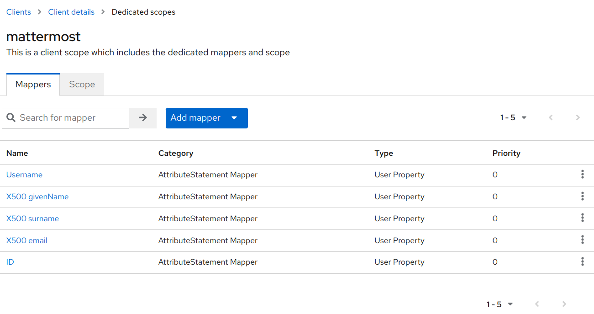

Configure SAML with Keycloak
============================

.. include:: ../../_static/badges/all-commercial.rst
  :start-after: :nosearch:

The following process provides steps to configure SAML with Keycloak for Mattermost.

See the encryption options documentation for details on what :ref:`encryption methods <deployment-guide/encryption-options:saml encryption support>` Mattermost supports for SAML.

Set up Keycloak for Mattermost SSO
-------------------------------------------

.. note:: 
    This was tested with Keycloak v26.4.0. We recommend adding Mattermost as a client to your primary realm.

1. Log in to Keycloak as an administrator.

2. Select **Clients**, then **Create client**. You'll use this client ID in a later step.

  - **Client type**: ``SAML``
  - **Client ID**: ``mattermost``

3. Click **Next** and update the following values:

  - **Root URL**: ``http://your-mattermost-url.com``
  - **Home URL**: ``/login/sso/saml``
  - **Valid redirect URIs**: ``/login/sso/saml``

4. **Save** the client.

5. Under the **Settings** tab, update the following values:

  - **Enabled**: **On**
  - **Name ID format**: ``email``
  - **Force Name ID format**: **On**

  .. image:: ../../images/keycloak_1_client_settings.png
        :alt: In Keycloak, create the Mattermost client, specify the Client ID and Client Protocol, then save your changes.

  .. image:: ../../images/keycloak_1_client_settings_2.png
        :alt: In Keycloak, create the Mattermost client, specify the Client ID and Client Protocol, then save your changes.

6. Under the **Signature and Encryption** section, update the following values:

  - **Sign Documents**: **Off**
  - **Sign Assertions**: **On**
  - **Signature Algorithm**: ``RSA_SHA1``
  - **SAML signature key name**: ``NONE``
  - **Canonicalization Method**: ``EXCLUSIVE``
  - **Encryption Algorithm**: ``AES_256_GCM``
  - **Key Transport Algorithm**: ``RSA_OAEP_MGF1P``
  - **Digest method for RSA-OAEP**: ``SHA1``

  .. image:: ../../images/keycloak_1_client_signature_encryption.png
        :alt: In Keycloak, configure the Signature and Encryption settings for the Mattermost client.

  .. warning:: 

    Mattermost only supports ``RSA_SHA1`` for Keycloak SAML, because Keycloak is using ``xmlenc`` for ``RSA_SHA512`` and ``RSA_SHA256``, wheras Mattermost currently only supports ``xmldsig``. So make sure to use ``RSA_SHA1`` as the *Signature Algorithm* and *Digest Method* as described in this section.

7. Navigate to the **Keys** tab.

  - **Client signature required**: **Off**
  - **Encrypt Assertions**: **On**

    a. Click **Generate**
    b. Download the **private.key** file.
    c. Click **Confirm**

    .. image:: ../../images/keycloak_2_saml_keys.png
        :alt: In Keycloak, on the Keys tab, generate new keys for encryption.

    .. warning:: 
        Mattermost does not support request signing with Keycloak so make sure to disable the Client signature setting as mentioned above.
    
    Next, click **Export** and update the following values and download the keystore.p12 file.
 
    - **Archive Format**: ``PKCS12``
    - **Key Alias**: ``mattermost``
    - **Key Password**: ``mattermost``
    - **Store Password**: ``mattermost`` 

    .. image:: ../../images/keycloak_2_saml_keys_2.png
        :alt: In Keycloak, on the Keys tab, generate new keys, export using the values documented, then select Download.

8. Navigate to the **Client scopes** tab.

   First we add the predefined mappers for email, first name, and last name.

   a. Select **mattermost-dedicated**
   b. Click **Add predefined mapper**
   c. Select the **X500 email**, **X500 givenName**, and **X500 surname** attributes.
   d. Click **Add**.

   Next, we add the mappers for username and id.

   a. Select **Add Mapper** -> **By Configuration** -> User Property.
   b. Set **Name** to ``Username``.
   c. Set **Property** to ``username`` (This is case sensitive and must be lowercase).
   d. Set **SAML Attribute Name** to ``username``.
   e. Select **Save**.

   .. image:: ../../images/keycloak_4_create_username_attribute.png
     :alt: In Keycloak, on the Mappers tab, create a protocol mapper, then save your changes.

   f. Repeat the above steps and use the custom property of ``id`` to create the ID Attribute.

   .. image:: ../../images/keycloak_4_create_id_attribute.png
    :alt: In Keycloak, on the Mappers tab, create a protocol mapper for the ID attribute, then save your changes.

.. note:: 

  If you're planning to sync your SAML users with LDAP within Mattermost, the ID value used here must match with your Mattermost LDAP ``ID Attribute``.

Once done your Mappers should look like this:

9. Get the metadata URL from Keycloak:

   a. Within your Realm, select **Realm Settings**.
   b. At the bottom of the **General** tab you should see a **SAML 2.0 Identity Provider Metadata** endpoint. Right-click and copy this URL. Store for the next step.

   .. image:: ../../images/keycloak_5_export_metadata.png
    :alt: Within your Realm, select Realm Settings. At the bottom of the General tab, you should see a SAML 2.0 Identify Provider Metadata endpoint. Copy this URL for the next step.

Configure SAML in Mattermost
-----------------------------

1. In the Mattermost **System Console** go to **Authentication > SAML**.

2. Set the **Identity Provider Metadata URL** to the value you copied from the step above and select **Get SAML Metadata from IdP**. The metadata import will populate fields related to your Keycloak configuration.

   If you have any issues with this import, you can check the ``mattermost.log`` file for more information. :ref:`Enable debug logging <administration-guide/manage/logging:how do i enable debug logging?>` and try again.

    .. image:: ../../images/keycloak_6_get_metadata.png
        :alt: In Mattermost, configure SAML in the System Console by going to Authentication > SAML. Set the Identity Provider Metadata URL to the value you copied in the previous step. When you select Get SAML Metadata from IdP, fields related to your Keycloak configuration are populated.

.. note::

    - If Mattermost does not correctly pull the **Identity Provider Public Certificate** you can manually add it by opening the metadata URL in a browser, copying the certificate value, and use a tool like `OneLogin's X.509 formatter <https://www.samltool.com/format_x509cert.php>`_ that can format the certificate for you. Then save the correctly formatted certificate to a file and upload it to the **Identity Provider Public Certificate** field in the Mattermost System Console.
    - If Mattermost can not pull the metadata and is throwing a connection issue enable debug logging and see if you need to add your Keycloak url to the **Allowed Untrusted Internal Connections** list in the System Console under **Environment > Developer** and restart the server. See the :ref:`Allowed Untrusted Internal Connections <administration-guide/configure/environment-configuration-settings:allow untrusted internal connections>` documentation for details.

3. Set the below fields:

   - **Verify Signature**: **false**
   - **Service Provider Login URL**: ``http://your-mattermost-url.com/login/sso/saml``
   - **Service Provider Identifier**: ``mattermost``

   The Service Provider Identifier will match the **Client ID** that you configured in the second Keycloak step.

   .. image:: ../../images/keycloak_7_mattermost_config.png
    :alt: In the System Console, configure SAML as documented, where the Service Provider Identifier matches the Client ID you configured in Keycloak.

4. Configure the Encryption using the key you downloaded in step 6 of the Keycloak config.

   a. Generate the ``.crt`` file from the ``.p12`` file.

   .. code-block:: console

       openssl pkcs12 -password pass:mattermost -in keystore.p12 -out mattermost.crt -nodes -legacy

   b. Generate the ``.key`` file from the ``.p12`` file.

   .. code-block:: console

       openssl pkcs12 -password pass:mattermost -in keystore.p12 -out mattermost.key -nodes -nocerts -legacy

   c. Upload both of these files within the Mattermost System Console. Make sure to select **Upload**.

    - **Service Provider Private Key**: ``mattermost.key``
    - **Service Provider Private Certificate**: ``mattermost.crt``
    - **Sign Request**: **true**
    - **Signature Algorithm**: ``RSAwithSHA256``
    - **Canonicalization Algorithm**: ``Exclusive XML Canonicalization 1.0 (omits comments)``

    .. image:: ../../images/keycloak_8_mattermost_encryption.png
        :alt: In the System Console, upload both the Service Provider Private Key and the Service Provider Private Certificate.

5. Set attributes for the SAML Assertions, which will update user information in Mattermost. 

   The attributes below are from steps 7 and 8 above. These values must be the **SAML Attribute Name** within Keycloak. See :ref:`documentation on SAML configuration settings <administration-guide/configure/authentication-configuration-settings:saml 2.0>` for more details.

   - **Email Attribute**: ``email``
   - **Username Attribute**:  ``username``
   - **Id Attribute**: ``id``

   .. image:: ../../images/keycloak_9_mattermost_attributes.png
        :alt: Set attributes for the SAML assertions which updates user information in Mattermost.

6. Select **Save**.

To confirm SAML is working correctly, log out of Mattermost or open Mattermost in a new Incognito Browser Window and select **Sign in with SAML** on the login page and login with an existing Keycloak account.

If you have existing users in Mattermost that are going to be migrated to SAML login, make sure to plan for user migration and update your users accordingly.

You may also configure SAML for Keycloak by editing ``config.json``. Before starting the Mattermost server, edit ``config.json`` to enable SAML based on :ref:`SAML configuration settings <administration-guide/configure/authentication-configuration-settings:saml 2.0>`. You must restart the Mattermost server for the changes to take effect.

Configuing a SAML user as a Guest in Keycloak
---------------------------------------------

1. In Mattermost, go to **System Console > Authentication > SAML**.

2. Set the **Guest Attribute** to designate which SAML users are guests.

   .. image:: ../../images/mm-guset-config.png
    :alt: In Mattermost, configure the SAML guest attribute

3. In the Keycloak administration interface, add a user attribute mapper for guests.

  a. Select **Clients** from the LHS menu.
  b. Select **mattermost** from the list.

    - Select the  *Client Scopes* tab
    - Select *mattermost dedicated* from the list of scopes
    - Click the *Add mapper* drop down and select *By configuration* 
    - Select *User Attribute* on the model that opens
    - Add values for *Name*, *User Attribute* and *SAML Attribute Name* as shown

    .. image:: ../../images/keycloak-mapper-details.png
      :alt: <Add attribute mapper>

4. In Keycloak specify which users are guest by adding the attribute under **User details** 

  a. Select **Users** from the LHS menu.
  b. Select the username of the desired user.
  c. Select the **Attribute** tab and select **+ add an attribute**.
  d. Add the key and value.

    .. image:: ../../images/guest-user-attribute.png
      :alt: An example of adding an attribute to a user.

.. include:: sso-saml-ldapsync.rst
   :start-after: :nosearch:

.. include:: sso-saml-faq.rst
   :start-after: :nosearch: