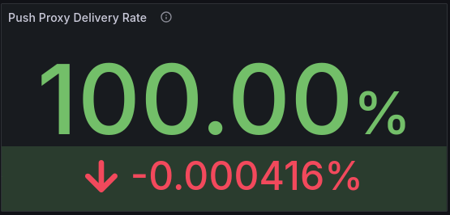
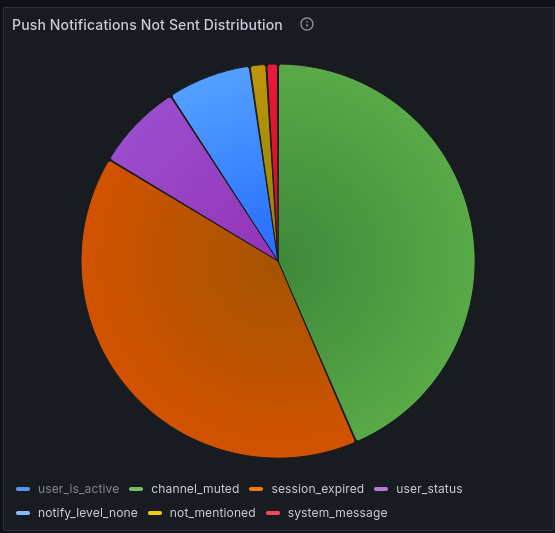
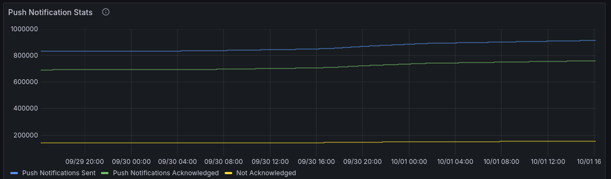
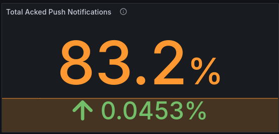

Push notification health targets
=================================

.. include:: ../../_static/badges/entry-ent.rst
  :start-after: :nosearch:

When using the `Mattermost Notification Health <https://grafana.com/grafana/dashboards/21305-mattermost-notification-health>`_ Grafana dashboard to track different types of notifications sent from Mattermost, we recommend adhering to the following mobile push notification health targets to ensure a performant production deployment of Mattermost.

.. note::

    - Accessing and enabling Mattermost Notification Health Monitoring requires ``MetricsSettings.Enable`` set to ``true``, and the feature flag ``NotificationMonitoring`` set to ``true``.
    - ``MetricsSettings.EnableNotificationMetrics`` must be enabled in the :ref:`Performance Monitoring <administration-guide/configure/environment-configuration-settings:enable notification monitoring>` configuration.
    - System admins can :ref:`disable notification monitoring data collection <administration-guide/configure/site-configuration-settings:enable notification monitoring>` through the System Console.

Push Proxy Delivery Rate
------------------------

The **Push Proxy Delivery Rate** panel indicates the percentage of push notifications that have been successfully delivered to the Push Notification Service (i.e., Apple Push Notification service (APNs) or Firebase Cloud Messaging (FCM)) out of the total number of push notifications sent.

Monitor this delivery rate to ensure that users are receiving their notifications in a timely manner. This value should always be 100%. Anything below 99% should be investigated further to identify issues with the push notification configuration, connectivity problems, or possible service interruptions with the push proxy provider.

Push Notifications Errors by Reason
------------------------------------

The **Push Notifications Errors by Reason** panel is a critical tool for maintaining the reliability and effectiveness of the push notification system. These values provide a breakdown of the errors encountered when sending push notifications, categorized by the specific reason for each error. 

This information helps admins to pinpoint common problems affecting push notification delivery, diagnose and fix issues more efficiently, detect patterns and trends, identify intermittent issues before they become more serious, and enhance the overall user experience with the Mattermost platform.

Missing profile errors are generally safe to ignore. However, if you see occurences of this error increase, verify logs for ``push_proxy_send_error``.

Push Notifications Not Sent Distribution
------------------------------------------

The **Push Notifications Not Sent Distribution** panel helps admins ensure the robustness and reliability of the push notification system by providing detailed insights into the specific reasons why notifications weren't sent.

This information helps admins understand the reasons why push notifications may not be sent, (i.e., the channel is muted), identify underlying system or configuration problems that need attention, prioritize areas for troubleshooting and improvement by focusing on the most significant issues affecting notification delivery rates, and monitor any trends or spikes in push notifications not sent, resulting in proactive maintenance and quicker resolution of issues as they arise.

Push Notifications Stats
-------------------------

The **Push Notifications Stats** panel provides a high-level view of the number of notifications sent and acknowledged. 

An acknowledged push notification indicates successful communication between the service and the device because the recipient's mobile device successfully received the push notification, and sent back a confirmation of delivery to the push notification service.

When a push notification isn't acknowledged, this indicates that the notification wasn't received, or that the device didn't send back a confirmation to the push notification service.

Closer alignment between the send and acknowledge lines in this graph indicates better performance.

Total Acked Push Notifications
------------------------------

The **Total Acked Push Notifications** value indicates the total number of push notifications that have been acknowledged by mobile devices. This metric helps admins understand how many push notifications sent from the Mattermost server were successfully received and acknowledged by mobile devices. It's an important indicator of the reliability and effectiveness of the push notification system, as it ensures that messages are being delivered and received as intended. Any value over 80% is considered normal. 

There are several scenarios where notifications may not be acknowledged which cover the remaining ~10-20% of notifications, as follows:

Servers removed without users logging out

- When a server is removed from the mobile app, and you can no longer contact the server using the mobile app, the server never logs the user session out. Therefore, Mattermost continues to send notifications to the mobile device. These sent notifications, can't be acknowledged because Mattermost would be missing the information about the server URL.

iOS notifications are disabled

- When notifications are disabled on iOS devices, notifications aren't processed by the mobile app. Therefore, we cannot acknowledge those notifications. Mattermost tracks whether the device has notifications disabled, but this information is only updated when the app starts. So any change without re-starting the app can lead to notifications not being acknowledged.

Notifications are dropped at the Push Notification Service

- APNs and FCM can drop notifications in several circumstances, especially when the mobile device doesn't have a connection. The notifications are marked as sent to the Push Proxy, but are never sent to the devices from the Push Notification Service. Therefore, the mobile device cannot acknowledge the notification.

Extreme battery save mode

- On Android, users can activate an extreme battery save mode. In this mode, notifications are not acknowledged.

