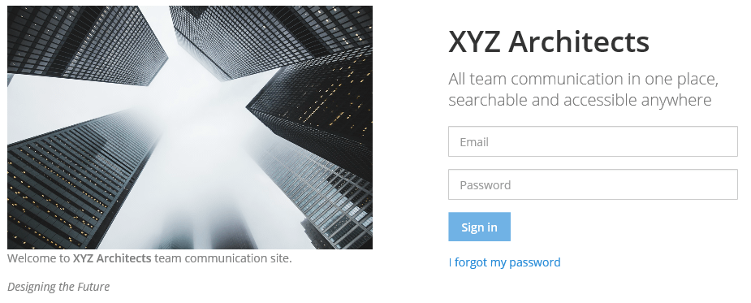

Custom Branding Tools
============================

Use custom branding tools to present a Mattermost experience that is tailored to the branding of your organization.



Enable Custom Branding
----------------------

1. Go to **System Console > Site Configuration > Customization > Enable Custom Branding** (or **System Console > Customization > Custom Branding** in versions prior to 5.12) and set the value to ``true``.
2. Choose a **Site Name**, upload a **Custom Brand Image**, and enter **Custom Brand Text**.
3. Click **Save**.

Users should see your new custom branding on the login page of your Mattermost server the next time they sign in.

From version 5.16, you can remove the custom brand image by selecting the **X** in the top right corner of the image. To apply the change, choose **Save**. Note that the value must be set to ``true`` in order to perform this step.

More about settings available in **Customer Branding Tools**:

Site Name
`````````
Choose the name of your Mattermost site to be shown in the UI. The site name appears in the header and footer of the site login page, team selection page, team creation page, account creation page, email invitations and replaces "Mattermost" on the **About** page. Note that the site name applies to the entire site and not just a specific team on the site. The site name is limited to 30 characters or less.

Custom Branding Image
`````````````````````
Upload a company logo or custom image representative of your site that is displayed on the left side of the site login page. Supported image formats are JPG, PNG, TIFF, and BMP. The recommended image size is 200-500px in width and height, and less than 2 MB since it is loaded for every user who logs in on desktop.

Custom Brand Text
`````````````````
Write custom text to display your company tagline or a welcome prompt. Custom text will be shown below the custom brand image on the left side of site login page on desktop. You can format this text to a maximum of 500 characters using the same `Markdown formatting syntax <https://docs.mattermost.com/help/messaging/formatting-text.html>`__ as used in Mattermost messages.

Site Description
````````````````
Use this field to describe the purpose of your site. The site description is shown below the site name on the login page.  This text defaults to ``All team communication in one place, searchable and accessible anywhere``. This text can be a maximum of 1024 characters and is not formatted with Markdown.

