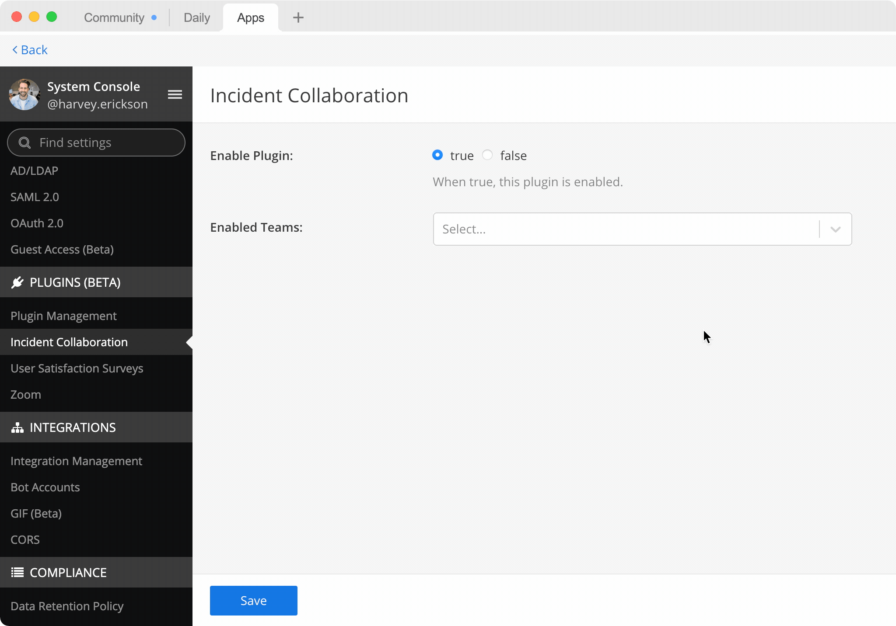
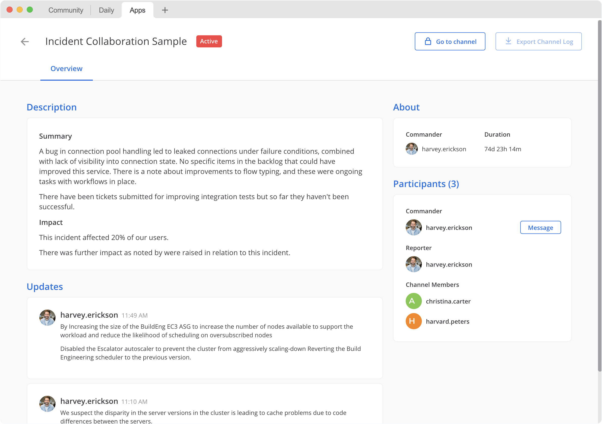

Mattermost Incident Collaboration
=================================

*Available in Mattermost Enterprise Edition E20, Mattermost Cloud Professional, and Mattermost Cloud Enterprise.*

Incidents are situations which require an immediate response, and incidents benefit from a clearly defined process that guides toward resolution. Mattermost Incident Collaboration equips your team to coordinate, manage, and resolve incidents from within Mattermost:

* Starting an incident automatically creates a dedicated incident channel to coordinate discussion. 
  
  - Use custom categories in the channel sidebar to streamline access to ongoing incidents.

* Playbooks define the tasks toward resolution as your team manages the incident.
  
  - Define your playbooks in advance with automated actions such as creating a Jira ticket, starting a Zoom call, or finding out who is on-call in Opsgenie.

* Reviewing the timeline and conversation helps refine the process for future such incidents.
  
  - Export the incident channel conversation to conduct a post-mortem review.

Delivering more reliable services requires an efficient resolution process. Use Mattermost Incident Collaboration not only to resolve incidents more efficiently, but also to learn from past incidents and refine the process your team relies upon for success.

.. contents::
  :depth: 1
  :local:
  :backlinks: entry
  
Installing Mattermost Incident Collaboration
--------------------------------------------

*For Cloud deployments*

Mattermost Incident Collaboration is included in the Mattermost Cloud workspace, enabled by default, and upgraded automatically.

*For self-managed deployments*

Mattermost Incident Collaboration is available in the Plugin Marketplace:

1. As a System Admin, go to **Main Menu > Plugin Marketplace**.
2. Search for **Incident Collaboration**.
3. Select **Install** if not yet installed, then select **Configure** to enable.
4. From the plugin configuration page, set **Enable Plugin** to **true**.
5. Select **Save** to enable the plugin.

Getting Started with Mattermost Incident Collaboration
------------------------------------------------------

Mattermost Incident Collaboration has the following components:

* **Incidents** are situations that require an immediate response. Every reported incident results in a newly-created, public or private incident channel exposing a custom user interface for collaboration and resolution.
* **Playbooks** define the process to guide an incident toward resolution. Playbooks are created in advance by defining the tasks, checklists, and other configuration used during an incident.
* **Tasks** are the discrete actions to be taken when resolving an incident. As the necessary work is completed, the team should mark the tasks as complete. During an incident, tasks may be assigned to a member of the incident channel to communicate ownership.
* The **Commander** is a defined role during the incident. This person is responsible for ensuring forward momentum on resolving the incident. By default, the reporter of the incident starts as the commander, but the commander may be changed at any time to another member of the incident channel.
* **Slash commands** may be assigned to tasks defined in the playbook to help to streamline common actions.

.. note:: 
   From v1.3.0, stages have been renamed to checklists, and serve only as a grouping mechanism for tasks. Tasks from any checklist may now be completed at any time.

To access Mattermost Incident Collaboration:

* From the Main Menu, select **Incident Collaboration** to view stats, review incidents of which you are a member, and configure playbooks. System Admins have unrestricted access.
* From the channel header, select the **Incidents** icon to open the right-hand sidebar. From there, create a new incident or collaborate on active incidents of which you are a member.

Playbooks and Incidents
-----------------------

Playbooks and incidents are associated with teams in Mattermost. Starting an incident prompts for a playbook and incident name. The selected playbook defines the process, communication options, channel permissions, and automation. You can read more about `channel permissions (Public and Private channels) <https://docs.mattermost.com/help/getting-started/organizing-conversations.html>`_.

System Admins can configure Incident Collaboration access permissions in the System Console. This allows for specific teams to better manage who can create playbooks, start incidents, and access potentially sensitive information.

Playbooks are always private by default. Membership in the playbook is required to configure the playbook or start an incident using that playbook. Once an incident is started, any member of the team may be added to the incident channel. Users who are not members of the team are unable to access playbooks or incidents belonging to that team.

While the commander of an incident has a dedicated, named role, all members of an incident channel have unrestricted access to modify the current state of the incident. This permissive access model ensures the incident is never blocked on any one individual. Use Private channels and channel membership to restrict access, or configure the playbook as public if everyone on the team is trusted with access to the incident.

During an ongoing incident, use the channel to communicate status updates which are visible to stakeholders via the Overview page without requiring their membership in the incident channel. Providing regular status updates increases visibility and helps ensure continued momentum toward resolution.

Stakeholders can view updates on the Overview page.

  
Any member of the channel can write a status update, post that update to the channel, and optionally start a reminder timer to prompt for a subsequent update. Also, if configured in the playbook, status updates may also be broadcast to another channel.

Once an incident is ended, schedule a post-mortem meeting to iterate on the design of your playbook. Automatic posts can help expose a timeline of events for review, such as when a task is marked as complete or when the commander changes. You can export the messages from the incident channel and use them to build a post-mortem document. Identify bottlenecks by explaining gaps between task completion, and suggest changes to the playbook for the next incident.

Playbooks
^^^^^^^^^

.. contents::
  :backlinks: top
  :local:

Creating a playbook
~~~~~~~~~~~~~~~~~~~

A playbook must be defined before starting an incident.

1. Go to **Main Menu > Incident Collaboration**.
2. Select **Playbooks**.
3. Start a **Blank Playbook**, or use the built-in **Incident Collaboration Playbook** as a template.
4. Name your playbook and provide a description.
5. Select the **Tasks** tab.
6. Within the **Tasks** tab, customize the checklists and tasks:
  * Create and name new tasks to capture actions your team should take to resolve the incident.
  * Create new checklists to group tasks meant to be completed together.
  * Drag and drop to reorganize checklists and tasks.
  * Optionally add task descriptions to give additional context to members of the incident channel. Descriptions support a limited form of Markdown, including text styling and hyperlinks.
  * Optionally add a slash command to the task that can be executed by members of the incident channel as needed.
7. Select the **Preferences** tab.
8. Within the **Preferences** tab, customize how status updates are communicated:
  * Optionally configure a broadcast channel to which status updates will be copied. If you are not a member of the configured broadcast channel, **Unknown Channel** is displayed instead of the channel name.
  * Optionally configure the default reminder timer used to prompt for regular updates. The reminder timer may be changed when a status update is written.
  * Optionally configure a template to use for the first status update. Subsequent status updates will start with the text of the most recent update.
9. Select the **Automation** tab.
10. Within the **Automation** tab, customize automatically triggered tasks:
  * Optionally enable the **Invite members** toggle and select a set of members. This set of members are automatically invited to the incident channel when the incident starts.
  * Optionally enable the **Assign commander** toggle and select a member. This member is automatically assigned as commander of the incident when the incident starts.
  * Optionally enable the **Announce it in another channel** toggle and select a channel. When the incident is started, an announcement is made in the selected channel.
  * Optionally enable the **Send a webhook** toggle and enter the webhook you want to use.
11. On the right-hand side of the screen, configure the permissions:
  * Decide whether the automatically-created incident channel should be Public or Private within the team.
  * Share this playbook with other members of the team to allow them to use the playbook to start an incident, as well as edit the playbook.

Configuring a playbook
~~~~~~~~~~~~~~~~~~~~~~

You can change a playbook's configuration at any time, but changes will only be applied to future incidents. Ongoing or ended incidents previously started from that playbook remain unchanged.

1. Go to **Main Menu > Incident Collaboration**.
2. Select **Playbooks**.
3. Find the playbook to be edited.
 * Only playbooks of which you are a member are listed. System Admins have unrestricted access to all playbooks on the team.
4. Select the name of the playbook, or select the **Actions** menu next to the playbook name, then select **Edit**.
5. Configure the playbook the same way a playbook is created or edited.

Deleting a playbook
~~~~~~~~~~~~~~~~~~~

You can delete a playbook at any time. Ongoing or ended incidents previously started from that playbook remain unchanged.

1. Go to **Main Menu > Incident Collaboration**.
2. Select **Playbooks**.
3. Find the playbook to be edited.
 * Only playbooks of which you are a member are listed. System Admins have unrestricted access to all playbooks on the team.
4. Select the **Actions** menu next to the playbook name, then select **Edit**.
5. Confirm that you want to **Delete Playbook**.

Incidents
^^^^^^^^^

.. contents::
  :backlinks: top
  :local:

Starting an incident
~~~~~~~~~~~~~~~~~~~~

To start an incident you can run the ``/incident start`` slash command from any channel. You can also use the desktop or browser to:

 * Select the **Incidents** icon in the channel header, and select **Start Incident** from the right-hand sidebar.
 * Use the context menu of a post and select **Start incident**.

Starting an incident opens an interactive dialog. Provide an incident name and select a playbook to be used with the incident. Optionally provide a description to offer immediate context into the newly started incident. Only playbooks of which you are a member are listed in the **Playbook** drop-down menu.

The creator of an incident is automatically added as the first member and becomes the commander.

When the incident is created, it is announced in the configured channel. If that channel is archived or deleted, the bot posts a notification in the incident channel.

Joining an incident
~~~~~~~~~~~~~~~~~~~

Join an incident by joining the incident channel. If the incident channel is public, you may join the channel without permission. Search for and join the channel via **Browse Channels**.

If the incident channel is private, an existing member of the incident channel must invite you. System Admins may join private incident channels without permission.

Working with tasks
~~~~~~~~~~~~~~~~~~

Tasks can be part of pre-configured task templates in playbooks, and they can also be added, edited, and removed as needed during an active incident. Any member of the incident channel can work with tasks.

.. note::
  Tasks added during an active incident (ad-hoc tasks) are not saved to the playbook. They only apply to that incident and incident channel.

* To mark a task as completed, select the unchecked checkbox next to the task. To undo this, clear the checkbox.
* To assign a task to a member of the incident channel, select **No Assignee** (or the existing assignee's username), then select a user.
* To view any description associated with a task, select the information icon to the right of the task name.
* To execute a slash command associated with a task, select **Run** next to the listed slash command. Configured slash commands may be run as often as necessary.
* To add an ad-hoc task, select **+ Add new task**.

.. image:: ../images/IC-ad-hoc-tasks.gif

Changing commanders
~~~~~~~~~~~~~~~~~~~

To change commanders you can run the ``/incident commander @username`` slash command from the incident channel. You can also use the desktop or browser to:

1. Select the **Incidents** icon in the channel header to open the right-hand sidebar.
2. Select the **Summary** tab.
3. Within the **Summary** tab, select the current commander's name in the right-hand sidebar, then select the new commander.
  * To change the commander to a user who is not in the channel, first add the user to the channel.

Providing a status update
~~~~~~~~~~~~~~~~~~~~~~~~~

Incident status updates ensure that stakeholders remain informed about the progress toward incident resolution. To post a status update:

1. Select the **Incidents** icon in the channel header to open the right-hand sidebar.
2. Find the incident you're looking for and select **Go to Incident Channel**.
3. Select the **Summary** tab.
4. Within the **Summary** tab, select **Update Status**.
5. Add a Markdown-formatted message.
 * If this is the first status update and the playbook has a defined template, that template will be pre-populated here.
 * If this is a subsequent status update, the message from the last status update will be pre-populated here.
6. Optionally set a reminder to prompt for the next status update.
 * If this is the first status update and the playbook has a defined default reminder timer, that timer will be pre-selected here.
 * If this is a subsequent status update, the last reminder timer will be pre-populated here.
7. Select **Update Status** to post your status update.
 * Status updates are posted to the incident channel as a message from the user providing the status update.
 * If the playbook has a defined broadcast channel, status updates are copied to the broadcast channel as a message from the incident bot.

The most recent status post will also appear in the right-hand sidebar of the incident channel. To correct or remove a status post, edit or delete the post as needed. Status updates that are broadcast to another channel will not be edited or deleted.

Ending an incident
~~~~~~~~~~~~~~~~~~~

Incident members can end an incident using the ``/incident end`` slash command. Incidents can also be ended from the desktop or browser:

1. Select the **Incidents** icon in the channel header to open the right-hand sidebar.
2. Find the incident you're looking for and select **Go to Incident Channel**.
3. Select **Update Status**.
4. From the **Status** drop-down menu, select **Resolved**.
5. Enter a message with additional details.
6. Select **Update Status**.

Ending an incident signals to all members of the channel that the incident is no longer ongoing. Members of the team can continue to post in the channel, mark tasks as complete, and change the commander if needed.

Restarting an incident
~~~~~~~~~~~~~~~~~~~~~~

If an incident was ended prematurely, it can be restarted within the incident channel using the ``/incident restart`` slash command. Incidents can also be restarted from the desktop or browser:

1. Select the **Incidents** icon in the channel header to open the RHS.
2. Find the incident you're looking for and select **Go to Incident Channel**.
3. Select **Update Status**.
4. From the **Status** drop-down menu, select **Active**.
5. Enter a message with additional details.
6. Select **Update Status**.

Reviewing past incidents
~~~~~~~~~~~~~~~~~~~~~~~~

To view past incidents of which you are a member, from the desktop or browser:

1. Navigate to **Main Menu > Incident Collaboration**.
2. Select the **Incidents** tab.
3. Within the **Incidents** tab, find the incident to be reviewed, then select the name of the incident.
4. Review the incident details:
 * The duration, total number of members ever involved, and messages sent in the channel are listed.
 * A graphical timeline shows how much time elapsed between completed checklist items.
5. Optionally export the contents of the incident channel to review during a post-mortem.

Built-in slash commands
-----------------------

The ``/incident`` slash command allows interaction with incidents via the post textbox on desktop, browser, and mobile for:

- ``/incident start`` - Start a new incident.
- ``/incident end`` - End an ongoing incident.
- ``/incident update`` - Update the current incident's status.
- ``/incident restart`` - Restart an ended incident.
- ``/incident check [checklist item]`` - Check/uncheck the specified task.
- ``/incident announce ~[channels]`` - Announce the current incident in other channels.
- ``/incident list`` - List all your incidents.
- ``/incident commander [@username]`` - Show or change the current commander.
- ``/incident info`` - Show a summary of the current incident.

Channel Export
--------------

Exporting the contents of an incident channel requires the channel export plugin. See the `Channel Export plugin documentation <https://mattermost.gitbook.io/channel-export-plugin>`_ for more information.

API Documentation
-----------------

To interact with the incidents data model programmatically, consult the `REST API specification <https://github.com/mattermost/mattermost-plugin-incident-collaboration/blob/master/server/api/api.yaml>`_.
