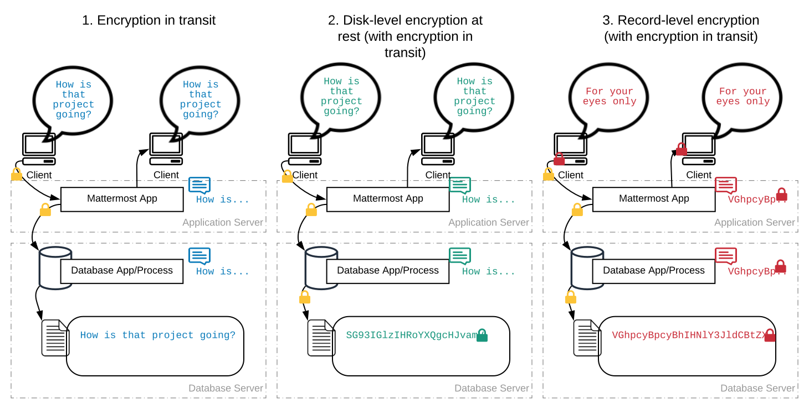

Encryption Options
=======================

Mattermost provides encryption-in-transit and encryption-at-rest capabilities. This page guides you through setting up appropriate encryption security.

Encryption is not required for GDPR, although it can be used as an additional safeguard against data breach.

.. contents::
  :backlinks: top
  :local:

Encryption-in-transit
-----------------------

Mattermost supports TLS encryption including AES-256 with 2048-bit RSA on all data transmissions between Mattermost client applications and the Mattermost server. You may either set up TLS on the Mattermost Server or install a proxy such as NGINX and set up TLS on the proxy. Refer to our `configuration guide for more details <https://docs.mattermost.com/install/config-tls-mattermost.html>`__.

Connections to Active Directory/LDAP can `optionally be secured with TLS or stunnel <https://docs.mattermost.com/administration/config-settings.html#id11>`__.

Encryption-at-rest
-----------------------

Database
~~~~~~~~~~~~~~~~~~~~~~~

Encryption-at-rest is available for messages via hardware and software disk encryption solutions applied to the Mattermost database, which resides on its own server within your infrastructure. Encryption options at the disk level are documented both for `MySQL <https://www.percona.com/blog/2016/04/08/mysql-data-at-rest-encryption/>`__ and `PostgreSQL <https://www.postgresql.org/docs/8.1/static/encryption-options.html>`__.

File Storage
~~~~~~~~~~~~~~~~~~~~~~~

For local storage or storage via Minio, encryption-at-rest is available for files stored via hardware and software disk encryption solutions applied to the server.

For Amazon’s proprietary S3 system, encryption-at-rest is available via `server-side encryption with Amazon S3-managed keys <https://docs.mattermost.com/administration/config-settings.html#enable-server-side-encryption-for-amazon-s3>`__ in Enterprise Edition E20.

Frequently Asked Questions
---------------------------------------------------

Why is encryption-at-rest not supported natively?
~~~~~~~~~~~~~~~~~~~~~~~~~~~~~~~~~~~~~~~~~~~~~~~~~~~

First we will levelset on what is meant by "encryption-at-rest".  It depends on how you define "at rest".  Two definitions we'll use here are:

* **Disk level** "at rest": Refers to the contents of the files created and managed by the database
* **Record level** "at rest": Refers to the records received and stored by the database process itself (commonly in a human-readable form, but not here).  In this definition, nobody can view the contents of the database record without the original security keys that encrypted it.

The diagram below illustrates 3 scenarios of data encryption. 

.. Original diagram available in Lucidchart here - https://www.lucidchart.com/invitations/accept/dcb4c561-3472-4297-86d1-5be57060a38f

1. The first message flow incorporates "encryption in transit".  
If a "bad actor" were sniffing the connections between the client and the Mattermost server they would not be able to make sense of the data without the decryption keys (TLS is involved here). This is **the** norm for secure connections on networks.

  - A message written by an end user is entered into the UI, which transmits the message over a secure connection to the Mattermost Server.
  - The Mattermost Server decrypts the message information and can apply application logic to it.
  - The Mattermost Server persists this message to the database over another secure connection.
  - The database will persist the information to special database files.

Technically speaking, if a "bad actor" had direct access to these database files (either through root access on the server, or removal of the harddisk) they could observe the contents.

2. The second message flow adds disk level encryption at rest (described above)

In this message flow a "bad actor" would require access to the database proces to observe the message contents.  The actual files on disk would not be usable without the decryption keys.  This is in addition to  "encryption in-transit".  The flow of the message data is the same as 1) with the additional encryption step done by the database process to the filesystem.

3. The third message flow adds an encryption step on the client side.

In this flow the message data is encrypted by the client before being sent over the secure connection to an application.  The application does not have the decryption keys and can therefore not apply useful logic to it, and passes it through to the database.  The database cannot understand the message contents either (which is commonly the driver behind this request).  With some non-sensitive information (available in unencrypted form) the application can offer this encrypted message back to a client.  This client must have the right decryption keys to make sense of the message.

Now, onto why we don't currently support scenario 3).  Enabling encryption-at-rest at record level level would:

  - Break search, given it relies on full-text database search in MySQL or PostgreSQL.  This would create a degration in experience for end-users.
  - Break :doc:`compliance exports <compliance-export>`, given the posts table in the database would be encrypted.  Compliance exports and auditability are key requirements for big proportion of the Mattermost user-base.

Hence, major architectural changes for the Mattermost server would be required for encryption-at-rest, which is why it is not yet natively supported.

We do, however, welcome feedback and guidance from the community on this topic and have three open feature proposals around encryption. We encourage upvoting the features relevant to you, and participating in the discussion to help guide the future of the project.

  - `Encryption-at-rest via server facilitated encryption of database contents <https://mattermost.uservoice.com/forums/306457-general/suggestions/13520235-server-facilitated-encryption-of-database-contents>`_
  - `End-to-end (e2e) encryption support <https://mattermost.uservoice.com/forums/306457-general/suggestions/36662833-end-to-end-e2e-encryption-support>`_
  - `Off-The-Record (OTR) messaging <https://mattermost.uservoice.com/forums/306457-general/suggestions/12818799-off-the-record-messaging>`_

To add additional controls to who can access data a common pattern for enterprise customers is to establish a *separation of duties* access model.  In this approach, the users who have access to the database are limited, and separate from the users who are administrators of Mattermost.