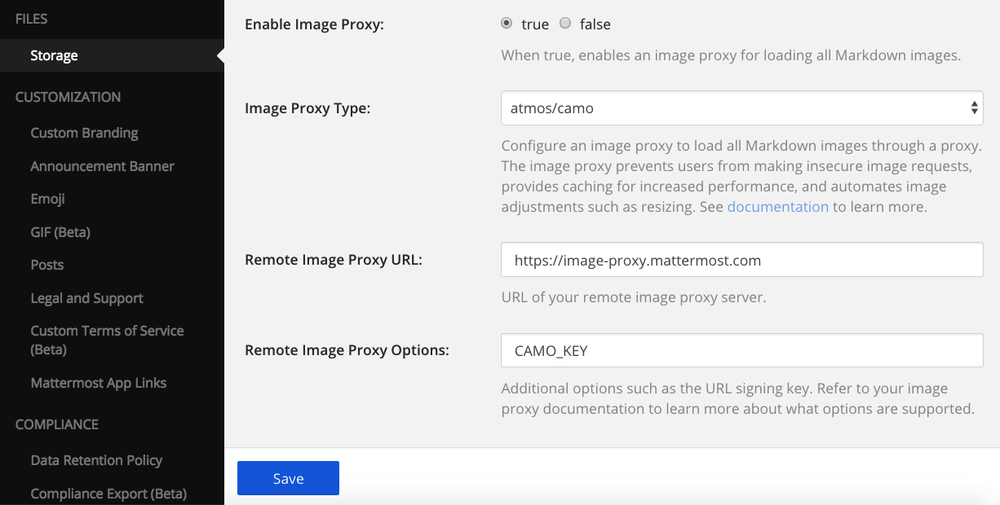

Image Proxy
================================

Using image proxies means that users make only secure requests. By allowing image requests to go straight to third-party
servers, tracking pixels is allowed. Users can put invisible images in posts that logs time and location data
for every user that views the post. An image proxy protects user privacy by eliminating this direct interaction with 
third-party servers.

Proxy servers also provide a layer of caching, and can be made faster and more reliable than third-party sites. This caching 
also helps preserve posts by protecting them from dead images.

Configuration Keys
~~~~~~~~~~~~~~~~~

Three configuration keys are included: ``ImageProxyType``, ``ImageProxyURL`` and ``ImageProxyOptions``. When these
keys are configured, posts served to the client will have their markdown modified such that all images are 
loaded through a proxy.

Image Proxy Type
........................

Configure an image proxy to load all Markdown images through a proxy. The image proxy prevents users from making insecure image requests to third-party sites and provides caching for increased performance.

Image Proxy URL
........................

URL of your image proxy server.

Image Proxy Options
........................

Additional options for basic image adjustments such as the URL signing key. Contact your image proxy 
service provider to learn more about what options are supported.

Setup Guide
~~~~~~~~~~~~~~~~~

This guide gives an example of how to set up an image proxy using ``atmos/camo``:

Deploy an ``atmos/camo`` (https://github.com/atmos/camo) instance to image-proxy.mattermost.com and update the 
configuration in the system console. For example:
 - "ImageProxyType": "atmos/camo",
 - "ImageProxyURL": "https://image-proxy.mattermost.com",
 - "ImageProxyOptions": the secret string that was used as the ``CAMO_KEY`` for the atmos/camo deployment.

The URL will be replaced with something similar to the following: https://image-proxy.mattermost.com/d7b4022717e8d015440cd70183b81196298b9453/687474703a2f2f692e726564642e69742f36636f687964636b6b363530312e6a7067 (See `https://github.com/atmos/camo <https://github.com/atmos/camo>`_).
  
Next, if you post a message with an image, you will get a proxied image in your post. This will ensure that every image
is downloaded via HTTPS.
