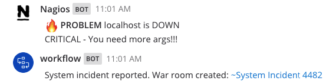
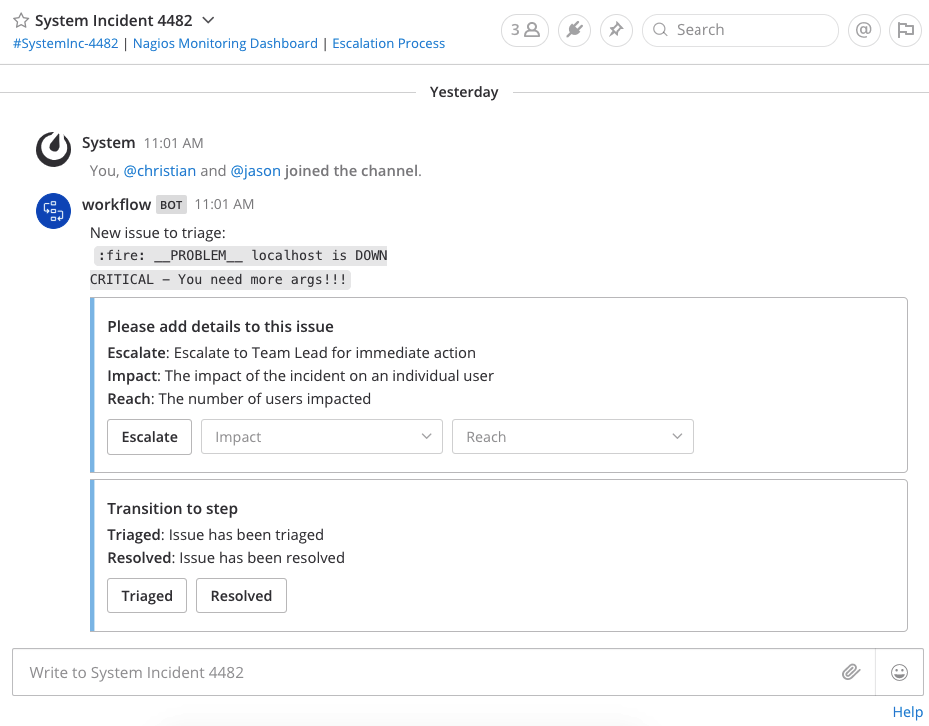
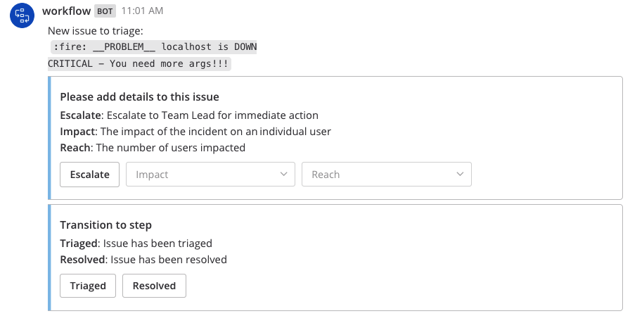
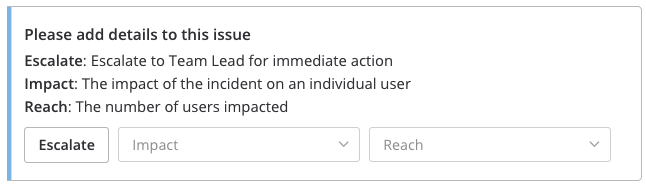
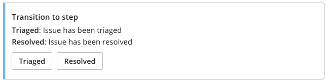
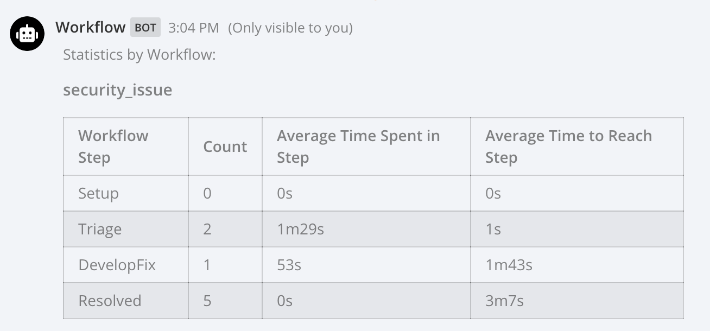

Incident Response Application (EE, Closed Alpha)
------------------------------------------------------

The incident response application is available in closed Alpha and is supported in Mattermost 5.12 and later.

Use the incident response application to connect all your workflows, automate repetitive tasks and collaborate on incidents within one secure messaging platform. Sample use cases you can accomplish with this app include the following:

1. Trigger automated incident response workflows based on keywords.
2. Automatically mention your InfoSec or DevSecOps teams when an incident occurs, including via email, mobile push and desktop notifications.
3. Auto-create "war rooms" and invite key team members to immediately collaborate on a critical incident.
4. Take quick actions, review data and access relevant links all in one place.
5. Archive resolved incidents to declutter your channel sidebar without losing access to past information.
6. Pull summary statistics of the incident response workflow, including mean-time-to-acknowledgment (MTTA) and mean-time-to-resolution (MTTR).

Below is an example of the incident response app automatically creating a channel from a Nagios alert, adding users to the channel and providing them quick actions to take on the incident.





To shape the direction of the incident response application, `sign up to our Alpha program here <https://docs.google.com/forms/d/e/1FAIpQLSf4Rr1YnofQQnKHJuL0Cgz_DaCUitt_Atik7K9KXsDefCyXlg/viewform>`_!

.. contents:: Contents
  :backlinks: top
  :local:
  :depth: 2

How Can I Try The App?
~~~~~~~~~~~~~~~~~~~~~~~~~~~

1. `Sign up for the closed Alpha program <https://docs.google.com/forms/d/e/1FAIpQLSf4Rr1YnofQQnKHJuL0Cgz_DaCUitt_Atik7K9KXsDefCyXlg/viewform>`_. If you're selected to join the Alpha program, you will receive an email from us with a plugin binary.

2. Upload the plugin binary in **System Console > Plugins > Plugin Management** `following these steps <https://about.mattermost.com/default-plugin-uploads>`_.

3. Enable the plugin from the **Installed Plugins** list.

4. Upload an incident response workflow to your Mattermost server:

 - Write an app workflow schema in a JSON file. You can use `one of these sample app workflows <https://github.com/mattermost/docs/tree/master/source/samples/incident-response-app>`_ to get started, and edit the sample (such as team and channel names) with the help of the configuration documentation below.
 - Go to any Mattermost channel and post ``/workflow edit`` to open the workflow editor.
 - Click **Choose .json file** and select the JSON file containing the app workflow schema.
 - Click **Upload**.

5. Post the trigger word defined in the app workflow schema to start the workflow!

See the documentation below to get help on how to configure and manage your app workflows, or open an issue at https://forum.mattermost.org and we'd be happy to help you.

Incident Response App Configuration
~~~~~~~~~~~~~~~~~~~~~~~~~~~~~~~~~~~~~~~

The app is configured through a JSON file, which you can upload as a System Administrator via ``/workflow edit``. We highly recommend using a text editor file that automatically validates syntax errors of your JSON file.

The JSON file looks something as follows.

  .. code-block:: json

    [
      {
        "name": "security_issue",
        "triggers": [
          {
            "name": "issuereported",
            "type": "text",
            "match": "#sec"
          }
        ],
        "steps": [
          {
            "name": "Setup",
            "start_actions": [
              {
                "name": "CreateWarroom",
                "type": "create_channel",
                "channel_name": "security-issue-{{.Instance.Number}}",
                "channel_displayname": "Security Issue {{.Instance.Number}}"
              },
              ...
              {
                "type": "transition_to",
                "name": "TransitionToTriage",
                "to": "Triage"
              }
            ]
          },
          ...
          {
            "name": "Resolved",
            "start_actions": [
              {
                "name": "ResolveWarroom",
                "type": "post",
                "channel_name": "{{.Action.CreateWarroom.ChannelName}}",
                "message": "Resolved."
              },
              ...
              {
                "name": "finished",
                "type": "finished_workflow"
              }
            ]
          }
        ]
      }
    ]

There are four components to an incident app workflow schema: triggers, steps, actions and transitions. Each one is explained in more detail below.

.. note::
  All field names must be a sequence of one or more letters, digits and underscores, and start with a letter.
  
  For instance, a trigger name can be ``sec_issue_workflow_3`` or ``SecIssueWorkflow3`` but not ``sec-issue-workflow-3``.

Trigger
^^^^^^^^^^^^^^^

A trigger is a condition on which a workflow can be started.

.. csv-table::
    :header: "Field", "Description", "Type", "Required"

    "name", "The name of the trigger.", "string", "Yes. This field must be unique."
    "type", "The type of trigger. This refers to the internal name of the trigger being configured.", "string", "Yes"
    "*additional fields", "Additional fields based on the type of trigger. See below for more details.", "string", "Yes"

Note that the trigger name must be a sequence of one or more letters, digits and underscores, and start with a letter, such as ``sec_issue_workflow_3``.

Text Trigger (type: ``text``)
*******************************

An incident can be created when a text trigger is seen. The specified message then becomes the description of the incident.

For example, you can specify "#s1critical" as the text trigger and any message that contains this keyword is treated as an incident and starts the workflow.

.. csv-table::
    :header: "Field", "Description", "Type", "Required"

    "team_name", "The team(s) to watch for the trigger. If none specified, all teams will be watched.", "string", "No"
    "channel_name", "The channel(s) to look for the trigger. If none specified, all channels will be watched.", "string", "No"
    "match", "The text string to match on.", "string", "If ``match_regex`` not set, yes"
    "match_regex", "The regex to match on.", "string", "If ``match`` not set, yes"

Below is an example JSON for a text trigger where any message posted to Nagios channel in InfoSec team containing the word ``#s1critical`` triggers the workflow:

.. code-block:: json

  "triggers": [
      {
          "name": "IssueReported",
          "type": "text",
          "team_name": "infosec",
          "channel_name": "nagios",
          "match": "#s1critical",
          "match_regex": ""
      }
  ]

Step
^^^^^^^^^^^^^^^

A step is the representation of a state the app workflow can be in. For now it contains a set of actions to be performed when it is started and when it is finished.

.. csv-table::
    :header: "Field", "Description", "Type", "Required"

    "name", "The name of the step.", "string", "Yes. This field must be unique."
    "start_actions", "Actions to perform when the step is reached.", "[]Action", "If ``finished_actions`` not set, yes"
    "finish_actions", "Actions to perform when the step is finished.", "[]Action", "If ``start_actions`` not set, yes"

Note that the step name must be a sequence of one or more letters, digits and underscores, and start with a letter.

Action
^^^^^^^^^^^^^^^

Actions are performed when steps are started and finished.

.. csv-table::
    :header: "Field", "Description", "Type", "Required"

    "name", "The name of the action.", "string", "Yes. This field must be unique."
    "type", "The type of action to perform.", "string", "Yes"
    "*additional fields", "Additional fields based on the type of action. See below for more details.", "string", "Yes"

Note that the action name must be a sequence of one or more letters, digits and underscores, and start with a letter.

Create Channel (type: ``create_channel``)
*******************************************

Creates a channel with the given parameters.

.. csv-table::
    :header: "Field", "Description", "Type", "Required"

    "channel_name", "The name of the channel. This is the channel handle used in the URL.", "string", "Yes"
    "channel_displayname", "The display name of the channel.", "string", "Yes"
    "team_name", "The team to create the channel in. If none specified, the channel is created in the same team as where the app workflow was triggered.", "string", "No"
    "header", "The channel header.", "string", "No"
    "purpose", "The channel purpose.", "string", "No"
    "private", "``Yes`` if the channel is private, ``No`` if the channel is public.", "boolean", "No"

Below is an example JSON for a step containing one ``create_channel`` start action.

.. code-block:: json

  "steps": [
      {
          "name": "Setup",
          "start_actions": [
              {
                  "name": "CreateWarroom",
                  "type": "create_channel",
                  "channel_name": "system-incident-{{.Instance.Number}}",
                  "channel_displayname": "System Incident {{.Instance.Number}}",
                  "header": "[Nagios Monitoring Dashboard](http://18.188.56.242/nagios/)"
              },
          ]
      }
  ]

.. tip::
  If the ``create_channel`` action attempts to create a channel that already exists, the workflow fails to continue as it's unable to create that said channel.
  
  Therefore, it is highly recommended that you use instance template variables to define ``channel_name`` and ``channel_displayname`` parameters to avoid non-unique channel names. For instance, if you define the channel name to be ``system-incident-{{.Instance.Number}}`` such as in the app workflow JSON example above, channels are created with names ``system-incident-1``, ``system-incident-2``, and so forth, avoiding duplicate names.

Add Users to Channel (type: ``add_users_channel``)
**************************************************************

Adds the specified users to a channel.

.. csv-table::
    :header: "Field", "Description", "Type", "Required"

    "channel_name", "The channel to create the post in.", "string", "Yes"
    "users", "A list of users to add to a channel. Can be usernames, user IDs or AD/LDAP group names.", "[]string", "Yes"
    "team_name", "The team the channel belongs to. Use it if the same channel name exists in different teams.", "string", "No"

Below is an example JSON for a step containing one ``add_users_channel`` start action, which adds Kathy and Christopher to a System Incident channel.

.. code-block:: json

  "steps": [
      {
          "name": "Setup",
          "start_actions": [
              {
                  "name": "AddUsers",
                  "type": "add_users_channel",
                  "channel_name": "{{.Action.CreateWarroom.ChannelName}}",
                  "users": [
                      "kathy",
                      "christopher"
                  ]
              },
          ]
      }
  ]

.. tip::
  Note that the above JSON uses ``{{.Action.CreateWarroom.ChannelName}}`` as the channel name. These are template variables which allow you to dynamically specify parameters based on other actions or steps within the app workflow schema.
  
  In this example, ``{{.Action.CreateWarroom.ChannelName}}`` pulls the channel name used in an ``CreateWarroom`` action, which is the example of the ``create_channel`` action above, and adds Kathy and Christopher to that channel.

Create Post (type: ``post``)
*******************************

Creates a post in the specified channel.

.. csv-table::
    :header: "Field", "Description", "Type", "Required"

    "channel_name", "The channel to create the post in.", "string", "Yes"
    "message", "The contents of the message.", "string", "Yes"
    "team_name", "The team the channel belongs to. Use it if the same channel name exists in different teams.", "string", "No"
    "fields", "A list of fields to include in the message. Usually dropdown menus or buttons that allow users to add more details to the incident.", "[]Field", "No"
    "fields_title", "A title for the fields.", "string", "No"
    "transitions", "A list of transitions to include in the message. When the user clicks on one of the transitions, the workflow transitions to the specified step.", "[]Button", "No"
    "transition_title", "A title for the transitions.", "string", "No"

Below is an example JSON for a step containing one ``post`` start action, which the message below to a channel created by the ``CreateWarroom`` action.



.. code-block:: json

  "steps": [
      {
          "name": "Triage",
          "start_actions": [
              {
                  "name": "TriagePost",
                  "type": "post",
                  "channel_name": "{{.Action.CreateWarroom.ChannelName}}",
                  "message": "New issue to triage:\n ```{{.Trigger.IssueReported.Message}}```",
                  "fields_title": "Please add details to this issue",
                  "fields": [
                      {
                          "name": "Escalate",
                          "type": "button",
                          "description": "Escalate to Team Lead for immediate action"
                      },
                      {
                          "name": "Impact",
                          "type": "options",
                          "description": "The impact of the incident on an individual user",
                          "options": [
                              "I1",
                              "I2",
                              "I3"
                          ]
                      },
                      {
                          "name": "Reach",
                          "type": "options",
                          "description": "The number of users impacted",
                          "options": [
                              "10,000+",
                              "1,000-10,000",
                              "Less than 1,000"
                          ]
                      }
                  ],
                  "transitions_title": "Transition to step",
                  "transitions": [
                      {
                          "label": "Triaged",
                          "description": "Issue has been triaged",
                          "to": "DevelopFix"
                      },
                      {
                          "label": "Resolved",
                          "description": "Issue has been resolved",
                          "to": "Resolved"
                      }
                  ]
              }
          ]
      }
  ]

.. tip::
  Note that the above JSON uses ``{{.Action.CreateWarroom.ChannelName}}`` as the channel name. These are template variables which allow you to dynamically specify parameters based on other actions or steps within the app workflow schema.
  
  In this example, ``{{.Action.CreateWarroom.ChannelName}}`` pulls the channel name used in an ``CreateWarroom`` action, which is the example of the ``create_channel`` action above, and posts a message to that channel.

**Fields and Transitions**

Note that in the above JSON example, the post action type contained fields and transitions.

Fields are usually dropdown menus or buttons that allow users to add more details to the incident, such as escalate an issue to the Team Lead, and specify the impact and reach of the incident.

You can also optionally set a title for them - if none specified, ``Fields`` is used.



Transitions allow a user to move the app workflow to the next step in the process, such as **Triage** or **Resolved**. When a user clicks on one of the transitions, the workflow transitions to the specified step.

You can also optionally set a title for them - if none specified, ``Transitions`` is used.



Transition to Another Step (type: ``transition_to``)
******************************************************

Specifies which step to transition the workflow to.

.. csv-table::
    :header: "Field", "Description", "Type", "Required"

    "to", "The name of the target step to transition to.", "string", "Yes"

Below is an example JSON for a step containing one ``transition_to`` start action, which transitions the workflow to ``Triage`` step.

.. code-block:: json

  "steps": [
      {
          "name": "Setup",
          "start_actions": [
              {
                  "name": "TransitionToTriage",
                  "type": "transition_to",
                  "to": "Triage"
              },
          ]
      }
  ]

Archive Channel (type: ``archive_channel``)
**********************************************

Archives the specified channel.

.. csv-table::
    :header: "Field", "Description", "Type", "Required"

    "channel_name", "The channel to archive.", "string", "Yes"
    "team_name", "The team the channel belongs to. Use it if the same channel name exists in different teams. By default, the team the workflow was triggered on is set.", "string", "No"

Below is an example JSON for a step containing one ``archive_channel`` start action, which archives a System Incident channel.

.. code-block:: json

  "steps": [
      {
          "name": "Resolved",
          "start_actions": [
              {
                  "name": "ArchiveIncidentChannel",
                  "type": "archive_channel",
                  "channel_name": "{{.Action.CreateWarroom.ChannelName}}"
              },
          ]
      }
  ]

.. tip::
  Note that the above JSON uses ``{{.Action.CreateWarroom.ChannelName}}`` as the channel name. These are template variables which allow you to dynamically specify parameters based on other actions or steps within the app workflow schema.
  
  In this example, ``{{.Action.CreateWarroom.ChannelName}}`` pulls the channel name used in an ``CreateWarroom`` action, which is the example of the ``create_channel`` action above, and archives it.

Sample Schema
~~~~~~~~~~~~~~~~~~~~~~~~

Below is a full sample schema with a text trigger, four steps and multiple actions including transitions. For other sample schemas, `see here <https://github.com/mattermost/docs/tree/master/source/samples/incident-response-app>`_.

Note that you should edit the sample (such as team and channel names) for your server.

  .. code-block:: json

    [
        {
            "name": "security_issue",
            "triggers": [
                {
                    "name": "IssueReported",
                    "type": "text",
                    "match": "#sec"
                }
            ],
            "steps": [
                {
                    "name": "Setup",
                    "start_actions": [
                        {
                            "name": "CreateWarroom",
                            "type": "create_channel",
                            "channel_name": "security-issue-{{.Instance.Number}}",
                            "channel_displayname": "Security Issue {{.Instance.Number}}"
                        },
                        {
                            "name": "AddUsers",
                            "type": "add_users_channel",
                            "channel_name": "{{.Action.CreateWarroom.ChannelName}}",
                            "users": [
                                "jon",
                                "chris"
                            ]
                        },
                        {
                            "type": "post",
                            "name": "attention_post",
                            "channel_name": "Town Square",
                            "message": "Security issue reported. War room created: ~{{.Action.CreateWarroom.ChannelName}}"
                        },
                        {
                            "type": "transition_to",
                            "name": "TransitionToTriage",
                            "to": "Triage"
                        }
                    ]
                },
                {
                    "name": "Triage",
                    "start_actions": [
                        {
                            "name": "TriagePost",
                            "type": "post",
                            "channel_name": "{{.Action.CreateWarroom.ChannelName}}",
                            "message": "New issue to triage:\n ```{{.Trigger.IssueReported.Message}}```",
                            "fields_title": "Please add details to this issue",
                            "fields": [
                                {
                                    "name": "Alert",
                                    "type": "button",
                                    "description": "Alert the Sysadmin to take immediate action"
                                },
                                {
                                    "name": "Likelihood",
                                    "description": "How likely the security issue is to be exploited.",
                                    "type": "options",
                                    "options": [
                                        "L1",
                                        "L2",
                                        "L3"
                                    ]
                                },
                                {
                                    "name": "Impact",
                                    "type": "options",
                                    "description": "The impact of the security issue if exploited",
                                    "options": [
                                        "I1",
                                        "I2",
                                        "I3"
                                    ]
                                },
                                {
                                    "name": "Severity",
                                    "type": "options",
                                    "description": "Derived from Impact and Likelihood",
                                    "options": [
                                        "S1",
                                        "S2",
                                        "S3"
                                    ]
                                }
                            ],
                            "transitions_title": "Transition to step",
                            "transitions": [
                                {
                                    "label": "Triaged",
                                    "description": "Issue has been triaged",
                                    "to": "DevelopFix"
                                },
                                {
                                    "label": "Resolved",
                                    "description": "Issue has been resolved",
                                    "to": "Resolved"
                                }
                            ]
                        }
                    ],
                    "finish_actions": [
                        {
                            "name": "TriageConfirmation",
                            "type": "post",
                            "channel_name": "{{.Action.CreateWarroom.ChannelName}}",
                            "message": "Finished Triage"
                        }
                    ]
                },
                {
                    "name": "DevelopFix",
                    "start_actions": [
                        {
                            "name": "InfoPost",
                            "type": "post",
                            "channel_name": "{{.Action.CreateWarroom.ChannelName}}",
                            "message": "Developing a fix underway. Issue information:\n\nLikelihood: {{.Action.TriagePost.Likelihood}}\nImpact: {{.Action.TriagePost.Impact}}\nSeverity: {{.Action.TriagePost.Severity}}",
                            "transitions": [
                                {
                                    "label": "Triage",
                                    "description": "Return to triage.",
                                    "to": "Triage"
                                },
                                {
                                    "label": "Resolved",
                                    "description": "Close issue as resolved",
                                    "to": "Resolved"
                                }
                            ]
                        }
                    ]
                },
                {
                    "name": "Resolved",
                    "start_actions": [
                        {
                            "name": "ResolveWarroom",
                            "type": "post",
                            "channel_name": "{{.Action.CreateWarroom.ChannelName}}",
                            "message": "Resolved."
                        },
                        {
                            "name": "PostResolved",
                            "type": "post",
                            "channel_name": "town-square",
                            "message": "Resolved Security Issue {{.Instance.Number}}"
                        },
                        {
                            "name": "ArchiveSecurityChannel",
                            "type": "archive_channel",
                            "channel_name": "security-issue-{{.Instance.Number}}"
                        }
                    ]
                }
            ]
        }
    ]

Statistics
~~~~~~~~~~~~~~~~~~

The incident response application also enables you to pull summary statistics, including mean-time-to-acknowledgment (MTTA) and mean-time-to-resolution (MTTR).

To pull a sample report, use ``/workflow stats`` in any Mattermost channel:



The statistics are based on an aggregated summary of all individual workflow instances. You may also reset statistics at any time via ``/workflow reset-stats``.

You must be a System Administrator or an authorized user in **System Console > Plugins > Incident Response App** to execute these commands.

Permissions and Management of the App
~~~~~~~~~~~~~~~~~~~~~~~~~~~~~~~~~~~~~~~~~~~~~~~~

By default, System Administrators can edit the incident response app by uploading a JSON file via the ``/workflow edit`` command. This allows System Administrators to have full control over what app workflows are configured in a Mattermost server.

You may optionally enable individual users to manage the app by adding a list of authorized user IDs in **System Console > Plugins > Incident Response**. User IDs can be found by navigating to **System Console > User Management**. After clicking into a user's name, their ID is on the right-hand side of the blue header.

Roadmap
~~~~~~~~~~~~~~~~~~~~~~~~~~~~~~~~~~~~~~~~~~~~~~~~

The following are some of the use cases we plan to support in a future Beta or stable release:

1. Pulling remote data to, for instance, look up responders who are on duty from an external system or from AD/LDAP, and notifying them about a new incident.
2. Creating and managing workflows through an interface instead of a JSON schema file.
3. Supporting branching and IF conditions for more complex incident management workflows.
4. Exporting all actions and conversations into a PDF for post-mortem and root cause analysis.
5. Richer analytics for measuring the effectiveness of incident response processes.
6. Deeper integrations with existing monitoring and ticketing systems for streamlined incident response management.

If you have any feedback on the incident response application, please let us know at https://forum.mattermost.org.

Troubleshooting
~~~~~~~~~~~~~~~~~~

Below are common error messages and how to resolve them.

Always review your Mattermost server logs in **System Console > Server Logs** for errors with the keyword ``workflow`` for more details. If you need any help with configuring the app, let us know at https://forum.mattermost.org and we'd be happy to assist you.

``Error parsing workflow: workflow name must not be blank``
^^^^^^^^^^^^^^^^^^^^^^^^^^^^^^^^^^^^^^^^^^^^^^^^^^^^^^^^^^^^

The app workflow name is empty. Please specify a name for the app workflow and try again.

``Error parsing workflow: unable to load triggers``
^^^^^^^^^^^^^^^^^^^^^^^^^^^^^^^^^^^^^^^^^^^^^^^^^^^^^^^^^^^^

One or more of the app workflow triggers are misconfigured. For each trigger, make sure to
1. define the trigger type as ``text``;
2. specify a ``match`` or ``match_regex`` for the trigger;
3. if you specified a ``match_regex`` trigger, confirm the regex is valid.

``Error parsing workflow: ... step name must not be blank``
^^^^^^^^^^^^^^^^^^^^^^^^^^^^^^^^^^^^^^^^^^^^^^^^^^^^^^^^^^^^

At least one of the step names is empty. Please specify a name for the step and try again.

``Error parsing workflow: ... unable to load actions``
^^^^^^^^^^^^^^^^^^^^^^^^^^^^^^^^^^^^^^^^^^^^^^^^^^^^^^^^^^^^

One or more of the app workflow actions are misconfigured. For each action, make sure to

1. define the action type as one of ``add_users_channel``, ``archive_channel``, ``create_channel``, or ``post``;
2. use the correct JSON for each action type as defined earlier in this document;
3. confirm the name in ``transition_to`` actions matches the name of another step in the app workflow.

Validation errors
^^^^^^^^^^^^^^^^^^^^^^^^^^^^^^^^^^^^^^^^^^^^^^^^^^^^^^^^^^^^

The incident response app validates template variables used in the app workflow. The error message indicates which specific variable is leading to the error.
