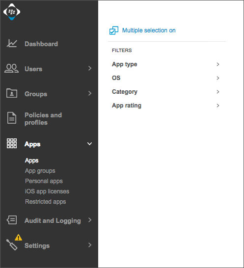
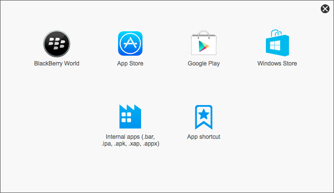
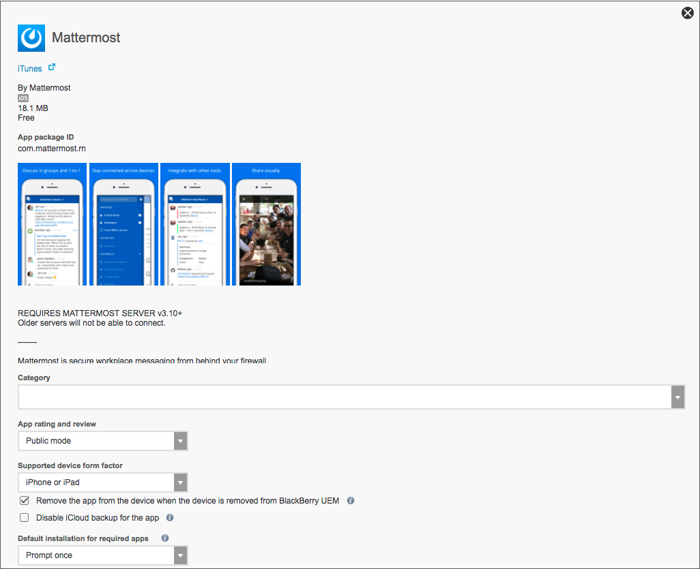

Set Up Mattermost with BlackBerry EMM
=====================================

1. Log in to your BlackBerry UEM environment.

2. Click on **Apps**.

3. Select the already published Mattermost app, or choose to add a new one.  When adding a new app, select **App Store** or **Google Play** to use the published apps by Mattermost. If you are building the apps yourself, use the option for **Internal apps** and then browse to select the .apk or .ipa file.

4. Next fill in the app name, description, and any other information needed for deployment in the screen below. See BlackBerry documentation for more details on the settings for `internal apps <https://help.blackberry.com/en/blackberry-uem/12.6/administration/adr1393870066674.html>`__, `public iOS apps <https://help.blackberry.com/en/blackberry-uem/12.6/administration/ios-apps.html>`__, and `Android for Work apps <https://help.blackberry.com/en/blackberry-uem/12.6/administration/adr1427221741509.html>`__.

5. In the same screen look for **App configuration**. You can either upload this :download:`xml file <mattermost-specfile.xml>` as the template, or add the configuration manually with the keys and values described in the :ref:`appconfig-table`.

  A. Using the template:

    - Browse for the xml template file (Note: If you build the app yourself, make sure to edit the template to use your bundle or package ID)

    .. image:: ../../source/images/blackberry_step5a1.png

    - Set the name of the app configuration and edit the settings that appear on screen, then click **Save**

    .. image:: ../../source/images/blackberry_step5a2.png

  B. Manual configuration:

    - Click on the "**+**" at the far right of the App configuration table and select **Configure Manually**

    .. image:: ../../source/images/blackberry_step5b1.png

    - Enter a name for the app configuration, and then add the key value pairs found in the :ref:`appconfig-table`.

    .. image:: ../../source/images/blackberry_step5b2.png

    - Save your configuration
