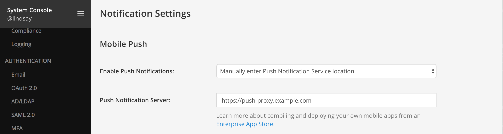

Build Your Own Version of the Mattermost Mobile Apps
====================================================

To deploy in production with privately-hosted mobile apps compiled by your organization in an Enterprise App Store:

1. Compile your own iOS and Android mobile applications from the `open source repository <https://github.com/mattermost/mattermost-mobile>`__
  - See the :doc:`mobile developer guide <../developer/mobile-developer-setup>` for help setting up your environment and building the apps
  - Note: If your server version is not supported by the Mattermost apps, you will need to use the Mattermost Classic app repositories for `iOS <https://github.com/mattermost/mattermost-ios-classic>`__ and `Android  <https://github.com/mattermost/mattermost-android-classic>`__

2. Compile your own Mattermost Push Notification Service (MPNS) from the `open source repository <https://github.com/mattermost/mattermost-push-proxy>`__ or use the pre-compiled version from https://github.com/mattermost/mattermost-push-proxy/releases
  - To secure your push notifications, make sure to use encrypted TLS connections between:

    - MPNS and Apple Push Notification Service
    - MPNS and Google’s Firebase Cloud Messaging
    - MPNS and your Mattermost server

3. Set up a way to connect to your private network Mattermost instance, using:
  - An external proxy with encrypted transport through HTTPS and WSS network connections
  - (Recommended) Depending on your security policies, consider deploying a mobile VPN client with multi-factor authentication (MFA), GitLab SSO with MFA, or run Mattermost Enterprise Edition with MFA

4. Enable mobile push notifications
  - Go to **System Console** > **Notifications** > **Mobile Push** in prior versions or **System Console > Environment > Push Notification Server** in versions after 5.12
  - Under **Send Push Notifications**, select **Manually enter Push Notification Service location**
  - Enter the location of your Mattermost Push Notification Service in the **Push Notification Server** field

5. (Optional) Customize mobile push notification contents
  - Go to **System Console** > **Notifications** > **Mobile Push** in prior versions or **System Console > Site Configuration > Notifications** in versions after 5.12
  - Select an option for **Push Notification Contents** to specify what type of information to include in push notifications
  - Most deployments choose to include the **full message content sent in the notification payload**. If your organization has policies or compliance requirements regarding data security, you may opt for sending **full message content fetched from the server on receipt** (Enterprise Edition E20) so messages are not sent to Apple's Push Notification Service or Google's Firebase Cloud Messaging notification service.

.. image:: ../images/mobile_push_contents.png

6. Deploy to an Enterprise App Store

7. Confirm you're subscribed to `Mattermost Security Bulletins <https://mattermost.com/security-updates/#sign-up>`__. In future, when notified of security updates, apply them promptly. 
