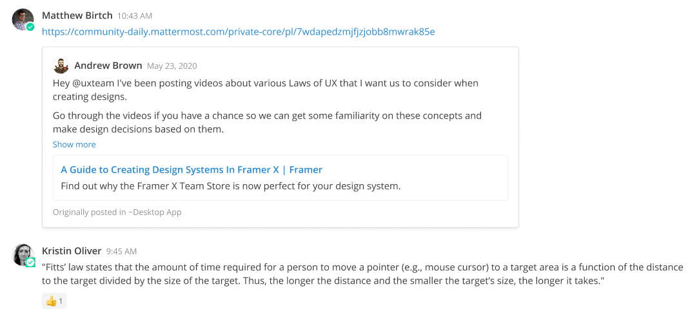

Sharing Messages
================

|all-plans| |cloud| |self-hosted|

.. |all-plans| image:: ../images/all-plans-badge.png
  :scale: 30
  :target: https://mattermost.com/pricing
  :alt: Available in Mattermost Free and Starter subscription plans.

.. |cloud| image:: ../images/cloud-badge.png
  :scale: 30
  :target: https://mattermost.com/download
  :alt: Available for Mattermost Cloud deployments.

.. |self-hosted| image:: ../images/self-hosted-badge.png
  :scale: 30
  :target: https://mattermost.com/deploy
  :alt: Available for Mattermost Self-Hosted deployments.

You can share links to messages in Mattermost. Select the **More Actions** option next to a message, then select **Copy Link**. Paste the link into a message to share the link with others.

Sharing links to messages generates a preview of the message which helps minimize context switching. 

Previews respect channel membership permissions, so they’re only visible to users who have access to the original message. If the link is to a message in a Public Channel, any member of the team can see the message preview. If the link is to a message in a Private Channel or Direct Message, only members in that channel can see the message preview.

.. tip::

    The timestamp next to the username of any message also functions as a permanent link to that conversation.

