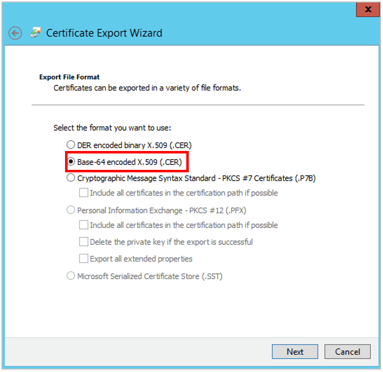

# Configure SAML with Microsoft ADFS (Active Directory Federation Services)

The following process provides steps to configure SAML with Microsoft ADFS for Mattermost.

## Basic Requirements for ADFS

The following are basic requirements to use ADFS for Mattermost:
 - An Active Directory instance where all users have a specified email and username attributes. For Mattermost servers running 3.3 and earlier, users must also have their first name and last name attributes specified.
 - A Microsoft Server running. The screenshots used in this guide are from Microsoft Server 2012R2, but similar steps should work for other versions.
 - An SSL certificate to sign your ADFS login page.
 - ADFS installed on your Microsoft Server. You can find a detailed guide for deploying and configuring ADFS in [this article](https://msdn.microsoft.com/en-us/library/gg188612.aspx).

## Pre-installation

1 - On your ADFS installation, note down the value of the **SAML 2.0/W-Federation URL** in ADFS Endpoints section, also known as the **SAML SSO URL Endpoint** in this guide. If you chose the defaults for the installation, this will be `/adfs/ls/`.

2 - Before configuring SAML with Microsoft ADFS, make sure you have the [XML Security Library](https://www.aleksey.com/xmlsec/download.html) installed on your Mattermost instance. The XML Security Library is usually included as part of Debian GNU/Linux.

Also confirm if the `xmlsec1-openssl` library was successfully installed. If not, run
 - `apt-get install libxmlsec1-openssl` on Ubuntu
 - `yum install xmlsec1-openssl` on RHEL

3 - (Optional) If you would like to set up encryption for your SAML connection, generate encryption certificates now. You are free to use [our script in the `/docs` repo](https://github.com/mattermost/docs/tree/master/source/scripts/generate-certificates) or use another method to generate them.

You should save the two files that are generated, which will be referred to as the **Service Provider Private Key** and the **Service Provider Public Certificate** in this guide.

## Adding a Relying Party Trust

4 - In ADFS management sidebar, go to **AD FS > Trust Relationships > Relying Party Trusts** and click **Add Relying Party Trust…**

5 - A configuration wizard for adding a new relying party trust opens. In the **Welcome** screen, click **Start**.

6 - In the **Select Data Source** screen, select the option **Enter data about the relying party manually**.

7 - In the **Specify Display Name** screen, enter a **Display Name** to recognize the trust, such as `Mattermost`, and add any notes you want to make.

8 - In the **Choose Profile** screen, select the option **AD FS profile**.

9 - In the **Configure Certificate** screen, leave the certificate settings at their default values. 

However, if you would like to set up encryption for your SAML connection, click the **Browse…** button and upload your Service Provider Public Certificate.

10 - In the **Configure URL** screen, select the option **Enable Support for the SAML 2.0 WebSSO protocol** and enter the **SAML 2.0 SSO service URL**, which is of the form `https://<your-mattermost-url>/login/sso/saml`.

11 - In the **Configure Identifiers** screen, enter the **Relying party trust identifier** (also known as the **Identity Provider Issuer URL**) of the form `https://<your-idp-url>/adfs/services/trust`and click **Add**.

12 - In the **Configure Multi-factor Authentication Now** screen, you may enable multi-factor authentication, but this is beyond the scope of this guide.

13 - In the **Choose Issuance Authorization Rules** screen, select the option **Permit all users to access this relying party**.

14 - In the **Ready to Add Trust** screen, you can review your settings.

15 - In the **Finish** screen, select the option **Open the Edit Claim Rules dialog for this relying party trust when the wizard closes**, and click **Close**. You will now exit configuration wizard and a **Claim Rules** editor opens.

## Creating Claim Rules

16 - In the **Issuance Transform Rules** of the **Claim Rules** editor, click the **Add Rule…** button. This action opens an **Add Transform Claim Rule Wizard**.

17 - In the **Choose Rule Type** screen, select **Send LDAP Attributes as Claims** from the drop-down menu, then click **Next**.

18 - In the **Configure Claim Rule** screen, enter a **Claim Rule Name** of your choice, select **Active Directory** as the **Attribute Store** and do the following:
  - From the **LDAP Attribute column**, select `E-Mail-Addresses`. From the **Outgoing Claim Type**, type `Email`
  - From the **LDAP Attribute column**, select `Given-Name`. From the **Outgoing Claim Type**, type `FirstName`
  - From the **LDAP Attribute column**, select `Surname`. From the **Outgoing Claim Type**, type `LastName`
  - From the **LDAP Attribute column**, select `SAM-Account-Name`. From the **Outgoing Claim Type**, type `Username`

For Mattermost 3.4 and later, the `FirstName` and `LastName` attributes are optional.

Then, click **Finish** to add the rule.

Note that the entries in the **Outgoing Claim Type** column can be chosen to be something else. They can contain dashes but no spaces. Note that they will be used to map the corresponding fields in Mattermost later.

19 - Create another new rule by clicking the **Add Rule…** button.

20 - In the **Choose Rule Type** screen, select **Transform an Incoming Claim** from the drop-down menu, then click **Next**.

21 - In the **Configure Claim Rule** screen, enter a **Claim Rule Name** of your choice, then
  - Select `Name ID` for the **Incoming claim type**
  - Select `Unspecified` for the **Incoming name ID format**
  - Select `E-Mail Address` for the **Outgoing claim type**

Moreover, select the **Pass through all claim values** option. Then click **Finish**.

22 - Click **Finish** to create the claim rule, then **OK** to finish creating rules.

23 - Open Windows PowerShell as an administrator and run the following command:

`Set-ADFSRelyingPartyTrust -TargetName <display-name> -SamlResponseSignature "MessageAndAssertion"`

where <display-name> is the name you specified in step 7. In our example it would be `mattermost`.

This action will add the signature to SAML messages, making verification successful.

## Export Identity Provider Certificate

Next, we export the identity provider certificate, which will be later uploaded to Mattermost to finish SAML configuration.

24 - In ADFS management sidebar, go to **AD FS > Service > Certificates** and double click on the certificate under **Token-signing**. You may alternatively right-click the field, then click **View Certificate...*

25 - In the **Certificate** screen, go to the **Details** tab and click **Copy to File…**, then **OK**. This opens a **Certificate Export Wizard**.

26 - In the **Certificate Export Wizard** screen, click **Next**. Then, select the option **Base-64 encoded X.509 (.CER)** and click **Next** again.

27 - In the **Certificate Export Wizard** screen, click **Browse** to specify the location you want the Identity Provider Certificate to be exported, and specify the file name.

28 - Click **Save**. In the **Certificate Export Wizard** screen, verify the file path is correct, and click **Next**. 

29 - In the **Completing the Certificate Export Wizard**, click **Finish**, then **OK** to confirm the export was successful.

You’re now about to finish configuring SAML for Mattermost!

## Configure SAML for Mattermost

30 - Start Mattermost server and sign into Mattermost as a System Administrator. Go to **System Console > Authentication > SAML**.
  - `SAML SSO URL`: **SAML 2.0/W-Federation URL** ADFS Endpoint you noted in step 1.
  - `Identity Provider Issuer URL`: `Relying party trust identifier` from ADFS you specified in step 11.
  - `Identity Provider Public Certificate`: X.509 Public Certificate you downloaded in step 29.

31 - (Optional) Configure Mattermost to verify the signature. The `Service Provider Login URL` is the `SAML 2.0 SSO service URL` you specified in ADFS in step 10.

32 - (Optional) Enable encryption by uploading the Service Provider Private Key and Service Provider Public Certificate you generated  in step 3.

33 - Set attributes for the SAML Assertions, which will be used to update user information in Mattermost. Attributes for email and username are required and should match the values you entered in ADFS in step 15. See [documentation on SAML configuration settings](https://docs.mattermost.com/administration/config-settings.html#saml-enterprise) for more detail.

For Mattermost servers running 3.3 and earlier, the first name and last name attributes are also required fields.

34 - (Optional) Lastly, customize the login button text.

35 - Click `Save`.

You’re done! If you’d like to confirm SAML SSO is successfully enabled, switch your System Administrator account from email to SAML-based authentication via **Account Settings > General > Sign-in Method > Switch to SAML SSO** and sign in with your SAML credentials to complete the switch.

It is also recommended to post an announcement about how the migration will work to users.

You may also configure SAML for ADFS by editing `config.json`. Before starting the Mattermost server, edit `config.json` to enable SAML based on [SAML configuration settings](https://docs.mattermost.com/administration/config-settings.html#saml-enterprise). You must restart Mattermost server for the changes to take effect.

### Troubleshooting

The following are troubleshooting suggestions on common error messages and issues. 

#### 1. System Administrator locks themselves out of the system

If the System Administrator is locked out of the system during SAML configuration process, they can set an existing account to System Administrator using [a commandline tool](https://docs.mattermost.com/deployment/on-boarding.html#creating-system-administrator-account-from-commandline). 

#### 2. Received error message: `An account with that username already exists. Please contact your Administrator.`

This usually means an existing account has another authentication method enabled. If the user wants to use the existing account for SAML authentication, they should sign in using that method (such as email and password), then change their sign-in method to SAML via **Account Settings > Security > Sign-in method**.

If the user wants to use another ADFS account for SAML instead, they will first need to log out from the existing session, then re-enter credentials for the other account. To log out from the existing session, either:

 - Go to the ADFS provider and log out from the account
 - Delete the existing session cookie by [invoking a passive sign out](https://social.technet.microsoft.com/wiki/contents/articles/1439.ad-fs-how-to-invoke-a-ws-federation-sign-out.aspx) via `https://{DNS_name_of_RP_STS}/adfs/ls/?wa=wsignout1.0` where [RP_STS is the relying party security token service](https://msdn.microsoft.com/en-us/library/ee748489.aspx).

#### 3. Received error message: `An account with that email already exists. Please contact your Administrator.`

This usually means an existing account has another authentication method enabled. If so, the user should sign in using that method (such as email and password), then change their sign-in method to SAML via **Account Settings > Security > Sign-in method**.

#### 4. Received error message: `SAML login was unsuccessful because one of the attributes is incorrect. Please contact your System Administrator.`

Confirm all attributes, including `Email Attribute` and `Username Attribute`, are correct in both the ADFS configuration and in **System Console > SAML**.

#### 5. Unable to switch to SAML authentication successfully

First, ensure you have installed the [XML Security Library](https://www.aleksey.com/xmlsec/download.html) on your Mattermost instance and that **it is available in your** `PATH`.

Second, ensure you have completed each step in our guide for configuring SAML with Microsoft ADFS.

Third, you may consult the [Microsoft ADFS troubleshooting guide](https://technet.microsoft.com/en-us/library/cc776135(v=ws.10).aspx) for potential issues with the ADFS installation.

Lastly, if you are still having trouble with configuration, feel free to post in our [Troubleshooting forum](https://mattermost.org/troubleshoot/) and we'll be happy to help with issues during setup.
