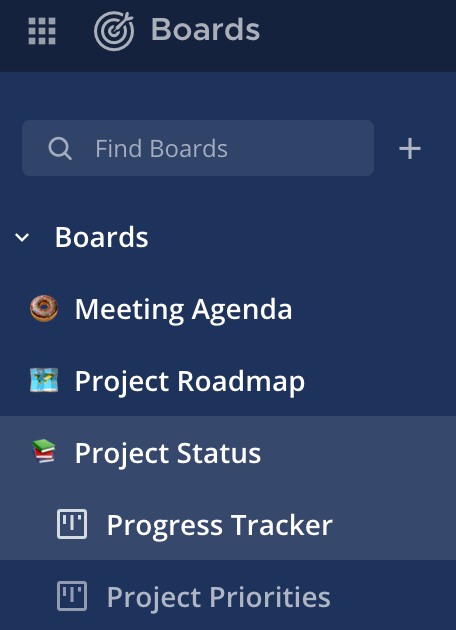
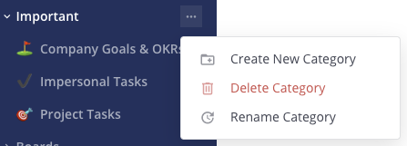
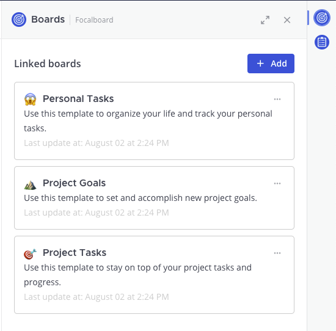
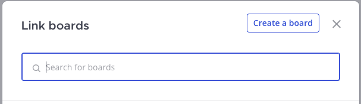
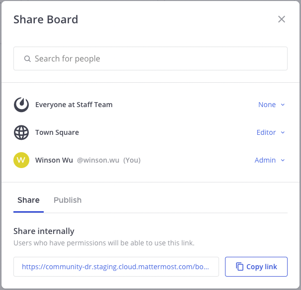

What’s new in Mattermost Boards 
===============================

.. important::

  From Mattermost v8.0, Mattermost Boards is now operating as the Focalboard plugin and can be `enabled or disabled in the System Console </configure/plugins-configuration-settings.html#id9>`__. For the latest Focalboard plugin updates, check out our `Mattermost self-hosted changelog <https://docs.mattermost.com/install/self-managed-changelog.html#mattermost-self-hosted-changelog>`__ and our `Mattermost Cloud changelog <https://docs.mattermost.com/install/cloud-changelog.html>`__.

Overview of v7.2 and beyond
---------------------------

1. All the boards you're currently a member of from your current team will appear on the sidebar without needing to switch workspaces.
2. Organize boards on the sidebar with custom categories. 
3. Press :kbd:`Ctrl` :kbd:`K` on Windows or Linux, press :kbd:`⌘` :kbd:`K` on macOS to find additional boards.
4. Navigate between teams in Boards with the new team switcher.
5. Set board and template permissions in the new **Share** dialog.
6. Link boards to channels to automatically grant board permissions to channel members.

Navigation
----------

Sidebar categories
~~~~~~~~~~~~~~~~~~~

Navigation is simplified, and now works similarly to channels. No more switching between workspaces - and the dashboard page has been removed. All the boards you're currently a member of from your current team will appear on the sidebar without needing to switch workspaces. Use the search box (:kbd:`Ctrl` :kbd:`K`/:kbd:`⌘` :kbd:`K`) to find additional boards.

Boards can be organized under custom categories on a per-user level. So, users can organize their boards under categories that make sense to them without impacting the boards or categories for other users. Select the “...” options menu next to a custom category to manage your categories.

Team sidebar
~~~~~~~~~~~~

Boards now supports a team sidebar so you can easily navigate between boards on different teams. If you’re a member of multiple teams, the team sidebar will appear on the left hand side. To switch teams, select any of the team icons from the team sidebar.

.. image:: ../images/boards-whats-new-03.png
  :alt: The team sidebar allows you to switch between teams from within boards.

Linking boards to channels
--------------------------

The channel header’s board icon is now located on the channel `Apps Bar </configure/configuration-settings.html#enable-apps-bar>`_. When you select the **Boards** icon, you’ll open a new right-hand sidebar (RHS) where channel members can search and link boards to the channel. To maintain the same organization, all the boards previously associated with the workspace will automatically appear on the RHS post-migration. Select a linked board to navigate directly to the board.

Channel members can search and link boards within the team where they are also board admins. Linking a board to a channel automatically grants all channel members Editor access to the board.

.. note:: 
  
  A channel can be linked to multiple boards, but each individual board can only be linked to one channel at a time. Linking the same board to another channel will automatically remove the link from the previous channel.

Channel members can also create a new board from the RHS. Doing so will automatically link the new board to the channel and grant channel members permissions to the board.

Sharing
-------

Select **Share** to view and edit permissions to a board.

    
Team access
~~~~~~~~~~~

Boards belong to teams, and only members of that team can either be granted editor access or no access to the board by default.

Roles
~~~~~

In v7.2, there will only be two roles:

- **Admin**: Can modify the board, its contents, and its permissions
- **Editor**: Can modify the board and its contents

In the future, there will be additional roles:

- **Commenter**: Can add comments
- **Viewer**: Can view the board and its contents

Channel role groups
~~~~~~~~~~~~~~~~~~~

Board Admins can add a channel to a board to grant its members editor access. To do this, open the **Share** option, search for the channel, and add it to the board as a user. The default role is **Editor**. Doing so also links the board back to the channel, where the board will appear on the channel RHS.

Custom templates
----------------

Custom templates also support permissions control, and are restricted to only the template creator by default. The template creator is an admin of the template and can make it public so it will be accessible to everyone on the team via the **Share** button on the template editor, and then setting the team role as **Editor**.

Automatic migration
-------------------

Instead of being tied to a particular channel, each board has been automatically migrated to use its own access control list. The creator of the original board is set as an admin on the board, with the ability to change the board’s permissions. Other members are granted the **Editor** role.

.. note::
  
  There are schema changes introduced in Boards v7.2. If you have a large database, you may need to allocate additional time and resources to this migration. Please review `this document <https://docs.google.com/document/d/1hKQV6QfXSJ6LznvKxoENvU1Z21ulaZ09b-h8N1caS64/edit#heading=h.1ozc9hcotgot>`_ for details around permission migrations.

Public channels
~~~~~~~~~~~~~~~

If a board or custom template was previously attached to a public channel: It’s now searchable by, and accessible to, any member of that channel’s team, including future members.

Private channels
~~~~~~~~~~~~~~~~

If a board or custom template was previously attached to a private channel: It's now searchable by, and accessible to, any member of that channel at the time of migration. Future members will need to be added by the admin.

Direct messages (DMs) and group messages (GMs)
~~~~~~~~~~~~~~~~~~~~~~~~~~~~~~~~~~~~~~~~~~~~~~

If a board or custom template was previously attached to a direct message or group message: It's now searchable by, and accessible to, any member of that channel. Future members will need to be added by the admin.

For boards previously attached to DMs and GMs whose members are associated with **more than one team**:

- The board will be moved to the first team on the team sidebar where all the board members are current team members.
- In the case where some members do not belong to the same team, we will associate the board to the first team where the creator (board admin) has access and where most other board members are current team members.

.. note::
   
   These boards may not appear in your search results when switching teams.

Workspaces to categories
~~~~~~~~~~~~~~~~~~~~~~~~

If you belonged to a workspace at the time of migration you’ll see that they’ve been migrated to custom categories in the sidebar. All boards from a workspace are listed under a category of the same name. Boards from direct messages and group messages appear under the default **Boards** category.

Categories are per-user, and can be renamed or deleted by each user after migration. New users won’t see the custom categories created from migration, and boards they join will appear under the default **Boards** category.

Boards that you create after the migration won’t be linked to a workspace, and will always appear under the default **Boards** category unless you move or hide the boards.

Frequently asked questions
--------------------------

Do I need to plan for downtime during the migration?
~~~~~~~~~~~~~~~~~~~~~~~~~~~~~~~~~~~~~~~~~~~~~~~~~~~~

There are schema changes in v7.2. If you have a large database you may need to allocate additional time and resources to this migration. Please review `this document <https://docs.google.com/document/d/1hKQV6QfXSJ6LznvKxoENvU1Z21ulaZ09b-h8N1caS64/edit#heading=h.1ozc9hcotgot>`_ for details around permission migrations.

Will I need to backup and restore any data?
~~~~~~~~~~~~~~~~~~~~~~~~~~~~~~~~~~~~~~~~~~~

The migration will happen automatically, but your administrator should perform a backup prior to the upgrade.

Why are there so many boards on my sidebar?
~~~~~~~~~~~~~~~~~~~~~~~~~~~~~~~~~~~~~~~~~~~

We removed workspaces, so if you were a member of many boards prior to migration, they will now all appear under the same sidebar. To help you organize your boards better, you can collapse categories, hide boards, delete old boards, and/or move them to other categories.

How do I find my boards now?
~~~~~~~~~~~~~~~~~~~~~~~~~~~~

Use the search box (:kbd:`Ctrl` :kbd:`K`/:kbd:`⌘` :kbd:`K`).

How do I create a new sidebar category?
~~~~~~~~~~~~~~~~~~~~~~~~~~~~~~~~~~~~~~~

Select the **…** menu next to the “Boards” (default) category or any other existing category, and select **Create New Category**.

How do I move a board to another category?
~~~~~~~~~~~~~~~~~~~~~~~~~~~~~~~~~~~~~~~~~~

Select the **…** menu next to the board’s name in the sidebar, and select **Move To…**.

How do I remove a board from the sidebar?
~~~~~~~~~~~~~~~~~~~~~~~~~~~~~~~~~~~~~~~~~

Select the **…** menu next to the board’s name, and select **Hide board**. If you're an admin of the board, you can delete the board by selecting **Delete board** from the same menu. Deleting the board permanently removes the board from the sidebar of all board members.

.. note:: 
  
  Hiding the board only removes the board from *your* sidebar. You can add the board back to your sidebar using the search box (CMD+K/CTRL+K).

What happens if I delete a category with boards underneath it?
~~~~~~~~~~~~~~~~~~~~~~~~~~~~~~~~~~~~~~~~~~~~~~~~~~~~~~~~~~~~~~

The boards will be moved to the default “Boards” category. Other users with the same category name will not be impacted.

How do I create a public custom template?
~~~~~~~~~~~~~~~~~~~~~~~~~~~~~~~~~~~~~~~~~

On the template editor, select **Share** and set the team role to **Editor**.

Help, I’ve got a problem not covered here, what do I do?
~~~~~~~~~~~~~~~~~~~~~~~~~~~~~~~~~~~~~~~~~~~~~~~~~~~~~~~~
Please report any issues to the public `Focalboard channel <https://community.mattermost.com/core/channels/focalboard>`_ or `file a bug <https://github.com/mattermost/focalboard/issues/new?assignees=&labels=Bug%2C+Triage&template=bug_report.md&title=Bug%3A+>`_ on GitHub. We’re here to help!
