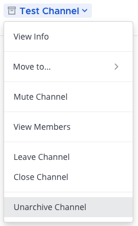

Archive and unarchive channels
==============================

.. include:: ../_static/badges/allplans-cloud-selfhosted.rst
  :start-after: :nosearch:

Archive a channel
-----------------

Anyone can archive the public channels or private channels they belong to, unless the System Admin has restricted the permissions.
Select the channel name at the top of the center pane to access the drop-down menu, then select **Archive Channel**. 

When a channel is archived, it's removed from the user interface, but a copy exists on the server in case it's needed for audit reasons at a later stage. Because of this, the URL of a newly created channel can't be the same URL as an archived channel.

In addition to this, when a channel is archived, by default the contents can't be viewed, shared, or searched. If you want to be able to view or search the channel later, either:

1. Ask your System Admin to set ``ExperimentalViewArchivedChannels`` to ``true`` in ``config.json`` to allow users to view, share, and search for content of channels that have been archived; or
2. Leave the channel open, but post a message in the channel saying it's considered archived: such as ``# This channel is archived.``

.. note::
  
  System Admins can archive channels in the System Console without needing to be a channel member.

Unarchive a channel
-------------------

System Admins and Team Admins can unarchive public channels or private channels they belonged to when it was archived.
Search for the channel if required. Then, open the channel, select the channel name at the top of the center pane to access the drop-down menu and select **Unarchive Channel**. 

When a channel is unarchived, channel membership and all its content is restored, unless messages and files have been deleted based on the `data retention policy </configure/configuration-settings.html#data-retention-policies>`__.

Alternatively, System Admins can unarchive channels `via the CLI </manage/command-line-tools.html#mattermost-channel-restore>`__, or via the `mmctl </manage/mmctl-command-line-tool.html#mmctl-channel-unarchive>`__. Team Admins can unarchive channels `via the API <https://api.mattermost.com/#operation/RestoreChannel>`__.
