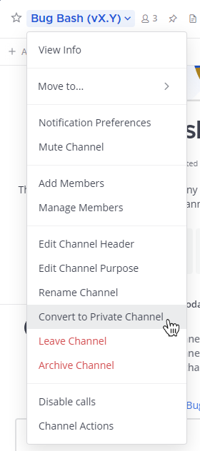

Convert public channels to private channels
===========================================

.. include:: ../_static/badges/allplans-cloud-selfhosted.rst
  :start-after: :nosearch:

You must be a System Admin, Team Admin, or Channel Admin to convert public channels to private channels. 

.. note::
    Default channels such as ``Town Square`` and ``Off-Topic`` can't be converted to private channels.

To convert a public channel to a private channel, select the public channel name at the top of the center pane to access the drop-down menu, then select **Convert to Private Channel**. 

When a channel is converted from public to private, its history and membership are preserved. Membership in a private channel remains as invitation only. Publicly-shared files remain accessible to anyone with the link.

Convert private channels to public channels
-------------------------------------------

Due to potential security concerns with sharing private channel history, only System Admins can convert private channels to public channels via **System Console > Channels > Edit (Channel Configuration)**. 

Alternatively, System Admins can perform this action using the `mmctl channel modify command </manage/mmctl-command-line-tool.html?highlight=mmctl#mmctl-channel-modify>`__.
