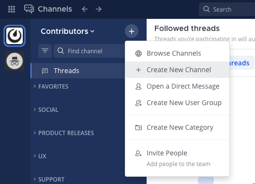
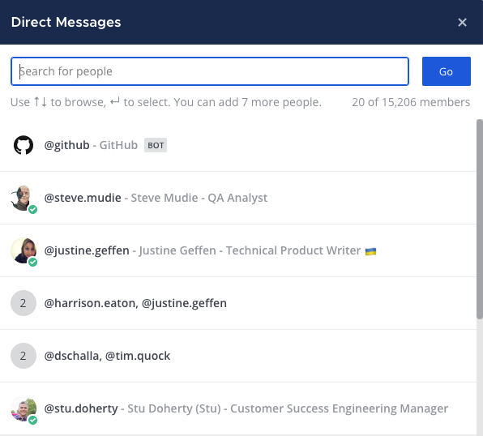

Create channels
===============

|all-plans| |cloud| |self-hosted|

.. |all-plans| image:: ../images/all-plans-badge.png
  :scale: 30
  :target: https://mattermost.com/pricing
  :alt: Available in Mattermost Free and Starter subscription plans.

.. |cloud| image:: ../images/cloud-badge.png
  :scale: 30
  :target: https://mattermost.com/download
  :alt: Available for Mattermost Cloud deployments.

.. |self-hosted| image:: ../images/self-hosted-badge.png
  :scale: 30
  :target: https://mattermost.com/deploy
  :alt: Available for Mattermost Self-Hosted deployments.

Anyone can create public, private, direct, and group channels, unless the System Admin has `restricted permissions to do so using advanced permissions <https://docs.mattermost.com/onboard/advanced-permissions.html>`__.

.. tip::

  The person who creates a channel automatically becomes the Channel Admin. Channel Admins can access **Channel Actions** from the channel name drop-down menu in the center pane to configure automatic actions when users `join the channel <https://docs.mattermost.com/channels/join-leave-channels.html#join-a-channel>`__ or `post a message <https://docs.mattermost.com/channels/send-messages.html>`__ to the channel. 
  
  Automatic actions include:
  
  - Displaying a temporary welcome message for new channel members.
  - Automatically adding the channel to a `category in the user's channel sidebar <https://docs.mattermost.com/channels/customize-your-channel-sidebar.html>`__.
  - Prompting a playbook to run based on the contents of a message.

Create a public or private channel
-----------------------------------

To create a public or private channel, select the **+** symbol at the top of the channel sidebar, then select **Create New Channel**.

Create a direct or group message
--------------------------------

To start a direct or group message, select the **+** symbol next to the **Direct Messages** category in the channel sidebar.

.. image:: ../images/write-dm.png
    :alt: Access recent Direct Messages and Group Messages.

.. tip::
    Alternatively, you can select the **+** symbol at the top of the channel sidebar, then select **Open a Direct Message**. 

In the **Direct Messages** popup, identify your most recent conversations by relative timestamps.     

