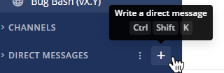

Create channels
===============

|all-plans| |cloud| |self-hosted|

.. |all-plans| image:: ../images/all-plans-badge.png
  :scale: 30
  :target: https://mattermost.com/pricing
  :alt: Available in Mattermost Free and Starter subscription plans.

.. |cloud| image:: ../images/cloud-badge.png
  :scale: 30
  :target: https://mattermost.com/download
  :alt: Available for Mattermost Cloud deployments.

.. |self-hosted| image:: ../images/self-hosted-badge.png
  :scale: 30
  :target: https://mattermost.com/deploy
  :alt: Available for Mattermost Self-Hosted deployments.

Create a public or private channel
-----------------------------------

Anyone can create public channels or private channels, unless the System Admin has `restricted permissions to do so <https://docs.mattermost.com/configure/configuration-settings.html#enable-public-channel-creation-for>`__.

Select the **+** symbol at the top of the channel sidebar, then select **Create New Channel**.

.. image:: ../images/create-new-channel.png
    :alt: Create a channel.

Create a direct or group message
--------------------------------

To start a direct or group message, select the **+** symbol next to the **Direct Messages** category in the channel sidebar.

.. tip::
    Alternatively, you can select the **+** symbol at the top of the channel sidebar, then select **Open a Direct Message**. 

In the **Direct Messages** popup, identify your most recent conversations by relative timestamps.     

.. image:: ../images/recent-direct-group-messages.png
    :alt: Write a Direct Message or Group Message.