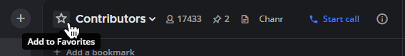

Mark channels as favorites
==========================

.. include:: ../_static/badges/allplans-cloud-selfhosted.rst
  :start-after: :nosearch:

Marking channels as a favorite is a great way to organize your channel sidebar by choosing which public channels, private channels, and direct messages are most important to you.

To mark a channel as a favorite, open the channel:

**On desktop:** At the top of the page, select on the star icon next to the channel name.

       
This adds the channel to a **Favorites** list at the top of the channel sidebar, so it's easy to access. To remove a channel from the **Favorites** list, select the star again.

.. image:: ../images/favorites-list-sidebar.png
    :alt: Favorite channels in the channel sidebar.
       
**On mobile:** Select the channel name at the top of the center pane to access the drop-down menu, then select **Favorite**. To remove a channel from the **Favorites** list, select **Favorite** again.