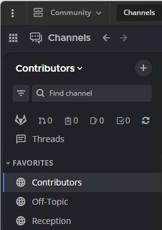

Mark channels as favorites
==========================

.. include:: ../_static/badges/allplans-cloud-selfhosted.rst
  :start-after: :nosearch:

You can mark public channels, private channels, and direct messages as Favorite so they appear in the Favorite category in the channel sidebar.
To mark a channel as a **Favorites** one, you need to open the channel:

**On desktop:** At the top of the page, select on the star icon next to the channel name.

.. image:: ../images/favorite-channel-desktop.png
    :alt: Mark a channel as a favorite.
       
This adds the channel to a **Favorites** list at the top of the channel sidebar, so it's easy to access. To remove a channel from the **Favorites** list, select the star again.

       
**On mobile:** Select the channel name at the top of the center pane to access the drop-down menu, then select **Favorites**. To remove a channel from the **Favorites** list, select **Favorites** again.

.. tab:: Mobile App v2

.. image:: ../images/fav_channel_mobile_app.gif
    :alt: Favorite channels in the channel sidebar using mobile app.
    :width: 300px
    :height: 400px

