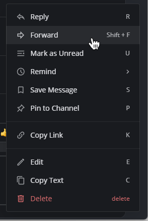

Forward messages
================

.. include:: ../_static/badges/allplans-cloud-selfhosted.rst
  :start-after: :nosearch:

From Mattermost v7.2, using a web browser or the desktop app, you can forward messages in Mattermost to another channel by selecting the **More** |more-icon| icon next to a message, then selecting **Forward**. From Mattermost v7.5, you can also forward messages from bots and webhooks.

.. |more-icon| image:: ../images/dots-horizontal_F01D8.svg
  :alt: When you hover over messages, you can access more message options from the More icon.

Specify where you want to forward the message, and include an optional comment. Forwarding messages generates a preview of the message.

.. image:: ../images/permalink-previews.png
   :alt: Mattermost generates previews of links shared in Channels.

Previews respect channel membership permissions, so they’re only visible to users who have access to the original message. If the link is to a message in a public channel, any member of the team can see the message preview. If the link is to a message in a private channel or direct message, only members in that channel can see the message preview.