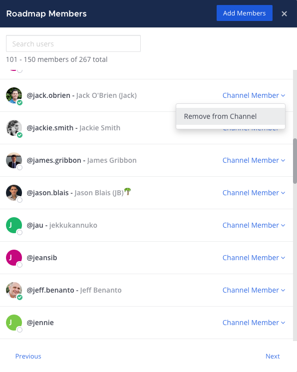

Manage channel members
=======================

.. include:: ../_static/badges/allplans-cloud-selfhosted.rst
  :start-after: :nosearch:

Add members to a channel
------------------------

Any member of a channel can add other members to public or private channels, unless your System Admin has restricted access to do so. 

1. Select the channel name at the top of the center pane to access the drop-down menu, then select **Add Members**. 

  .. image:: ../images/add-member-to-channel.png
    :alt: Use options available through the channel name to add a member to a channel.

2. Search for users, select users, then select **Add** to add users to the current channel. Mattermost notifies you when a user is already a member of the channel.
 
Add users from their profile
----------------------------

You can also add users to channels within their profile pop-over.

1. Select a user's profile image to access their profile pop-over.
2. Select **Add to a Channel**.

  .. image:: ../images/add-member-pop.png
    :alt: Use options on a user's profile pop-over to add a member to a channel.

3. Type to find a channel name, then select a channel and choose **Add**.

Remove members from a channel
-----------------------------

Any member of a channel can remove other members from a channel. 

Select the channel name at the top of the center pane to access the drop-down menu, then select **Manage Members**. Select the member's `user role </welcome/about-user-roles.html>`__, then select **Remove from Channel**.

