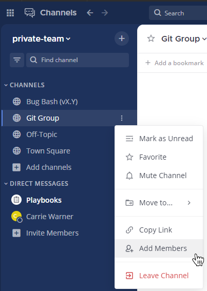
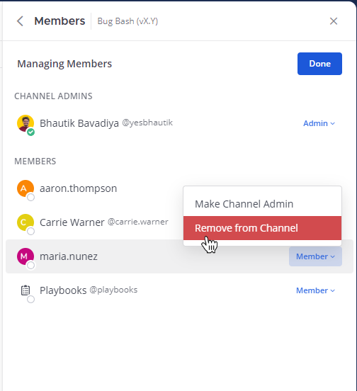

Manage channel members
=======================

|all-plans| |cloud| |self-hosted|

.. |all-plans| image:: ../images/all-plans-badge.png
  :scale: 30
  :target: https://mattermost.com/pricing
  :alt: Available in Mattermost Free and Starter subscription plans.

.. |cloud| image:: ../images/cloud-badge.png
  :scale: 30
  :target: https://mattermost.com/apps
  :alt: Available for Mattermost Cloud deployments.

.. |self-hosted| image:: ../images/self-hosted-badge.png
  :scale: 30
  :target: https://mattermost.com/deploy
  :alt: Available for Mattermost Self-Hosted deployments.

Add members to a channel
------------------------

Any member of a channel can add new members to a channel. Select the channel name at the top of the center pane to access the drop-down menu, then select **Add Members**. Search for users, select users, then select **Add** to add them to the current channel. Mattermost notifies you when a user is already a member of the channel.

You can also add users to channels within their profile pop-over by choosing **Add to a Channel**, specifying the channel you want them to join, then selecting **Add**.

.. image:: ../images/add-member-pop.png
    :alt: Add a member to a channel.

Remove members from a channel
-----------------------------

Any member of a channel can remove other members to a channel. Select the channel name at the top of the center pane to access the drop-down menu, then select **Manage Members**. Select the member's `user role <https://docs.mattermost.com/welcome/about-user-roles.html>`__, then select **Remove from Channel**.

