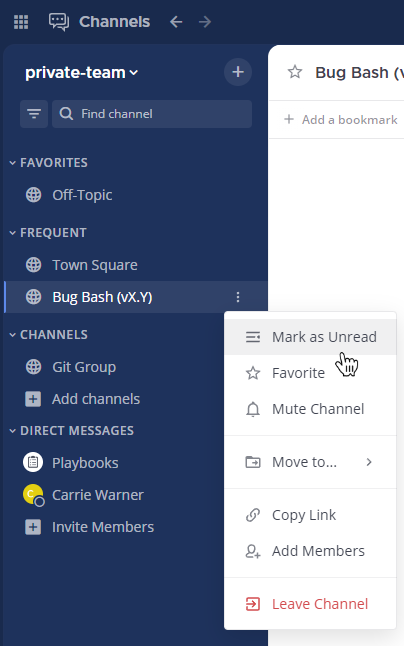

Mark channels as unread
=======================

.. include:: ../_static/badges/allplans-cloud-selfhosted.rst
  :start-after: :nosearch:

.. |vertical-3-dots| image:: ../images/dots-vertical_F01D9.svg
  :alt: Select the More icon to access additional channel management options.

If you read a messages in a channel, but don't have time to address them right away, you can mark that channel as unread. Hover over the channel name in the channel sidebar, select the **More** |vertical-3-dots| option, then select **Mark as Unread**.

Marking a channel as unread displays the channel as bold in the channel sidebar, and marks all messages in the channel as unread messages. 