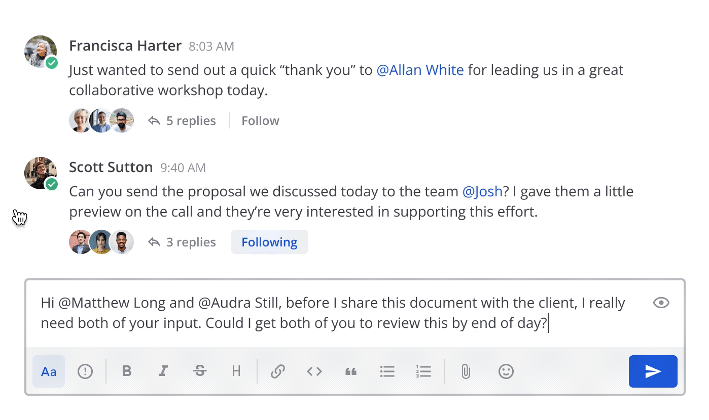

Set message priority (beta)
===========================

.. include:: ../_static/badges/allplans-cloud-selfhosted.rst
  :start-after: :nosearch:

.. |priority-icon| image:: ../images/Priority-Message-Icon.svg
  :alt: Select the Priority icon to mark new messages as important or urgent before sending them.

.. |acknowledge-button| image:: ../images/Ack-Button-Default.svg
  :alt: Select the Acknowledge button to indicate that you've read it and taken necessary action.

.. |acknowledged-icon| image:: ../images/Ack-Button-Active.svg
  :alt: Hover over the Acknowledged icon to see who has read and actioned the message. Select the icon to remove your acknowledgement within five minutes.

From Mattermost v7.7, you can add a message priority label to root messages to make important messages requiring timely action or response more visible and less likely to be overlooked.

Set message priority
--------------------

You can add one of three priority labels when sending a new message: Standard, Important, or Urgent. 

To set the priority of a new message:

1. Select the **Message Priority** |priority-icon| icon in the message formatting toolbar. 
2. Select the priority for the message. Messages have a standard priority by default.

When you send the message, the priority label displays next to your name in the channel and the Threads view when others reply to the thread. 

Request acknowledgements
------------------------

.. include:: ../_static/badges/ent-pro-only.rst
  :start-after: :nosearch:

`Mattermost Professional or Enterprise <https://mattermost.com/pricing>`__ customers can additionally request that recipients actively acknowledge the message to track that messages have been seen and actioned. By default, marking a message as Urgent priority automatically requests an acknowledgement. The ability to request acknowledgements and acknowledge messages is available using Mattermost in a web browser or the desktop app with mobile support coming in a future release. 

When you request acknowlegement of a message, an **Acknowledge** |acknowledge-button| button is added below the sent message. You can mark message as acknowledged by selecting the button, and you can hover over the **Acknowledged** |acknowledged-icon| icon to review who has acknowledged the message.

.. tip::

    After acknowledging a message, you have up to five minutes to change your mind. Select the **Acknowledged** |acknowledged-icon| button again to remove your name from the list of acknowledged users.