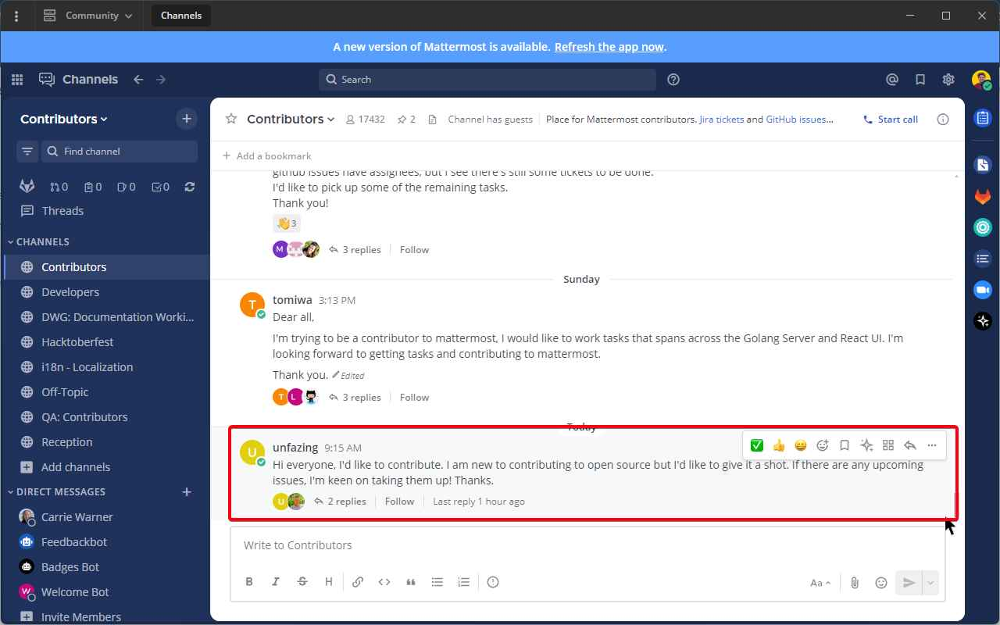
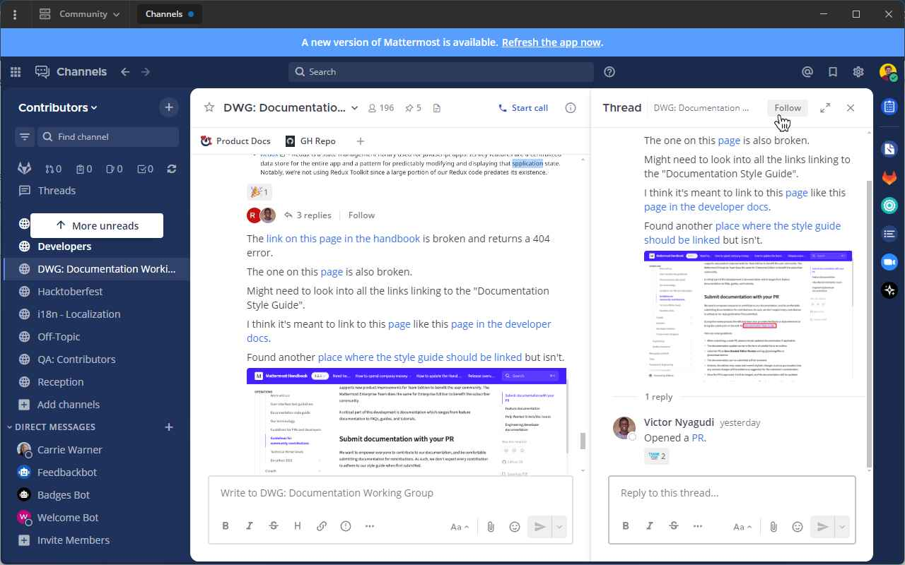

Organize conversations using Collapsed Reply Threads
====================================================

|all-plans| |cloud| |self-hosted|

.. |all-plans| image:: ../images/all-plans-badge.png
  :scale: 30
  :target: https://mattermost.com/pricing
  :alt: Available in Mattermost Free and Starter subscription plans.

.. |cloud| image:: ../images/cloud-badge.png
  :scale: 30
  :target: https://mattermost.com/download
  :alt: Available for Mattermost Cloud deployments.

.. |self-hosted| image:: ../images/self-hosted-badge.png
  :scale: 30
  :target: https://mattermost.com/deploy
  :alt: Available for Mattermost Self-Hosted deployments.

.. |more-actions-icon| image:: ../images/dots-horizontal_F01D8.svg
  :height: 24px
  :width: 24px
  :alt: Access additional message actions using the More Actions icon.

Threads are a key part of the messaging experience in Mattermost Channels. They're used to organize conversations and enable users to discuss topics without adding noise to channels or direct messages.

Collapsed Reply Threads offers an enhanced experience for users communicating in threads and replying to messages that includes a unified threads inbox to read all conversations in one view. Threads improve the ability to process channel content, find, follow, and resume conversations more easily, and keep threaded conversations focused.

.. image:: ../images/collapsed-reply-threads.gif
  :alt: Organize conversations using Collapsed Reply Threads.

Start or reply to threads
-------------------------

Replies are collapsed under the first message of a thread. To reply to a thread, select the **Reply** icon, or select the reply count if a thread already exists.

.. tip:: 
    
    - Select anywhere on a message in a channel in the center pane to view it, or reply to it on the right-hand side.
    - In channels, a dot next to the thread participants indicates there are unread replies. You'll only see unreads for threads you're following.

Follow threads and messages
---------------------------

You can follow particular messages and threads so that any reply activity triggers `notifications <https://docs.mattermost.com/channels/channels-settings.html#notifications>`__. Follow or unfollow any thread, at any time, by toggling the thread’s **Follow/Following** indicator, or from the **More Actions** |more-actions-icon| icon.

.. image:: ../images/crt-following-thread.png
   :alt: Follow threads to stay updated on replies to messages.

You'll automatically follow every thread you participate or are mentioned in. If you’re no longer interested in a or message thread, you can unfollow it to stop receiving notifications. Viewing a thread without responding to it doesn’t automatically follow that thread.

   
.. tip::
  - Follow messages with no replies from the **More Actions** |more-actions-icon| icon to be notified if someone replies to the message later based on your notification preferences.
  - Use keyboard arrow keys to navigate threads in the **Threads** view.

View all threads
----------------

Select **Threads** at the top of the channel sidebar to see all your followed threads on the currently selected team. Threads with the most recent replies display at the top of the list. 

Select **Unreads** to filter your followed threads by only those with unread replies.

.. image:: ../images/crt-thread-view.jpg
  :alt: Select Threads in the channel sidebar to see all thread updates in your Threads View.

Tutorial video
---------------

For additional details about working with Collapsed Reply Threads, see our `tutorial video <https://mattermost-2.wistia.com/medias/5gjgi10rr0>`__. 

.. raw:: html

   

      <iframe src="https://mattermost-2.wistia.com/medias/5gjgi10rr0" frameborder="0" allowfullscreen style="position: absolute; top: 0; left: 0; width: 100%; height: 95%;"></iframe>
   

Enable Collapsed Reply Threads
------------------------------

See our `configuration settings <https://docs.mattermost.com/configure/configuration-settings.html#collapsed-reply-threads>`__ documentation for details on configuring the default availability of collapsed reply threads. From Mattermost v7.0, Collapsed Reply Threads are enabled by default for all new Mattermost deployments.

Depending on how your System Admin has configured **Collapsed Reply Threads** for your workspace, it may already be enabled for you, or you may be able to `enable this feature for your account <https://docs.mattermost.com/channels/channels-settings.html#collapsed-reply-threads>`__ by going to **Settings > Display > Collapsed Reply Threads**. 