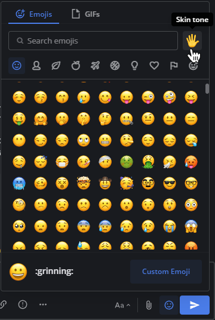

React to messages using emojis
==============================

.. include:: ../_static/badges/allplans-cloud-selfhosted.rst
  :start-after: :nosearch:

Emojis are small, digital images or icons used to communicate or express concepts such as emotions and physical gestures in your messages. React to messages with emoji by selecting the **Smile** |smile-icon| icon inside the Mattermost message input box to open the Emoji Picker. If the existing emojis available in Mattermost don't cover what you want to express, you can also `upload your own custom emoji <#upload-custom-emojis>`__.

.. |smile-icon| image:: ../images/smile-icon.png
  :alt: Smile icon.

.. image:: ../images/selectemoji.png
  :alt: The Mattermost Emoji Picker dialog.

.. tip::

    You can also react to messages by typing ``:`` followed by at least two characters of the word describing the emoji, which will open an emoji autocomplete. Descriptions include skin tone details for people-based emojis, where supported.

    .. image:: ../images/emojiautocomplete.png
        :alt: Emoji Autocomplete

Select recent emojis
--------------------

From Mattermost v6.1 and in Mattermost Cloud, react to messages quickly by selecting a recent emoji while hovering over a message. Recent emojis are sorted based on the number of times you've used the emoji. If your most recent reactions aren't visible, you can enable quick reactions by selecting **Settings > Display > Quick reactions on messages**.

Select default skin tone
-------------------------

Select the **Skin Tone** icon in the top right corner of the Emoji Picker to specify the skin tone you prefer to use for people-based emojis by default. You can select an alternate skin tone any time.

Upload custom emojis
---------------------
  
Everyone in your Mattermost workspace can use the custom emojis you upload. From the Emoji Picker, select **Custom Emoji**. Small, square pictures work best when selecting an image to upload. The file can be any JPG, GIF, or PNG that's up to one MB in size.
  
1. Enter a name for your custom emoji. This is the name that shows up in the emoji autocomplete.
2. Choose **Select**, then select the image to use for the emoji. 
3. Select **Save**. Once saved, your emoji is added to the list of custom emoji.
  
.. image:: ../images/add_custom_emoji.png
  
.. note::

  If you can't see the **Custom Emoji** option, then your Mattermost System Admin may have restricted access to upload custom emoji. Contact your Mattermost System Admin for assistance.
  
To use your custom emoji in a message, select it from the Emoji Picker, or type ``:`` followed by your emoji name to bring it up in the emoji autocomplete. 
  
Remove custom emojis
--------------------
  
You can remove custom emojis that you uploaded to Mattermost.
  
1. Open the Emoji Picker.
2. Select **Custom Emoji**.
3. If required, use the Search Bar to find your custom emoji in the list.
4. Under **Actions** select **Delete**.
5. Choose **Delete** to confirm.
  
.. image:: ../images/delete_custom_emoji.png
   :alt: Remove custom emoji.
