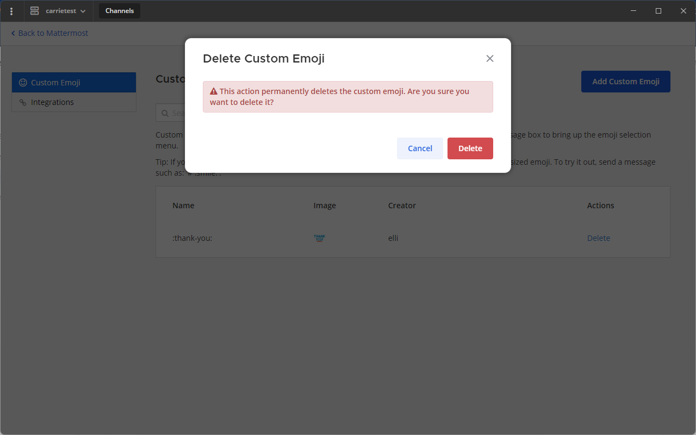

React to messages using emojis
==============================

.. include:: ../_static/badges/allplans-cloud-selfhosted.rst
  :start-after: :nosearch:

Emojis are small, digital images or icons you can use to communicate or express concepts such as emotions and physical gestures in your messages. 

From Mattermost v6.1 and in Mattermost Cloud, you can react to messages quickly by selecting a recently used emoji. Recent emojis are sorted based on the number of times you've used the emoji. If your most recent reactions aren't visible, you can enable quick reactions by selecting **Settings > Display > Quick reactions on messages**.

.. tabs::

  .. tab:: Desktop
              
    Select the **Smile** icon |smile-icon| inside the Mattermost message input box to open the emoji picker. If the existing emojis available in Mattermost don't cover what you want to express, you can also `upload your own custom emoji <#upload-custom-emojis>`__.

       .. |smile-icon| image:: ../images/smile-icon.png
           :alt: Smile icon

    Hover over a message to access recently used emojis. 

    .. image:: ../images/recent-emojis.png
      :alt: React to messages quickly by selecting one of your most recently used emojis.
     
    You can also react to messages by typing ``:`` followed by at least two characters of the word describing the emoji. This opens an emoji autocomplete. Descriptions include skin tone details for people-based emojis, where supported.

    .. image:: ../images/emojiautocomplete.png
      :alt: Emoji autocomplete
        
  .. tab:: Mobile
   
    Long press on a message, and then select a recently used emoji, or select the |smile-icon| to add a different reaction.
    
Manage emojis
-------------

Using Mattermost in a web browser or the desktop app, you can select recently used emojis, select a default skin tone for people-based emojis, as well as manage custom emojis.

Select default skin tone
~~~~~~~~~~~~~~~~~~~~~~~~

Select the **Skin tone** icon in the top right corner of the emoji picker to specify the skin tone you prefer to use for people-based emojis by default. You can select an alternate skin tone at any time.

.. image:: ../images/emoji-skin-tone.png
  :alt: Select a default skin tone preference for people-based emojis.

Upload custom emojis
~~~~~~~~~~~~~~~~~~~~

Everyone in your Mattermost workspace can use the custom emojis you upload. From the emoji picker, select **Custom Emoji**. Small, square pictures work best when selecting an image to upload. The file can be any JPG, GIF, or PNG that's up to 1 MB in size.

1. Enter a name for your custom emoji. This is the name that shows up in the emoji autocomplete.
2. Choose **Select**, then select the image to use for the emoji.
3. Select **Save**. Once saved, your emoji is added to the list of custom emoji.

.. image:: ../images/add_custom_emoji.png
  :alt: You can upload custom emojis to Mattermost.

4. To use your custom emoji in a message, select it from the emoji picker, or type ``:`` followed by your emoji name to bring it up in the emoji autocomplete.

.. note::

  If you can't see the **Custom Emoji** option, your Mattermost system admin may have restricted access to upload custom emoji. Contact your Mattermost system admin for assistance.
  
Remove custom emojis
~~~~~~~~~~~~~~~~~~~~

You can remove custom emojis that you uploaded to Mattermost.

1. Open the emoji picker.
2. Select **Custom Emoji**.
3. If required, use the Search bar to find your custom emoji in the list.
4. Under **Actions** select **Delete**.
5. Choose **Delete** to confirm.

