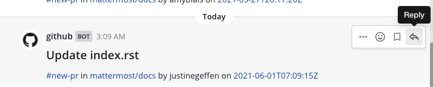

Reply to messages
=================

|all-plans| |cloud| |self-hosted|

.. |all-plans| image:: ../images/all-plans-badge.png
  :scale: 30
  :target: https://mattermost.com/pricing
  :alt: Available in Mattermost Free and Starter subscription plans.

.. |cloud| image:: ../images/cloud-badge.png
  :scale: 30
  :target: https://mattermost.com/download
  :alt: Available for Mattermost Cloud deployments.

.. |self-hosted| image:: ../images/self-hosted-badge.png
  :scale: 30
  :target: https://mattermost.com/deploy
  :alt: Available for Mattermost Self-Hosted deployments.

Reply to messages by selecting the **Reply** |reply-arrow| icon next to the message text. You can `edit and delete messages <https://docs.mattermost.com/channels/send-messages.html#edit-or-delete-messages>`__ after you've sent them.

Organize conversations into threads
-----------------------------------

You can also reply to a message by hovering over a message and selecting the **Reply** link to organize the conversation into a thread. Threaded conversations are easy to follow and allow multiple parallel conversations to occur at the same time without confusion. Replies are indented slightly in the center pane to indicate that they are child messages of a parent message.

Selecting the reply link opens a sidebar in the right-hand sidebar. To expand the right-hand sidebar to its full width, select the **Expand** icon with two arrows at the top of the sidebar.

.. image:: ../images/expand-sidebar.png
   :alt: Expand right-hand sidebar to its full width

To shrink the right-hand sidebar to its original width, select the same **Collapse** icon.

.. image:: ../images/collapse-sidebar.png
   :alt: Collapse the right-hand sidebar to its original width

.. note::
  
  Your System Admin may restrict Messaging actions, such as editing or deleting messages, by configuring `Advanced Permissions <https://docs.mattermost.com/onboard/advanced-permissions.html>`__, available in `Mattermost Enterprise and Professional subscription plans <https://mattermost.com/pricing>`__.

Work with Collapsed Reply Threads
---------------------------------

An early access beta of Collapsed Reply Threads is available for Mattermost Cloud and Mattermost self-hosted customers from v5.37. Collapsed Reply Threads offer a new way to organize conversations within channels. See our `Organizing Conversations using Collapsed Reply Threads (Beta) <https://docs.mattermost.com/channels#organize-conversations.html>`__ documentation to learn more.
