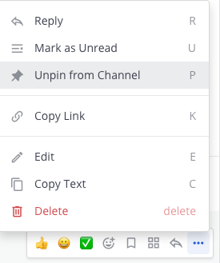

Save and pin messages
=====================

.. include:: ../_static/badges/allplans-cloud-selfhosted.rst
  :start-after: :nosearch:

You have two ways to mark a post to make it easy to find later: `saving messages <#save-messages>`__ and `pinning messages <#pin-messages>`__. 

- Saving a message saves it for only you. 
- Pinning a message marks it for an entire channel.

Save messages
--------------

Save messages for later follow up by selecting the **Save** |save-icon| icon next to a message. 

.. |save-icon| image:: ../images/save-icon.png
  :height: 24px
  :width: 24px
  :alt: Save icon.

.. |more-icon| image:: ../images/dots-horizontal_F01D8.svg
  :alt: When you hover over messages, you can access more message options from the More icon.

.. image:: ../images/save-message.png
   :alt: Save messages for later follow up using the Save option.

See your saved messages
~~~~~~~~~~~~~~~~~~~~~~~

To see all of your saved messages, select the **Bookmark** icon to the left of your avatar. The right-hand sidebar opens to show the list of saved messages.

Unsave messages
~~~~~~~~~~~~~~~

To remove an item from your **Saved Posts** list, select the **Save** icon next to message to clear it.

.. image:: ../images/remove-from-saved-posts.png
  :alt: Remove saved messages by toggling the Save option.

Pin messages
------------

All members of a channel can pin important or useful messages to that channel. The list of pinned messages is visible to all channel members. There is no limit to the number of pinned posts in a channel.

1. Hover over the message that you want to pin. The **More** |more-icon| icon link appears.
2. Select the **More** option, then select **Pin to channel**.

.. image:: ../images/pin-message-to-channel.png
  :alt: You can pin messages to make them easy to return to later.

Pinned messages are marked with the pinned icon. For example:

.. image:: ../images/pinned-example-channel.png
  :alt: An example of a pinned message in a channel marked with a pin icon.

See all pinned messages
~~~~~~~~~~~~~~~~~~~~~~~

To see all pinned messages in a channel, select the **Pinned posts** icon in the channel header. 

.. image:: ../images/pinned-posts.png
  :alt: Open pinned messages in the right-hand sidebar.

The right-hand sidebar opens to show the list of pinned messages. For example:

.. image:: ../images/pinned-example-rhs.png
  :alt: Review the list of pinned messages.

Unpin messages
~~~~~~~~~~~~~~

1. Mouse over the message that you want to unpin. The **More** |more-icon| icon link appears.
2. Select the **More** icon, then select **Unpin from channel**

