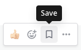
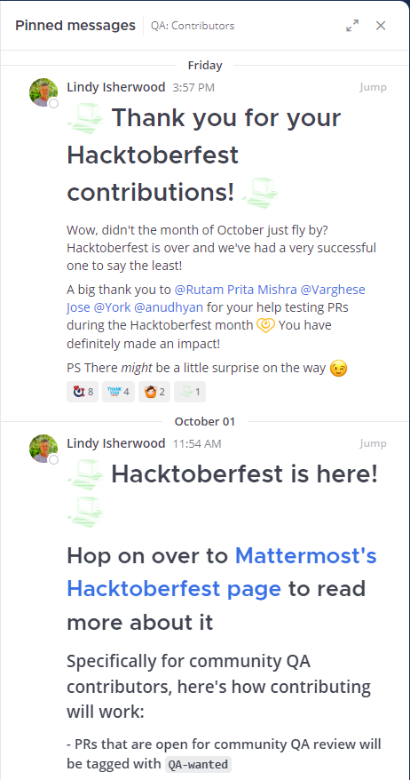

Save and pin messages
=====================

.. include:: ../_static/badges/allplans-cloud-selfhosted.rst
  :start-after: :nosearch:

You have two ways to flag a post to make it easy to find later: `saving messages <#save-messages>`__ and `pinning messages <#pin-messages>`__. 

- Saving a message saves it for only you. 
- Pinning a message flags it for an entire channel.

Save messages
--------------

Save messages for later follow up by selecting the **Save** |save-icon| icon next to a message. 

.. |save-icon| image:: ../images/save-icon.png
  :alt: Save icon.

See your saved messages
~~~~~~~~~~~~~~~~~~~~~~~

To see all of your saved messages, select the **Bookmark** icon to the left of your avatar. The right-hand sidebar opens to show the list of saved messages.

Unsave messages
~~~~~~~~~~~~~~~

To remove an item from your **Saved Posts** list, select the **Save** icon next to message to clear it.

.. image:: ../images/remove-from-saved-posts.png

Pin messages
------------

All members of a channel can pin important or useful messages to that channel. The list of pinned messages is visible to all channel members. There is no limit to the number of pinned posts in a channel.

1. Mouse over the message that you want to pin. The [...] link appears.
2. Select **[...] > Pin to channel**

Pinned messages are marked with the pinned icon. For example:

.. image:: ../images/pinned-example-channel.png
  :alt: Enter slash commands in the message field.

See all pinned messages
~~~~~~~~~~~~~~~~~~~~~~~

To see all pinned messages in a channel, select the **Pin** icon located in the channel header. 

.. image:: ../images/pinned-posts.png
  :alt: Open pinned messages in the right-hand sidebar.

The right-hand sidebar opens to show the list of pinned messages. For example:

Unpin messages
~~~~~~~~~~~~~~

1. Mouse over the message that you want to unpin. The [...] link appears.
2. Select **[...] > Unpin from channel**