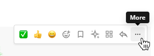

Send Messages
=============

|all-plans| |cloud| |self-hosted|

.. |all-plans| image:: ../images/all-plans-badge.png
  :scale: 30
  :target: https://mattermost.com/pricing
  :alt: Available in Mattermost Free and Starter subscription plans.

.. |cloud| image:: ../images/cloud-badge.png
  :scale: 30
  :target: https://mattermost.com/download
  :alt: Available for Mattermost Cloud deployments.

.. |self-hosted| image:: ../images/self-hosted-badge.png
  :scale: 30
  :target: https://mattermost.com/deploy
  :alt: Available for Mattermost Self-Hosted deployments.

Compose a message by typing into the text box at the bottom of Mattermost. Press ENTER to send a message. Use SHIFT+ENTER to create a new line without sending a message. You can also `edit and delete messages <#edit-or-delete-messages>`__ after you've sent them.

Mattermost can automatically detect and display messages written using right-to-left scripts, such as Arabic, Hebrew, or Persian. Your System Admin must install the `RTL Plugin <https://github.com/QueraTeam/mattermost-rtl>`__ to enable this functionality.

.. note::
  
  Your System Admin may restrict Messaging actions, such as editing or deleting messages, by configuring `Advanced Permissions <https://docs.mattermost.com/onboard/advanced-permissions.html>`__, available in `Mattermost Enterprise and Professional subscription plans <https://mattermost.com/pricing>`__.

.. tabs::

  .. tab:: Mattermost v6.0 onwards

      If you prefer to use ENTER to insert new lines and CTRL+ENTER to send messages instead, select the **Gear** |gear-icon| icon to go to **Settings**, then select **Advanced > Send messages on CTRL+ENTER**.

      .. |gear-icon| image:: ../images/settings-outline_F08BB.svg
        :alt: Select the Gear icon to open the Settings dialog.

  .. tab:: Mattermost v5.39 and earlier

      In Mattermost versions up to v5.39, you can configure Mattermost to use ENTER to insert new lines and CTRL+ENTER to send messages instead. Select the three horizontal lines at the top of the channel sidebar (also known as a hamburger menu) to go to **Account Settings**, then select **Advanced > Send messages on CTRL+ENTER**.
  
Edit or delete messages
-----------------------

Select the **More Actions** link next to a message that you've sent.

Select **Edit** to edit your own messages. Message edits do not trigger new @mention notifications, desktop notifications, or notification sounds.

Select **Delete** to delete your own messages. Select **Delete** again to confirm.