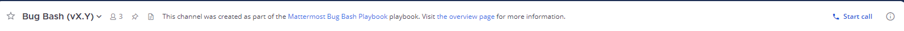

Set channel preferences
=======================

.. include:: ../_static/badges/allplans-cloud-selfhosted.rst
  :start-after: :nosearch:

.. |more-icon| image:: ../images/dots-horizontal_F01D8.svg
    :alt: Use the More icon to access additional message options.

.. |channel-info| image:: ../images/information-outline_F02FD.svg
  :alt: Use the Channel Info icon to access additional channel management options.

.. |vertical-3-dots| image:: ../images/dots-vertical_F01D9.svg
  :alt: Select the More icon to access additional channel management options.

For each channel you're a member of, you can set notification preferences as well as the channel's header, purpose, and name. See the documentation for details on :doc:`renaming channels </channels/rename-channels>` and :doc:`channel naming convention recommendations </channels/channel-naming-conventions>`.

.. image:: ../images/channel-preferences.png
    :alt: Select the channel name at the top of the screen to set preferences for each channel you belong to.

Channel notification preferences
--------------------------------

You have 2 ways to manage individual channel notification preferences

- Select the channel name, then select **Notification Preferences**, or
- Select the **View Info** |channel-info| icon, then select **Notification Preferences** in the right pane.

Mute channel
~~~~~~~~~~~~~

By default, all channels, direct messages, and group messages are unmuted. 

Muting a channel turns off desktop, email, and mobile push notifications for that channel, direct message, or group message. The channel will only be marked as unread in the channel sidebar if you're mentioned. 

Once a channel is muted:

- Email, desktop, and push notifications are disabled.
- A mute icon displays next to the channel, direct message, or group message's name.
- The channel, direct message, or group message appears at reduced opacity in the channel sidebar, and isn't marked as unread unless you're mentioned directly.

.. tabs::

  .. tab:: Desktop

    To mute a channel and disable notifications, select **Mute Channel** from the channel name at the top of the screen. To mute a direct message or group message, select **Mute Conversation** from the conversation name at the top of the screen.

    To unmute the channel, select the channel name again to access the drop-down menu, then select **Unmute Channel**. To unmute a direct message or group message, select the conversation name again, then select **Unmute Conversation**.

    .. tip::

      Quickly mute or unmute any channel any time by selecting **Mute Channel** or **Unmute Channel** from the channel name at the top of the screen, or by selecting **More Options** for a channel in the Channel Sidebar. You can mute conversations in the same way.
  
  .. tab:: Mobile

    1. Tap the channel or conversation you want to mute.
    2. Tap the **More** |more-icon| icon located in the top right corner of the app.
    3. Tap **Mute**.

    To unmute the channel or conversation, tap **Mute** again.

Ignore mentions for @channel, @here, and @all
~~~~~~~~~~~~~~~~~~~~~~~~~~~~~~~~~~~~~~~~~~~~~~

By default, you'll receive mention notifications every time someone on your team `mentions an entire channel </channels/mention-people.html>`__ using ``@channel``, ``@all``, or ``@here``.

.. tabs::

  .. tab:: Desktop

    To stop receiving notifications for these types of mentions, enable the **Ignore mentions for @channel, @here and @all** option, then select **Save**. When enabled, mention notifications for channel-wide mentions are ignored, but the channel is marked as unread unless the channel is muted.
  
  .. tab:: Mobile

    1. Tap the channel where you want to mute mention notifications.
    2. Tap the **More** |more-icon| icon located in the top right corner of the app.
    3. Tap **View info**.
    4. Tap **Ignore @channel, @here, @all** to disable the option.

Desktop notifications
~~~~~~~~~~~~~~~~~~~~~

By default, the `desktop notification preferences </channels/channels-settings.html#notifications>`__ you've configured in **Settings** apply to all channels you're a member of by default. Desktop notifications are available on Edge, Firefox, Safari, Chrome, and `Mattermost desktop apps <https://mattermost.com/apps>`__.

To configure desktop notifications for a channel, edit **Desktop notifications**, update your channel-specific desktop notifications, sound, and thread reply preferences, then select **Save**.

To revert a channel to use global desktop notifications, select **Reset to defaults**.

Mobile push notifications
~~~~~~~~~~~~~~~~~~~~~~~~~~~~~~

Mattermost push notifications `must be enabled </configure/configuration-settings.html#enable-push-notifications>`__ by a system admin. 

Once enabled, your `mobile push notification preferences </messaging/manage-channels-settings.html#mobile-push-notifications>`__ configured in **Settings** apply to all channels you're a member of by default.

To customize mobile push notifications per channel:

.. tabs::

  .. tab:: Desktop

    To configure mobile notifications for a channel, edit **Mobile push notifications**, update your channel-specific mobile notifications and thread reply preferences, then select **Save**.

    To revert a channel to use global mobile push notifications, select **Reset to defaults**.
  
  .. tab:: Mobile

    1. Tap the channel where you want to mute mention notifications.
    2. Tap the **More** |more-icon| icon located in the top right corner of the app.
    3. Tap **View info**.
    4. Tap **IMobile Notifications**, and tap your notification preference for that channel.

Channel header
--------------

A channel header refers to text that displays under a channel name at the top of the screen. A channel header can be up to 1024 characters in length and is often used to summarize the channel's focus or to provide links to frequently accessed documents, tools, or websites.

Change the channel header by selecting **Edit Channel Header**. You can use Markdown to `format channel header text </messaging/formatting-text.html>`__ using the same Markdown for messages. Any channel member can change a channel header, unless the system admin has `restricted permissions to do so </configure/configuration-settings.html#enable-public-channel-renaming-for>`__.

.. tip::

  Alternatively, to provide or update a channel header, select the channel name, then select **Edit Channel Header** from the list of options.

Channel purpose
---------------

A channel purpose refers to text that displays when users select **View Info** for a channel. A channel purpose can be up to 250 characters in length and is often used to help users decide whether to join the channel.

Change the channel purpose by selecting **Edit Channel Purpose**. Any channel member can change a channel purpose, unless the system admin has `restricted permissions to do so using advanced permissions </onboard/advanced-permissions.html>`__.

.. image:: ../images/channel-purpose.png
    :alt: Channel purpose helps users decide if they want to join the channel based on its scope or focus.

.. tip::

  Alternatively, to provide or update a channel purpose, select the channel name, then select **Edit Channel Purpose** from the list of options.

Channel name
------------

A channel name must be at least two characters, and can be up to 64 characters in length. `Some unicode characters <https://www.w3.org/TR/unicode-xml/#Charlist>`_ aren't supported.

Change the channel name by selecting **Rename Channel**. Changing the name of the channel also changes the channel URL. Any channel member can change a channel name, unless the system admin has `restricted permissions to do so using advanced permissions </onboard/advanced-permissions.html>`__.

Automatically follow all new threads in this channel
----------------------------------------------------

By default, you don't automatically follow new conversation threads unless you `start a thread or reply to a thread </channels/organize-conversations.html#start-or-reply-to-threads>`__, `follow a thread </channels/organize-conversations.html#follow-threads-and-messages>`__, or are `@mentioned </channels/mention-people.html#username>`__ in a thread. 

You can configure Mattermost to automatically follow every thread in a channel. When enabled, you can `access all threads </channels/organize-conversations.html#view-all-threads>`__ in the **Threads** view, and `unfollow specific threads </channels/organize-conversations.html#follow-threads-and-messages>`__ as you prefer.