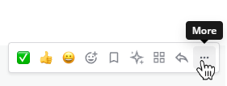
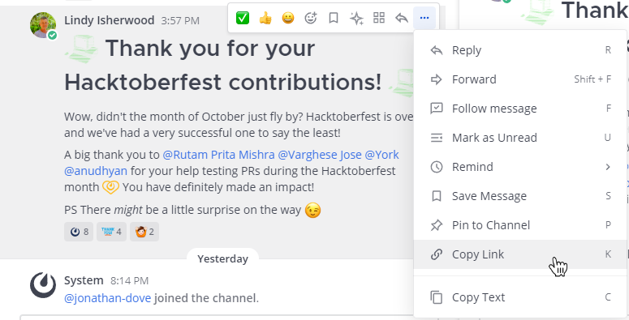

Share links to messages
=======================

.. include:: ../_static/badges/allplans-cloud-selfhosted.rst
  :start-after: :nosearch:

.. |copy-link-icon| image:: ../images/link-variant_F0339.svg
  :alt: Use the Copy Link icon to copy the public URL link for an image in a message.

.. |more-icon| image:: ../images/dots-horizontal_F01D8.svg
  :alt: Use the More icon to access additional message options.

To share links to messages in Mattermost, select the **More** |more-icon| icon next to a message, then select **Copy Link**. 

Paste the link into a message to share the image link with others. Sharing links to messages generates a preview of the message.

.. image:: ../images/permalink-previews.png
   :alt: Mattermost generates previews of links shared in Channels.

.. tip::
  
  You can also hover over an image and select the |copy-link-icon| icon in the top right corner. 

Previews respect channel membership permissions, so they’re only visible to users who have access to the original message. If the link is to a message in a public channel, any member of the team can see the message preview. If the link is to a message in a private channel or direct message, only members in that channel can see the message preview.

.. tip::

    The timestamp next to the username of any message also functions as a permanent link to that conversation.

